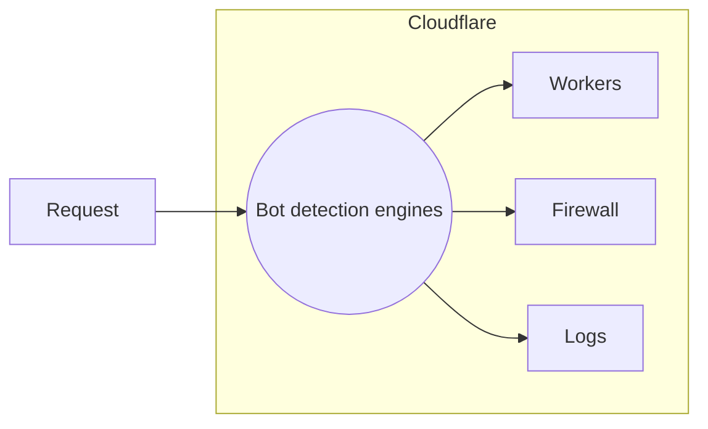

Though most customers choose to implement bot management through [Firewall rules](#firewall), Cloudflare actually makes various [bot signals](/learning-paths/bot-management/planning/bot-signals/) available in several different products.

## Firewall



### Common use cases

You can use Firewall variables in a variety of actions, including:

- Log
- Bypass
- Allow
- Challenge

For a full list of options, refer to [Firewall actions](/firewall/cf-firewall-rules/actions/).

---

## Workers



### Common use cases

You might want to do the following based on bot information in Cloudflare Workers:

- Capture score with request (asynchronous warfare).
- Redirect (to other page, application, honeypot, compute).
- Serve alternative content based on score (avoid serving ads to bots with a low score).
- Require additional authentication (for example, token authentication for requests with low score).
- Notify users of low-score logins.
- Check for combinations based on Bot Score and Clearance Cookie (show which bots passed challenges, or which humans got low scores).

For examples that could be useful in building these actions, refer to [Workers Examples](/workers/examples/).

---

## Logs



### Common use cases

With log information, the main use case is better understanding and analyzing bot traffic.