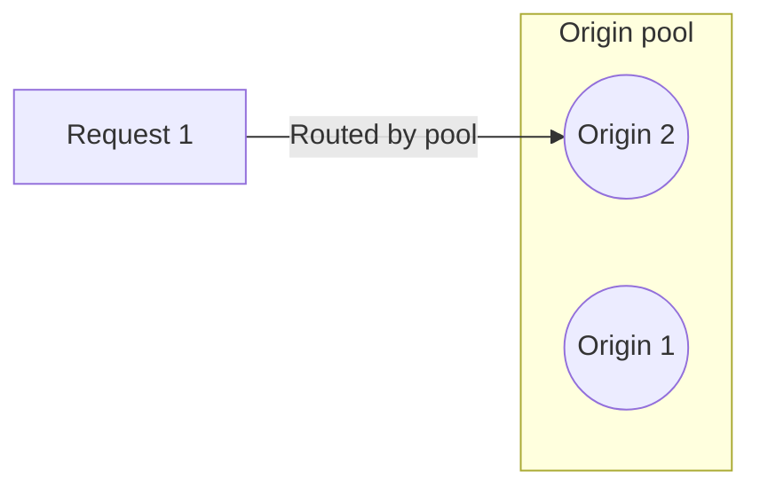

At it's most basic, load balancing is made up of three components:

- **Origin pools**: Which contain one or more servers.
- **Origin servers**: Which respond to individual requests.
- **A load balancer**: Which decides which traffic goes to each origin pool.

## How it works

Normally, requests to your application would go to individual servers directly.

With a load balancer, requests first go through the load balancer. Your load balancer then routes requests to specific pools.


 

Within each pool, requests then go to individual servers. And that server is what responds to the request.

 

This progression of load balancer --> pool --> server is the core part of how a load balancer works.