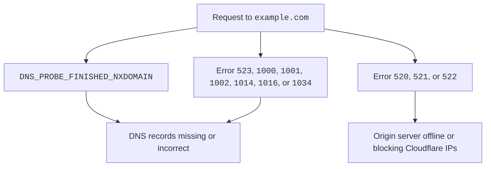

Once you [add and activate](/learning-paths/modules/get-started/onboarding/add-and-activate/) your domain at Cloudflare, check that all your DNS records are set up correctly.

What is DNS?

DNS stands for Domain Name System.

Without DNS, we would have to remember long strings of numbers to access our favorite websites. Not sure about you, but I would much rather prefer typing out `example.com` to `192.0.2.1`.

For more details on DNS, refer to the [Learning Center](https://www.cloudflare.com/learning/dns/what-is-dns/).

## Can you visit your website?

If your website already existed before adding it to Cloudflare, the easiest way to test DNS resolution is to try and visit your domain (`example.com`) or a subdomain (`www.example.com`).

As long as you [reviewed](/dns/zone-setups/full-setup/setup/#review-dns-records) your DNS records when adding your domain, everything should work just fine.

### Potential issues

Sometimes, domains added to Cloudflare can experience issues in DNS resolution.

 

For more details on these errors and how to fix them, refer to the following resources:

- [`DNS_PROBE_FINISHED_NXDOMAIN`](/dns/zone-setups/troubleshooting/dns-probe-finished-nxdomain/)
- [Cloudflare 5xx errors](/support/troubleshooting/cloudflare-errors/troubleshooting-cloudflare-5xx-errors/)
- [Cloudflare 1xxx errors](/support/troubleshooting/cloudflare-errors/troubleshooting-cloudflare-1xxx-errors/)
- [Add a root domain](/dns/manage-dns-records/how-to/create-root-domain/)
- [Add a subdomain](/dns/manage-dns-records/how-to/create-subdomain/)

## Does your domain's email still work?

If your domain supported email beforehand, try sending a few emails to your domain's address.

If those emails cannot be delivered, the issue is usually with your domain's `MX` DNS records. For help, refer to the following resources:

- [Vendor-specific DNS records](/dns/manage-dns-records/reference/vendor-specific-records/)
- [Troubleshooting email issues](/support/dns/troubleshooting/email-undeliverable-when-using-cloudflare/)
- [Add email records](/dns/manage-dns-records/how-to/email-records/)