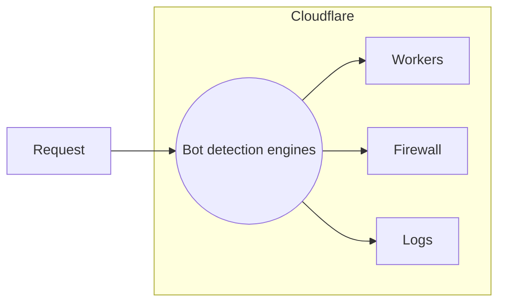

After running requests through various [detection engines](/learning-paths/modules/security/bot-management-concepts/bot-detections/?learning_path=bot-management), Cloudflare surfaces these insights as part of Bot Management.

## Bot insights

### Bot score



The following table groups these scores into general buckets.



### Bot tags


 



### Detection IDs


 

### JA3 Fingerprint



### Verified bots



---

## Associated products

Cloudflare surfaces these bot signals in different products so you can take actions based on specific aspects of a request.

 

### Firewall fields



### Workers fields



### Log fields

