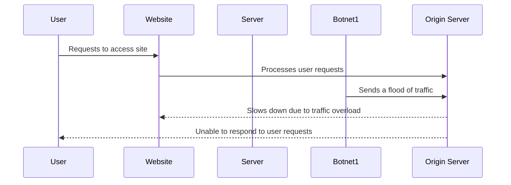

A distributed denial-of-service (DDoS) attack is where a large number of computers or devices, usually controlled by a single attacker, attempt to access a website or online service all at once. This flood of traffic can overwhelm the website's origin servers, causing the site to slow down or even crash.

 

To understand this, imagine a candy store with only a few employees. Normally, the employees can handle a steady stream of customers coming in to buy candy. However, if a large crowd of kids rush in all at once, it would be chaos. The employees may struggle to keep up with the demand and the store could become disorganized and overwhelmed.

Similarly, a website's origin servers are designed to handle a certain amount of traffic at any given time, but a DDoS attack can cause an abnormally high amount of traffic to flood the servers all at once. This can cause the website to become unresponsive, leaving legitimate users unable to access the site.

DDoS attacks can be devastating for businesses and organizations that rely on their websites or online services to operate. It can lead to lost revenue, damage to reputation, and potential security risks if the attack is used as a cover for more nefarious activity.

## Additional resources

For more resources on DDoS attacks and how they work, refer to our [Learning Center](https://www.cloudflare.com/learning/ddos/what-is-a-ddos-attack/).