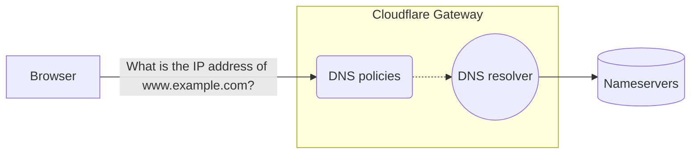
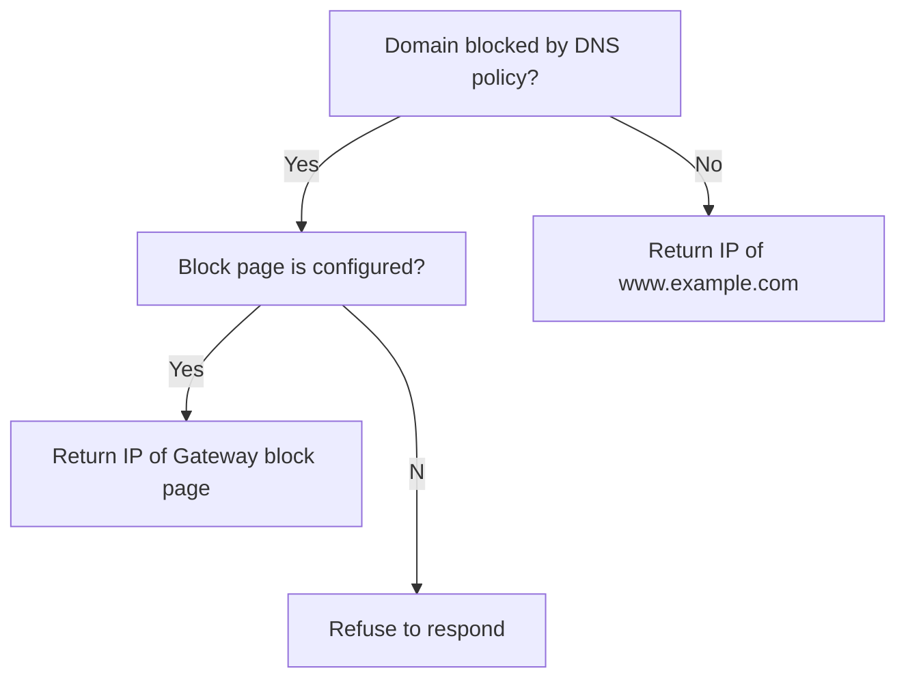

DNS filtering is the process of using the Domain Name System to block malicious websites and filter out harmful or inappropriate content. This ensures that company data remains secure and allows companies to have control over what their employees can access on company-managed networks. DNS filtering is often part of a larger access control strategy.

A URL generally assumes the form
`protocol://subdomain.domain.tld/path?query`.
DNS filtering applies to only `subdomain.domain.tld`. You cannot filter by protocol, path, or query type.

## Related resources
- For more background information on DNS filtering, refer to our [Learning Center](
https://www.cloudflare.com/learning/access-management/what-is-dns-filtering/).
- Learn about the [benefits](https://www.cloudflare.com/products/zero-trust/cloudflare-vs-cisco-umbrella/
) of replacing your DNS filtering software with Cloudflare Gateway.