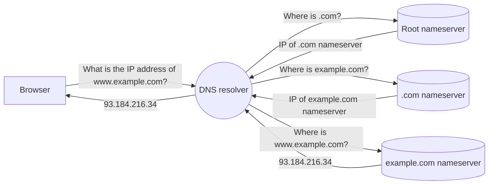

The Domain Name System (DNS) is the phonebook of the Internet. DNS translates the domain name that you type in the browser (such as `www.example.com`) to a computer-friendly IP address (`93.184.216.34`), similar to how a phonebook translates a person's name to a phone number. The IP address identifies the server where the website data is stored, allowing the browser to load the page.

## Life of a DNS request

The process of translating a domain to an IP address is known as a DNS lookup. DNS lookups are performed by dedicated servers called DNS resolvers. Examples of free, public DNS resolvers include Cloudflare 1.1.1.1, Google 8.8.8.8, OpenDNS, and others. You can configure your browser, operating system, or WiFi router to use the DNS resolver of your choice.

As shown in the diagram below, the DNS resolver contacts a series of DNS nameservers to track down the requested IP address. The resolver analyzes the domain in reverse, starting from the top-level domain (`.com`) and ending with the subdomain (`www`). The concept is similar to how the post office delivers a package — first routing it to the correct country, then to the correct state, city, street and so forth until it arrives at your home address.

## Related resources

For more background information on DNS, refer to our [Learning Center](https://www.cloudflare.com/learning/dns/what-is-dns/).
