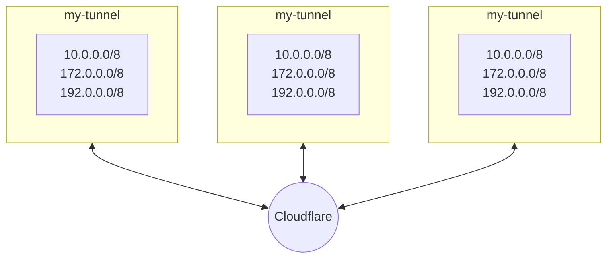
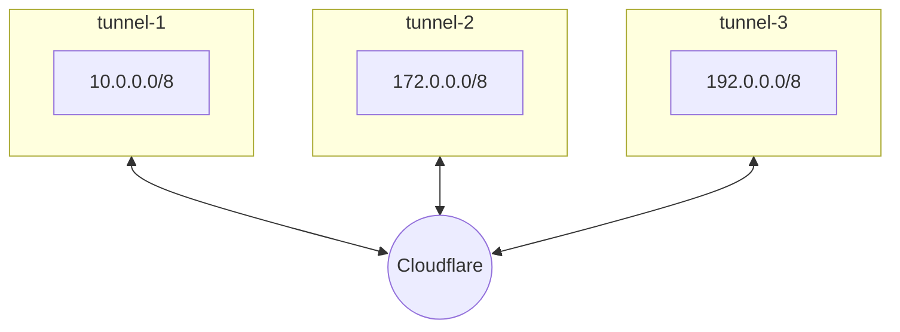

## Size your tunnel

1. Start with our recommendations.
2. Increase the number of ports on the host.
3. Calculate the actual tunnel usage.
4. Resize if needed.

## Scale the tunnel

There are two ways to scale Cloudflare Tunnel capacity to accommodate growth in traffic: you could either add additional replicas of the existing tunnel (Figure 1), or you could divide the network's IP space across multiple tunnels (Figure 2).

### When to add replicas

Adding additional replica instances (two per Connector is the baseline recommendation) of an existing Cloudflare Tunnel connector should only be done as a measure to support additional traffic to the resources or networks that the Cloudflare Tunnel hosts proxy. Replicas should always be added in the same physical/virtual location as one another such that all Connectors can operate in a ‘pooled’ model; if there are scenarios in which you are evaluating adding an additional replica in a different geographic location, you should reconsider the network proxy design for your Cloudflare Tunnel implementation.

### When to add tunnels

#### Servers in different locations

In most cases for example, this may be because your network represented by the CIDR 10.0.0.0/8 is almost entirely contiguous in an Eastern US, with one non-overlapping exception for 10.0.50.0/24, served out of the Pacific Northwest. Rather than serve an additional replica from that location to ensure low latency, you should instead break that CIDR range out from your primary Cloudflare Tunnel network ranges, and serve it from a second instance of Cloudflare Tunnel installed near that /24 subnet, with its own balanced replica implementation.

(As a note, if you add the 10.0.50.0/24 range to a new Tunnel without removing it from your existing Tunnel serving 10.0.0.0/8, Cloudflare will automatically default to the most specifically defined path for user traffic; meaning that all traffic to the 10.0.50/0/24 subnet will flow through the newly created Tunnel, even though both Tunnels technically include that route.)

#### Servers in same location

Separately, if you have a multitude of network ranges all relevant and being served from the same location, it may eventually make sense from a control-plane redundancy perspective to break them into separate Tunnels, even if they are in the same physical location, rather than replicas.

For instance, if you proxy the ranges 10.0.0.0/8, 172.0.0.0/8, 192.0.0.0/8, and 164.0.0.0/8 from a single Tunnel with multiple replicas, you may reach a point of port exhaustion with respect to the traffic flowing through the multitude of networks. It may make sense to either:
Break out specific networks into their own independent Tunnels as appropriate and resource with additional replicas accordingly, or
Find explicit applications or functions (like DNS servers, or other functions that generate a high volume of independent traffic) and break them out into standalone Tunnels with properly rated throughput and replica volume

