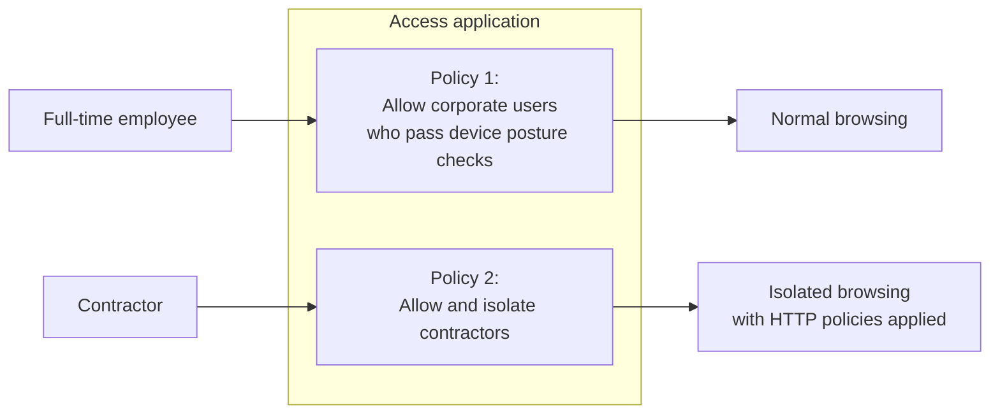

[Cloudflare Browser Isolation](/cloudflare-one/policies/browser-isolation/) integrates with your web-delivered Access applications to protect sensitive applications against data loss. You can build Access policies that require certain users to access your application exclusively through Browser Isolation, while other users matching different policies continue to access the application directly. For example, you may wish to layer on additional security measures for third-party contractors or other users without a corporate device.

Cloudflare sends all isolated traffic through our Secure Web Gateway inspection engine, which allows you to apply Gateway HTTP policies such as:

- Restrict specific actions and HTTP request methods.
- Inspect the request body to match against DLP profiles with as much specificity and control as if the user had deployed an endpoint agent.
- Control users ability to cut and paste, upload and download files, or print while in an isolated session.

## Prerequisites



## Enable Browser Isolation



## Example Access policies

## Example HTTP policies

### Block file downloads

### Block downloads of sensitive data
