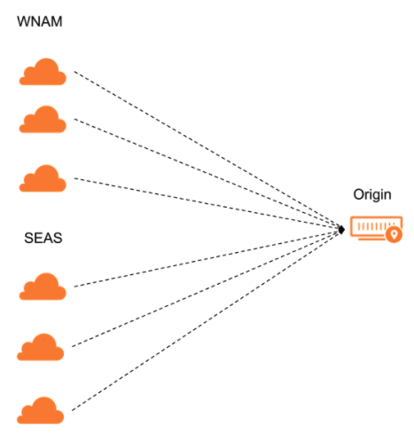

---
---

For each option selected in a pool's **Health Check Regions**, Cloudflare sends health checks from three separate data centers in that region.

If the majority of data centers for that region pass the health checks, that region is considered healthy. If the majority of regions is healthy, then the origin itself will be considered healthy.
