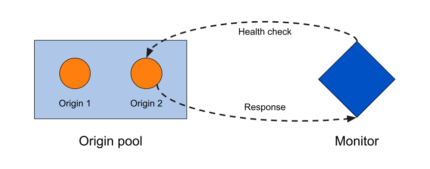

import MonitorDefinition from "../_partials/_monitor-definition.md"
import HealthCheckRegions from "../_partials/_health-check-regions.md"

# Monitors

<MonitorDefinition/>

Health checks that result in a status change for an origin server are recorded as events in the Load Balancing event logs.

<Aside type="note">

Health checks associated with load balancers are different from <strong>Standalone health checks</strong>. For more details about Standalone health checks, see the <a href="https://support.cloudflare.com/hc/articles/4404867308429">Support documentation</a>.

</Aside>

---

## Properties

For an up-to-date list of monitor properties, refer to [Monitor properties](https://api.cloudflare.com/#load-balancer-monitors-properties) in our API documentation.

---

## Create monitors

For step-by-step guidance, refer to [Create monitors](/how-to/create-monitor).

---

## Health check regions

When you [attach a monitor to a pool](/how-to/create-monitor#attach-the-monitor-to-a-pool), you can select multiple regions to increase reporting accuracy.

<HealthCheckRegions/>

### Increased origin strain

Because of how Cloudflare checks health from [multiple regions](#health-check-regions), adding multiple regions — or choosing to check health from **All Data Centers** — can send a lot of traffic to your origin.

The same problem can occur when setting low values for a monitor's **Interval**.

---

## Host header prioritization

When a load balancer runs health checks, headers set on an origin override headers set on a monitor. For more details, refer to [Override HTTP Host headers](/additional-options/override-http-host-headers).

---

## API commands

The Cloudflare API supports the following commands for monitors. Examples are given for user-level endpoint but apply to the account-level endpoint as well.

<TableWrap>

<table>
  <thead>
    <tr>
      <th><Strong>Command</Strong></th>
      <th><Strong>Method</Strong></th>
      <th><Strong>Endpoint</Strong></th>
    </tr>
  </thead>
  <tbody>
    <tr>
      <td><a href="https://api.cloudflare.com/#account-load-balancer-monitors-create-monitor">Create Monitor</a></td>
      <td><Code>POST</Code></td>
      <td><Code>accounts/:account_id/load_balancers/monitors</Code></td>
    </tr>
    <tr>
      <td><a href="https://api.cloudflare.com/#account-load-balancer-monitors-delete-monitor">Delete Monitor</a></td>
      <td><Code>DELETE</Code></td>
      <td><Code>accounts/:account_id/load_balancers/monitors/:id</Code></td>
    </tr>
    <tr>
      <td><a href="https://api.cloudflare.com/#account-load-balancer-monitors-list-monitors">List Monitors</a></td>
      <td><Code>GET</Code></td>
      <td><Code>accounts/:account_id/load_balancers/monitors</Code></td>
    </tr>
    <tr>
      <td><a href="https://api.cloudflare.com/#account-load-balancer-monitors-monitor-details">Monitor Details</a></td>
      <td><Code>GET</Code></td>
      <td><Code>accounts/:account_id/load_balancers/monitors/:id</Code></td>
    </tr>
    <tr>
      <td><a href="https://api.cloudflare.com/#account-load-balancer-monitors-patch-monitor">Overwrite specific properties</a></td>
      <td><Code>PATCH</Code></td>
      <td><Code>accounts/:account_id/load_balancers/monitors/:id</Code></td>
    </tr>
    <tr>
      <td><a href="https://api.cloudflare.com/#account-load-balancer-monitors-update-monitor">Overwrite existing monitor</a></td>
      <td><Code>PUT</Code></td>
      <td><Code>accounts/:account_id/load_balancers/monitors/:id</Code></td>
    </tr>
     <tr>
      <td><a href="https://api.cloudflare.com/#account-load-balancer-monitors-preview-monitor">Preview Monitor</a></td>
      <td><Code>POST</Code></td>
      <td><Code>accounts/:account_id/load_balancers/monitors/:id/preview</Code></td>
    </tr>
  </tbody>
</table>

</TableWrap>
