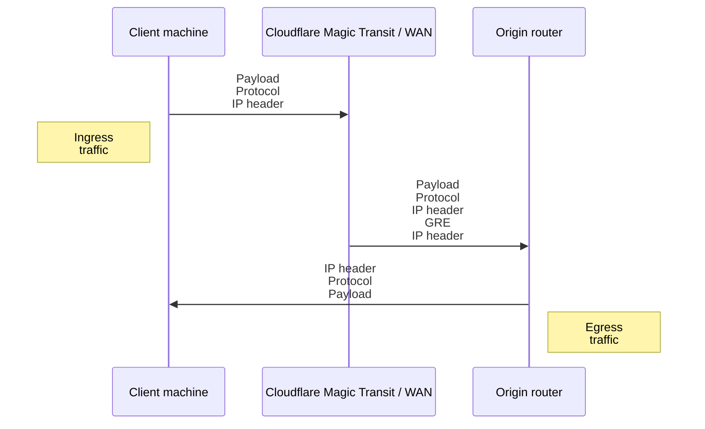
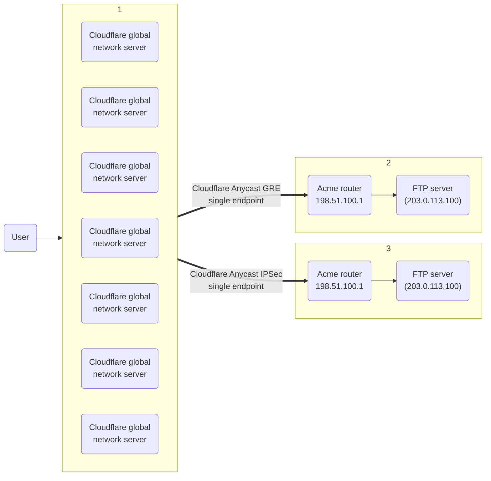

---
_build:
  publishResources: false
  render: never
  list: never
inputParameters: productName;;mssURL
---

# Tunnels and encapsulation

$1 uses [Generic Routing Encapsulation (GRE)](https://www.cloudflare.com/learning/network-layer/what-is-gre-tunneling/) and [IPsec tunnels](https://www.cloudflare.com/learning/network-layer/what-is-ipsec/) to transmit packets from Cloudflare’s global network to your origin network. Cloudflare sets up tunnel endpoints on global network servers inside your network namespace, and you set up tunnel endpoints on routers at your data center.

To accommodate additional header data introduced by encapsulation, the maximum segment size (MSS) must be adjusted so that packets comply with the standard Internet routable maximum transmission unit (MTU), which is 1500 bytes.

For instructions, refer to [Set Maximum Segment Size]($2).

This diagram illustrates the flow of traffic with $2.

 

By default, egress packets are routed by your ISP interface, not Cloudflare.

## ​​Anycast tunnels

$1 uses [Anycast](https://www.cloudflare.com/learning/cdn/glossary/anycast-network/) IP addresses for Cloudflare’s tunnel endpoints, meaning that any server in any data center can receive traffic and must be capable of encapsulating and decapsulating packets for any tunnel.

This works with GRE tunnels because the GRE protocol is stateless—each packet is processed independently and does not require any negotiation or coordination between tunnel endpoints. Tunnel endpoints are technically bound to IP addresses but do not need to be bound to specific devices. Any device that can strip off the outer headers and then route the inner packet can handle any GRE packet sent over the tunnel.

For IPsec tunnels, the customer's router negotiates the creation of an IPsec tunnel with Cloudflare using the IKE protocol. Next, the Cloudflare server that handled that negotiation will propagate the details of that newly created IPsec tunnel (traffic selectors, keys, etc.) across Cloudflare's data centers. The result is that any Cloudflare server can then handle traffic for that IPsec tunnel, even though only one Cloudflare server actually negotiated the setup of that tunnel.

Cloudflare’s Anycast architecture provides a conduit to your tunnel for every server in every data center on Cloudflare’s global network as shown in the image below.

