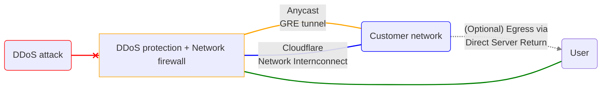

# About Magic Transit

Magic Transit is a network security and performance solution that offers DDoS protection, traffic acceleration, and more for on-premise, cloud-hosted, and hybrid networks.

Magic Transit delivers its connectivity, security, and performance benefits by serving as the front door to your IP network. This means it accepts IP packets destined for your network, processes them, and then outputs them to your origin infrastructure.

The Cloudflare network uses Border Gateway Protocol (BGP) to announce your company’s IP address space, extending your network presence globally, and [Anycast](https://www.cloudflare.com/learning/cdn/glossary/anycast-network/) to ingest your traffic. Today, Cloudflare’s Anycast global network spans 275 cities in more than 100 countries around the world.

Once packets hit Cloudflare’s network, traffic is inspected for attacks, filtered, steered, accelerated, and sent onward to your origin. Magic Transit connects to your origin infrastructure using Anycast Generic Routing Encapsulation (GRE) tunnels over the Internet or, with [Cloudflare Network Interconnect (CNI)](/network-interconnect/), via physical or virtual interconnect.

Magic Transit users have two options for their implementation: ingress traffic or ingress and egress traffic. Users with an egress implementation will need to set up policy-based routing (PBR) or ensure default routing on their end forwards traffic to Cloudflare via tunnels.



Magic Transit is not yet supported on Cloudflare's China Network.



For detailed information on Magic Transit architecture, refer to [Magic Transit Use Cases and Reference Architecture](/reference-architecture/magic-transit-reference-architecture/).