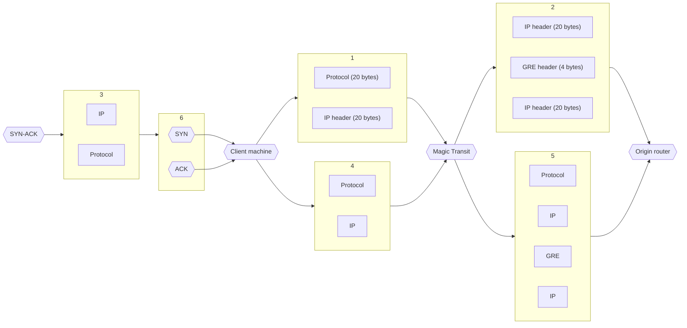

# Prerequisites

Before you can begin using Magic Transit, verify that you meet Cloudflare's onboarding requirements.

## Verify router compatibility

Magic Transit relies on Anycast tunnels to transmit packets from Cloudflare’s global network to your origin network.

The routers at your tunnel endpoints must meet the following requirements to ensure compatibility with Magic Transit.

- Support Anycast tunneling.
- Allow configuration of at least one tunnel per Internet service provider (ISP).
- Support maximum segment size (MSS) clamping.

## Draft Letter of Authorization

Draft a [Letter of Authorization (LOA)](/byoip/about/loa/) that identifies the prefixes you want to advertise and gives Cloudflare permission to announce them. The LOA is required by Cloudflare's transit providers so they can accept the routes Cloudflare advertises on your behalf. See this [LOA template](/byoip/about/loa/) for an example.

If you are an Internet service provider (ISP) and advertising prefixes on behalf of a customer, an LOA is required for the ISP and for the customer.

If you are using a Cloudflare IP, you do not need to submit an LOA. 



The Letter of Authorization must be a PDF. Transit providers may reject the LOA if it is a JPG or PNG.



## Verify IRR entries

Verify your Internet Routing Registry (IRR) entries match corresponding origin autonomous system numbers (ASNs) to ensure Magic Transit routes traffic to the correct autonomous systems (AS). For guidance, refer to [Verify IRR entries](/byoip/how-to/verify-irr-entries/).

If you are using a Cloudflare IP, you do not need to verify your IRR entries.

### Optional: RPKI check for prefix validation

You can also use the Resource Public Key Infrastructure (RPKI) as an additional option to validate your prefixes.

To check your prefixes, you can use [Cloudflare's RPKI Portal](https://rpki.cloudflare.com/?view=validator).






