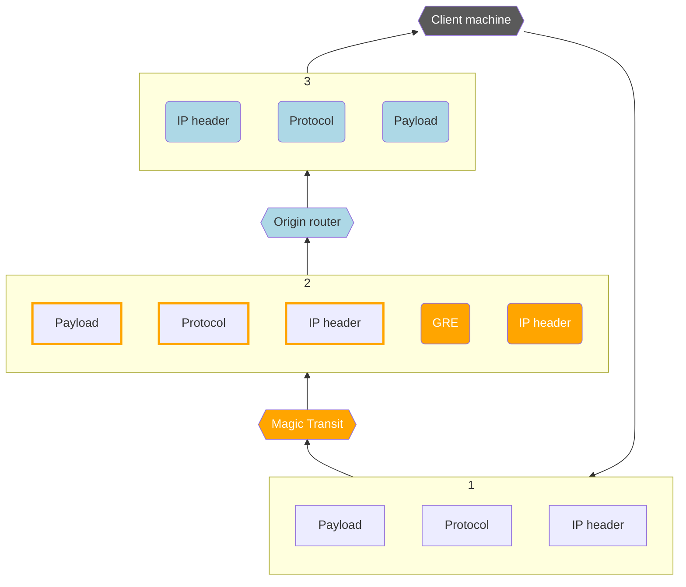

# Tunnels & encapsulation

Magic Transit uses [Generic Routing Encapsulation (GRE)](https://www.cloudflare.com/learning/network-layer/what-is-gre-tunneling/) and [IPsec tunnels](https://www.cloudflare.com/learning/network-layer/what-is-ipsec/) to transmit packets from Cloudflare’s global network to your origin network. Cloudflare sets up tunnel endpoints on global network servers inside your network namespace, and you [set up tunnel endpoints](/magic-transit/how-to/configure-tunnels/) on routers at your data center.

This diagram illustrates the flow of traffic with Magic Transit. Ingress traffic comes from the client machine side, and egress traffic from the origin router side.

Egress packets are routed by your ISP interface, not Cloudflare.

## Encapsulation

Magic Transit [encapsulates IP packets](https://www.cloudflare.com/learning/network-layer/what-is-tunneling/) destined for your network and transmits them across the tunnels to your tunnel endpoint router, which decapsulates the packets and sends them to your internal network.

In the diagram below, Magic Transit encapsulates packets at the Cloudflare global network and transmits them to a customer’s — Acme for example — tunnel endpoint router.



To accommodate additional header data introduced by encapsulation, the maximum segment size (MSS) must be adjusted so that packets comply with the standard Internet routable maximum transmission unit (MTU), which is 1500 bytes.

Because egress packets are routed via your ISP interface, not Cloudflare, you must set this value at your physical egress interfaces (not the tunnel interfaces).

For Magic Transit egress, the egress packets are routed along static routes via tunnels and the MSS clamp should be applied to the tunnels.

For instructions, refer to [Set Maximum Segment Size](/magic-transit/prerequisites/#set-maximum-segment-size).



## Anycast tunnels

Magic Transit uses [Anycast](https://www.cloudflare.com/learning/cdn/glossary/anycast-network/) IP addresses for Cloudflare’s tunnel endpoints, meaning that any server in any data center is capable of encapsulating and decapsulating packets for the same tunnel.

This works because the GRE protocol is stateless—each packet is processed independently and does not require any negotiation or coordination between tunnel endpoints. Tunnel endpoints are technically bound to IP addresses but do not need to be bound to specific devices. Any device that can strip off the outer headers and then route the inner packet can handle any GRE packet sent over the tunnel.

Cloudflare’s Anycast architecture provides a conduit to your tunnel for every server in every data center on Cloudflare’s global network as shown in the image below.

## Network Analytics

Cloudflare’s Network Analytics provides near real-time visibility into network and transport layer traffic patterns and DDoS attacks which can help troubleshoot IP traffic issues. You can also use Network Analytics to view information about the traffic that leaves Cloudflare's global network by reviewing ingress and egress tunnel traffic over a specific amount of time. 

For more information, refer to [Querying Magic Transit Tunnel Bandwidth Analytics with GraphQL](/analytics/graphql-api/tutorials/querying-magic-transit-tunnel-bandwidth-analytics/).