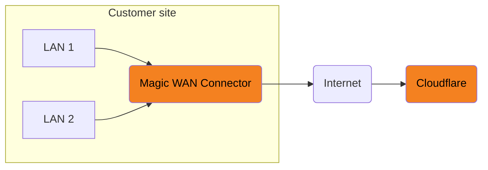
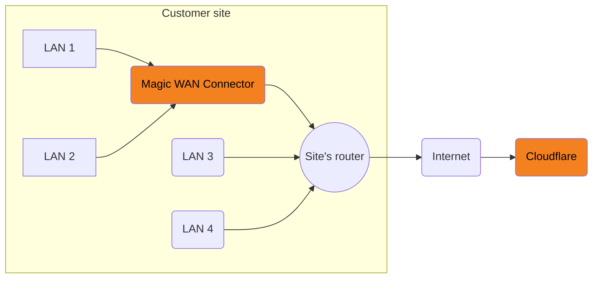

# Configure Magic WAN Connector

## Prerequisites

You need to purchase [Magic WAN](https://www.cloudflare.com/magic-wan/) before you can purchase and use the Magic WAN Connector. The Magic WAN Connector can function as your primary edge device for your network, or be deployed in-line with existing network gear.

You also need to purchase a Magic WAN Connector before you can start configuring your settings in the Cloudflare dashboard. After buying a Magic WAN Connector, the device will be registered with your Cloudflare account and show up in your Cloudflare dashboard.

Contact your account representative to learn more about purchasing options for the Magic WAN Connector device.

---

## High availability configurations

You can install up to two Magic WAN Connectors for redundancy at each of your sites. If one of your Connectors fails, traffic will fail over to the other Connector ensuring that you never lose connectivity to that site.

In this type of high availability (HA) configuration, you will choose a reliable LAN interface as the HA link which will be used to monitor the health of the peer connector. HA links can be dedicated links or can be shared with other LAN traffic.

If you need a high availability configuration for your premises, refer to [About high availability configurations](#about-high-availability-configurations) for more information.

If you do not need a high availability configuration for you premises, proceed to [Configure Cloudflare dashboard settings](#configure-cloudflare-dashboard-settings).

You cannot enable high availability for an existing site. To add high availability to an existing site in the Cloudflare dashboard, you need to delete the site and start again. Plan accordingly to create a high availability configuration from the start if needed.

---

## Port speeds

The hardware version of the Magic WAN connector includes two [SFP+ ports](https://en.wikipedia.org/wiki/Small_Form-factor_Pluggable) that support 10G throughput, as well as six RJ45 ports that support 1G throughput.

Refer to [SFP+ port information](/magic-wan/configuration/connector/configure-hardware-connector/sfp-port-information/) for details on this topic.

---

## Configure Cloudflare dashboard settings

{{<render file="connector/_create-site.md" withParameters="refers to the physical Magic WAN Connector Ethernet port that you are using for your WAN. The ports are labeled `GE1`, `GE2`, `GE3`, `GE4`, `GE5`, and `GE6`. Choose the number corresponding to the port that you are using in Connector.   If you need a throughput higher than 1 Gbps, you can use one of the SFP+ ports. Refer to [SFP+ port information](/magic-wan/configuration/connector/configure-hardware-connector/sfp-port-information/) for more information on the hardware supported.;;refers to the physical Magic WAN Connector Ethernet port that you are using for your LAN. The ports are labeled `GE1`, `GE2`, `GE3`, `GE4`, `GE5`, and `GE6`. Choose a number corresponding to the port that you are using in Connector.   If you need a throughput higher than 1 Gbps, you can use one of the SFP+ ports. Refer to [SFP+ port information](/magic-wan/configuration/connector/configure-hardware-connector/sfp-port-information/) for more information on the hardware supported.;;You need to have bought a Connector already for it to show up here. Refer to [Prerequisites](#prerequisites) if no Connector shows up in this list." >}}

## Set up your Magic WAN Connector

### Device installation

There are several deployment options for Magic WAN Connector. Connector can act like a DHCP server for your local network, or integrate with your local setup and have static IP addresses assigned to it.

When Connector acts like the WAN router for your site, deployment will be something like this:

 

In the example below, the Connector sits behind the WAN router in your site, and on-ramps only some of the existing LANs to Cloudflare.

 

#### Firewall settings required

If there is a firewall deployed upstream of the Magic WAN Connector, configure the firewall to allow the following traffic:

Protocol/port | Destination IP/URL | Purpose
---               | ---                | ---
`UDP/53` | DNS destination IP `1.1.1.1` | Needed to allow DNS traffic to Cloudflare DNS servers. Cloudflare uses this port for DNS lookups of control plane API endpoints.
`TCP/443` | - | The Connector will open outbound HTTPS connections over this port for control plane operations.
`UDP/4500` | Destination IP `162.159.64.1` | Needed for Connector's initialization and discovery traffic through outbound connections.
`UDP/4500` | Destination IP - Cloudflare anycast IPs | Needed for the Cloudflare anycast IPs assigned to your account for tunnel outbound connections. This traffic is tunnel traffic.
`TCP/7844`, `UDP/7844` | Outbound connections | This is for debugging facilities in the Connector.
`UDP/123` | `http://time.cloudflare.com/` | Needed for Magic WAN Connector to periodically contact Cloudflare's Time Services.

## Activate connector



### WAN with a static IP address

After activating your Connector, you can use it in a network configuration based on a static IP address — that is, a network configuration without a route to the Internet that has DHCP enabled.

To use your Connector on a network configuration with a static IP:

1. Wait 60 seconds after activating your Connector.
2. Unplug the physical connection to the Internet-connected device which provides DHCP.
3. Adjust your physical connections as required to match the configuration specified in the [site configuration](#1-create-a-site) step (for example, static IP WAN plugged into a physical port with no DHCP connection).
4. Power cycle the Connector.

---

## About high availability configurations

When you set up a site in high availability, the WANs and LANs in your Connectors have the same configuration but are replicated on two nodes. In case of failure of a Connector, the other Connector becomes the active node, taking over configuration of the LAN gateway IP and allowing traffic to continue without disruption.

Because Connectors in high availability configurations share a single site, you need to set up:

- **Static address**: The IP for the primary node in your site.
- **Secondary static address**: The IP for the secondary node in your site.
- **Virtual static address**: The IP that the LAN south of the Connector will forward traffic to, which is the LAN's gateway IP.

Make sure all IPs are part of the same subnet.


- Failure conditions include Connector down or software restart, LAN or WAN link down, tunnel health down.
- High availability (HA) is run in non-preempt mode, which means either the primary or the secondary node can come up as active through an election process which includes node health parameters.
- In the case of a failover where a Connector is acting as a DHCP server, DHCP leases will be synchronized.


### ​​Create a high availability configuration

You cannot enable high availability for an existing site. To add high availability to an existing site in the Cloudflare dashboard, you need to delete the site and start again.

To set up a high availability configuration:

1. Follow the steps in [Create a site](#1-create-a-site) up until step 4.
2. After naming your site, select **Enable high availability**.
3. Under **Connector**, select **Add Connector**.
4. From the list, choose your first Connector > **Add Connector**.
5. Back on the previous screen, select **Add secondary Connector**.
6. From the list, choose your second Connector > **Add Connector**.
7. Select **Next** to [Create a WAN](#2-create-a-wan). If you are configuring a static IP, configure the IP for the primary node as the static address, and the IP for the secondary node as the secondary static address.
8. To create a LAN, follow the steps mentioned above in [Create a LAN](#3-create-a-lan) up until step 4.
9. In **Static address**, enter the IP for the primary node in your site. For example, `192.168.10.1/24`.
10. In **Secondary static address**, enter the IP for the secondary node in your site. For example, `192.168.10.2/24`.
11. In **Virtual static address**, enter the IP that the LAN south of the Connector will forward traffic to. For example, `192.168.10.3/24`.
12. Select **Save**.
13.  From the **High availability probing link** drop-down menu, select the port that should be used to monitor the node’s health. Cloudflare recommends you choose a reliable interface as the HA probing link. The primary and secondary node’s probing link should be connected over a switch, and cannot be a direct connection.
15. Follow the instructions in [Set up your Magic WAN Connector](#set-up-your-magic-wan-connector) and [Activate connector](#activate-connector) to finish setting up your Connectors.

---

## IP sec tunnels and static routes



---

## Next steps


