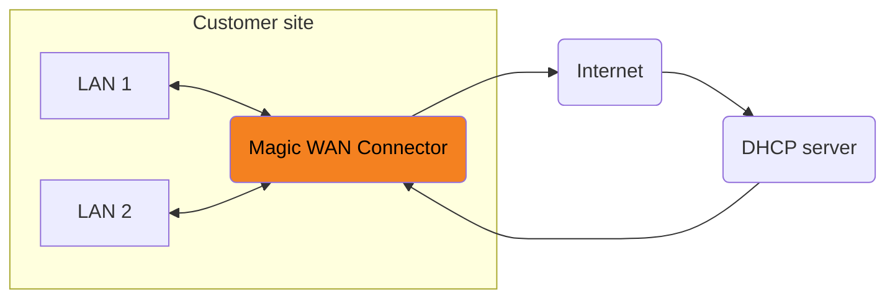

# DHCP relay

DHCP Relay provides a way for DHCP clients to communicate with DHCP servers that are not available on the same local subnet/broadcast domain. When you enable DHCP Relay, Magic WAN Connector forwards DHCP discover messages to a predefined DHCP server, and routes the responses back to the original device that sent the discover message.


_The above graph shows Connector sending DHCP discover messages to a DHCP server offsite._

To configure DHCP relay:




1. Log in to the [Cloudflare dashboard](https://dash.cloudflare.com/) and select your account.
2. Go to **Magic WAN** > **Sites**.
3. Select your site > **Edit**.
4. Select **Network**.
5. In **LAN configuration**, select the LAN where you need to configure DHCP relay.
6. Select **Edit**.
7. Select **This is a DHCP Relay**.
8. In **Upstream DHCP server addresses**, enter the IP address of your DHCP server.
9. (Optional) If you need to add more DHCP server addresses, select **Add upstream DHCP server address** as many times as needed, and enter the new values.






Create a [`PUT` request](/api/operations/magic-site-lans-update-lan) to update the LAN where you want to enable DHCP relay:

Example:

```bash
curl --request PUT \
https://api.cloudflare.com/client/v4/accounts/{account_id}/magic/sites/{site_id}/lans/{lan_id} \
--header "X-Auth-Email: <EMAIL>" \
--header "X-Auth-Key: <API_KEY>" \
--header "Content-Type: application/json" \
--data '{
  "lan": {
    "static_addressing": {
      "dhcp_relay": {
        "server_addresses": [
          "192.0.2.1"
        ]
      }
    }
  }
}'
```


