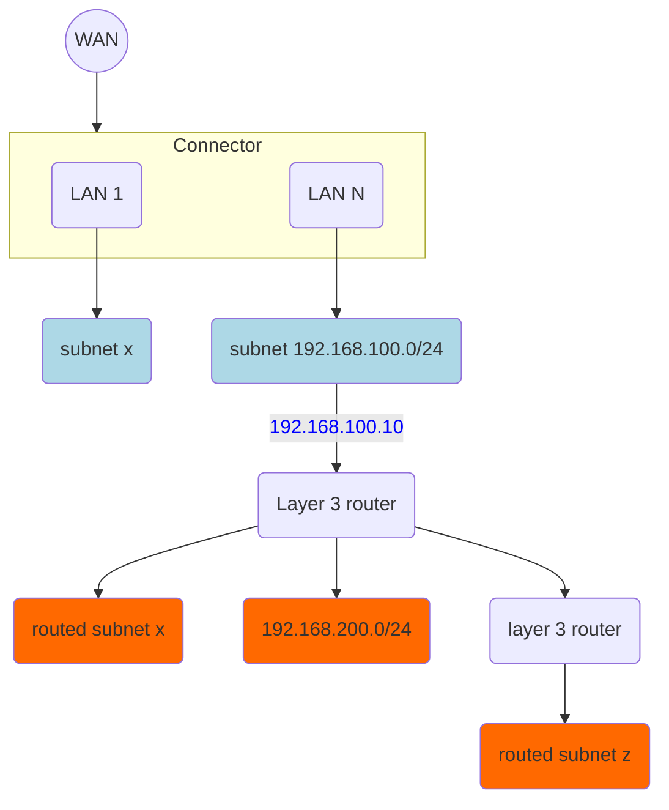
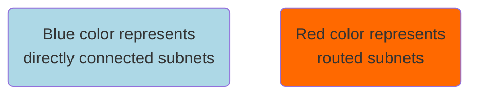

```mermaid
flowchart TB
accTitle: Routed subnets
accDescr: Some LANs are complex, and might have additional subnets behind L3 routers.

a((WAN)) --> b

subgraph b [Connector]
direction TB
c(LAN 1)
d(LAN N)
end

c --> e(subnet x):::blue
d --> f(subnet 192.168.100.0/24):::blue

f-->|192.168.100.10|g(Layer 3 router)

g --> h(routed subnet x):::red
g --> i(192.168.200.0/24):::red
g --> j(layer 3 router)
j --> k(routed subnet z):::red

linkStyle 3 color:blue
classDef blue fill:#add8e6
classDef red fill:#ff6900
```

 

```mermaid
flowchart TB
accTitle: Routed subnets
accDescr: Some LANs are complex, and might have additional subnets behind L3 routers.
a(Blue color represents <br> directly connected subnets):::blue
b(Red color represents <br> routed subnets):::red

classDef blue fill:#add8e6
classDef red fill:#ff6900
```
