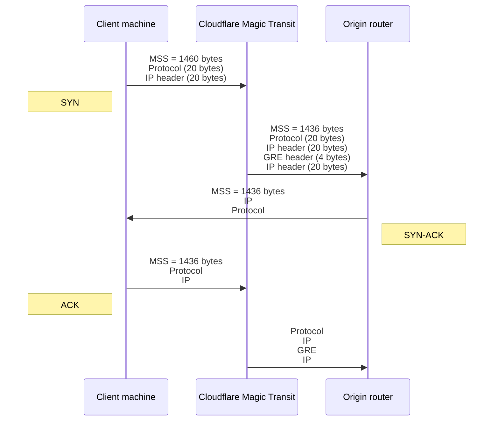

# Prerequisites

Before you can begin using Magic WAN, verify that you meet Cloudflare's onboarding requirements.

## Use compatible tunnel endpoint routers

Magic WAN relies on GRE and IPsec tunnels to transmit packets from Cloudflare’s global network to your origin network. To ensure compatibility with Magic WAN, the routers at your tunnel endpoints must:

- Allow configuration of at least one tunnel per Internet service provider (ISP).
- Support maximum segment size (MSS) clamping.

## Set maximum segment size

 




