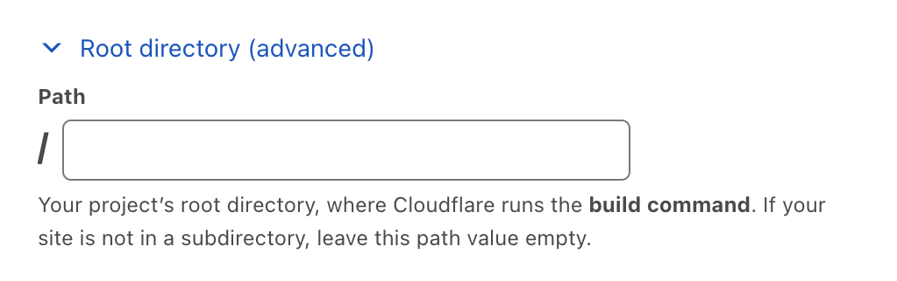
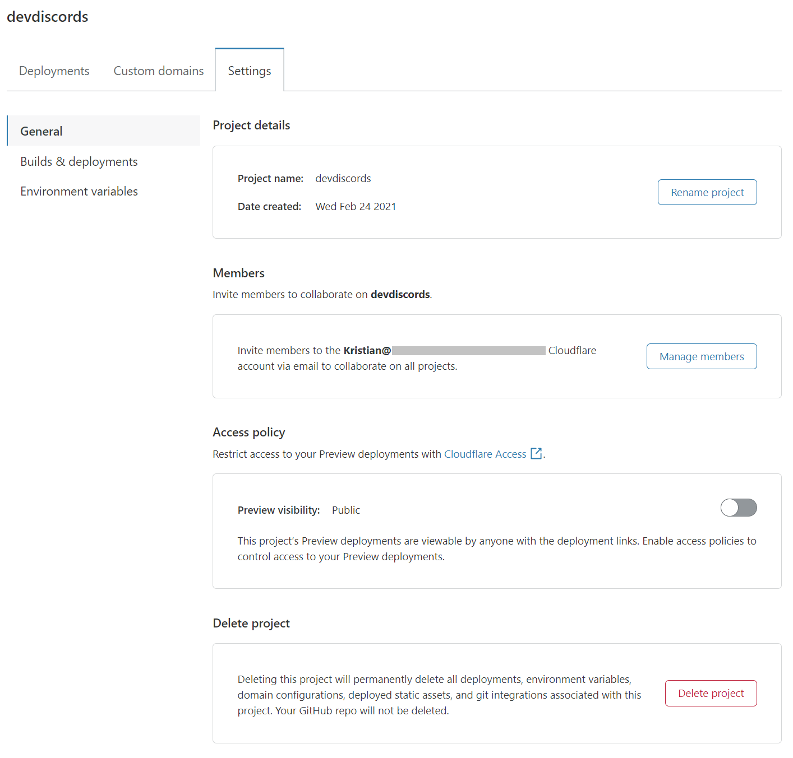

# Get started

In this guide, you will get started with Cloudflare Pages, and deploy your first website to the Pages platform.



You will be signing up for a Cloudflare account. You may also want to create a custom domain, but this is not required.



## Connecting your git provider to Pages

### Sign in to Cloudflare Pages

To begin, go to the [Cloudflare Pages site](https://pages.dev) and sign in with your Cloudflare account. If you do not have an account yet, you can sign up as you get started deploying your new Pages site.

### Connect to your git provider

Pages offers support for [GitHub](https://github.com/) and [GitLab](https://gitlab.com/). After logging in to your Cloudflare account, in **Account Home** > go to **Pages** > **Create a project**.

You will be prompted to sign in with your preferred git provider which allows [Cloudflare Pages](https://pages.dev) to deploy your projects, and update your PRs with [preview deployments](/pages/platform/preview-deployments/).



Signing in with GitLab will grant Pages access to all repositories on your account. Additionally, if you are a part of a multi-user Cloudflare account, and you sign in with GitLab, other members will also have the ability to deploy your repositories to Pages.

If you are using GitLab, you must have the **Maintainer** role or higher on the repository to successfully deploy with Cloudflare Pages.



## Configuration and deployment

### Selecting your GitHub repository

You can select a GitHub project from your personal account or an organization you have given Pages access to. This allows you to choose a GitHub repository to deploy using Pages. Both private and public repositories are supported.

### Selecting your GitLab repository

If using GitLab, you can select a project from your personal account or from a GitLab group you belong to. This allows you to choose a GitLab repository to deploy using Pages. Both private and public repositories are supported.

### Configuring your deployment

Once you have selected a repository, select **Install & Authorize** and **Begin setup**. You can then customize your deployment in the **Set up builds and deployments** page.

Your **project name** will be used to generate your project's hostname. By default, this matches your GitHub/GitLab project name.

**Production branch** indicates the branch that Cloudflare Pages should use to deploy the production version of your site. For most projects, this is the `main` or `master` branch. All other branches that are not your production branch will be used for [preview deployments](/pages/platform/preview-deployments/).



You must have pushed at least one branch to your GitHub or GitLab project in order to select a **Production branch** from the dropdown menu.



#### Build settings

Depending on the framework, tool, or project you are deploying to Cloudflare Pages, you will need to specify the site's **build command** and **build output directory** to tell Cloudflare Pages how to deploy your site. The contents of this directory are uploaded to Cloudflare Pages as your website's contents.



You do not need a framework to deploy with Cloudflare Pages. You can continue with the Get started guide without choosing a framework, and refer to the [Deploy your site](/pages/framework-guides/deploy-anything/) page for more information on deploying your site without a framework.



Our deployment dashboard provides a number of framework-specific presets, which provide the default values for the selected framework. If you are unsure what the correct values are for this section, refer to our documentation on [build configuration](/pages/platform/build-configuration/). If you do not need a build step, leave the **Build command** field blank.

Cloudflare Pages begins by working from your repository's root directory. The entire build pipeline, including the installation steps, will begin from this location. If you would like to change this, specify a new root directory location through the **Root directory (advanced)** > **Path** field.

Understanding your build configuration

The build command is provided by your framework. For example, the Gatsby framework uses `gatsby build` as its build command. When you are working without a framework, leave the **Build command** field blank.

The build directory is generated from the build command. Each framework has its own naming convention, for example, the build output directory is named `/public` for many frameworks.

The root directory is where your site’s content lives. If not specified, Cloudflare assumes that your linked git repository is the root directory. The root directory needs to be specified in cases like monorepos, where there may be multiple projects in one repository.

Refer to [Build configuration](/pages/platform/build-configuration/) for more information.

#### Environment variables

Environment variables are a common way of providing configuration to your build workflow. While setting up your project, you can specify a number of key-value pairs as environment variables. These can be further customized once your project has finished building for the first time.

After you have chosen your _Framework preset_ or left this field blank if you are working without a framework, configured **Root directory (advanced)**, and customized your **Environment variables (optional)**, you are ready to deploy.

## Your first deploy

Once you have finished setting your build configuration, select **Save and Deploy**. Your project build logs will output as Cloudflare Pages installs your project dependencies, builds the project, and deploys it to Cloudflare's global network.

When your project has finished deploying, you will receive a unique URL to view your deployed site.

## Managing your site

After your first deploy, select **Continue to project** to see your project's configuration in the Cloudflare Pages dashboard. On this page, you can see your project's current deployment status, the production URL and associated commit, and all past deployments.

### Adding a custom domain

While every Cloudflare Pages site receives a custom subdomain during deployment, you may also wish to point custom domains (or subdomains) to your site. To do this, select the **Custom domains** section in your site dashboard.

Select **Set up a domain**, provide the domain that you would like to serve your Cloudflare Pages site on and select **Continue**.

If you are deploying to an apex domain (for example, `example.com`), then you will need to add your site as a Cloudflare zone and configure your nameservers. If you are deploying to a subdomain, it is not necessary for your site to be a Cloudflare zone — you will need to add a custom CNAME record to point the domain to your Cloudflare Pages site.

#### Configure nameservers

To use a custom apex domain (for example, `example.com`) with your Pages project, configure your nameservers to point to Cloudflare's nameservers. If your nameservers are successfully pointed to Cloudflare, Cloudflare will proceed by creating a CNAME record for you.

#### Add a custom CNAME record

If you do not want to point your nameservers to Cloudflare, you can still use a custom CNAME record to use a single domain with Cloudflare Pages. After logging in to your DNS provider, add a CNAME record for your desired subdomain; for example, `shop.example.com`. This record should point to your custom Pages subdomain; for example, `custom.pages.dev`.

| Type    | Name               | Content            |
| ------- | ------------------ | ------------------ |
| `CNAME` | `shop.example.com` | `custom.pages.dev` |

If your site is already managed as a Cloudflare zone, the CNAME record will be added automatically after you confirm your DNS record.



To ensure a custom domain is added successfully, you must go through the [Adding a custom domain](/pages/get-started/#adding-a-custom-domain) process described above. Manually adding a custom CNAME record pointing to your Cloudflare Pages site - without first associating the domain (or subdomains) in the Cloudflare Pages dashboard - will result in your domain failing to resolve at the CNAME record address, and display a [`522` error](https://support.cloudflare.com/hc/en-us/articles/115003011431-Troubleshooting-Cloudflare-5XX-errors#522error).



### Deleting a custom domain

To detach a custom domain from your Pages project, you must modify your zone's DNS records.

Log in to the Cloudflare dashboard > **Account Home** > select your website > **DNS**.

In **DNS**:

1.  Locate your Pages project's CNAME record.
2.  Select **Edit**.
3.  Select **Delete**.

Next, in the **Pages** dashboard:

1.  Select **your Pages project**.
2.  Go to **Custom domains**.
3.  Select the **three dot icon** next to your custom domain > **Remove domain**.

After completing these steps, your Pages project will only be accessible through the `*.pages.dev` subdomain you chose when creating your project.

### Deleting a project

For projects with a custom domain, you must first delete the CNAME record associated with your Pages project. Failure to do so may leave the DNS records active, causing your domain to point to a Pages project that no longer exists. Refer to [Deleting a custom domain](#deleting-a-custom-domain) for instructions.

For projects without a custom domain (any project on a `*.pages.dev` subdomain), your project can be deleted in the project's settings.

To delete your Pages project:

1.  Go back to the **Account Home** or use the drop-down menu at the top of the dashboard.
2.  Select **Pages**.
3.  Remove your project by selecting your **Pages project** > **Settings** > **Delete project**.

## Advanced project settings

In the **Settings** section, you can configure advanced settings, such as changing your project name, updating your git configuration, or updating your build command, build directory or environment variables.

Refer to the [Hexo framework guide](/pages/framework-guides/deploy-a-hexo-site/#using-a-specific-nodejs-version) for more information on how to set up a Node.js version environment variable.

### Access policies

You can use [Cloudflare Access](https://www.cloudflare.com/teams-access/) to manage access to your deployment previews. By default, these deployment URLs are public. Enabling the access policy will restrict viewing project deployments to your Cloudflare account.

Once enabled, you can [set up a multi-user account](https://support.cloudflare.com/hc/en-us/articles/205065067-Setting-up-Multi-User-accounts-on-Cloudflare) to allow other members of your team to view preview deployments.

Refer to [Preview deployments](/pages/platform/preview-deployments/#customizing-preview-deployments-access) for more information.
