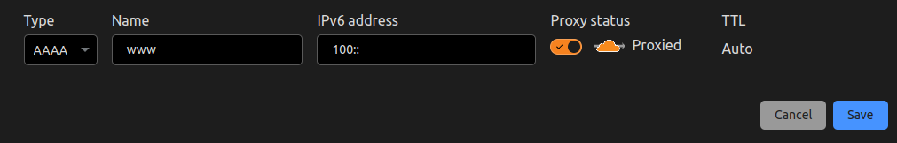
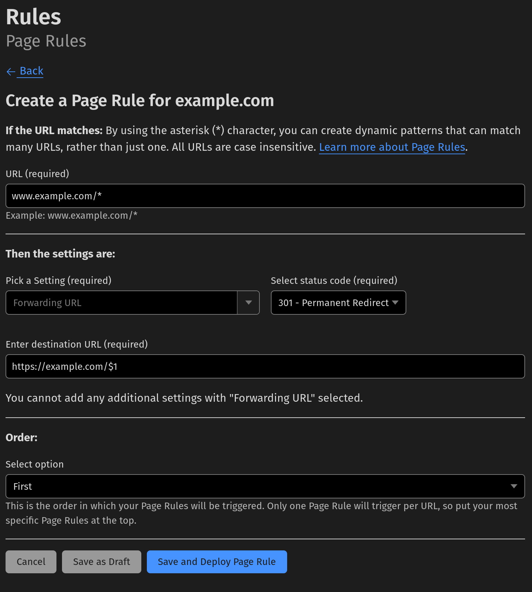

# Redirecting www to domain apex

In this tutorial, you will learn how to redirect the `www` subdomain to your apex domain (`example.com`). This is a common question and can be achieved by using [Page Rules](https://support.cloudflare.com/hc/en-us/articles/218411427).

<Aside type= "note">

Although it is generally recommended to use [Bulk Redirects](./use-bulk-redirects.md) when redirecting between domains, for smaller use cases, such as a single redirect from `www.example.com` to `example.com`, a single Page Rule will work just as well.

</Aside>

To do this, create a DNS record for the `www` subdomain. It must either be an `A` record with the `192.0.2.1` value or an `AAAA` record with the `100::` value. The new DNS record must also have Cloudflare's proxy enabled (orange-clouded) so that it can enact the Page Rule behavior that you will create next.

Next, make the Page Rule which will handle the redirect. For this, you will make it so all paths get redirected and it is done with a 301 (Permanent Redirect). Matching all paths allows for someone visiting `www.example.com/blog/category/example` to be redirected to `example.com/blog/category/example`.

To do this:

1.  Go to **Rules** [in the dashboard](https://dash.cloudflare.com?to=/:account/:zone/rules).
2.  Select **Create Page Rule**.
3.  Set the target to `www.example.com/*`, the `/*` is what matches all paths.
4.  Select *Forwarding URL* from the dropdown and select the **301 - Permanent Redirect** option from the status code dropdown.
5.  Finally, for the Forwarding URL location, set it to `example.com/$1`, the `$1` will be replaced by the wildcard match in target (the `*`).

Finally, select **Save** and wait a few seconds for your rule to propagate.
