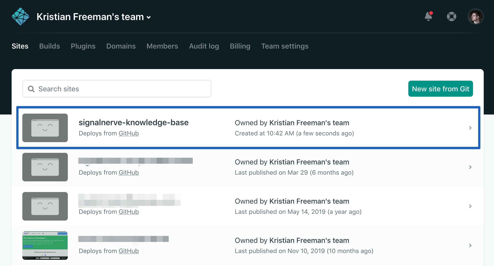
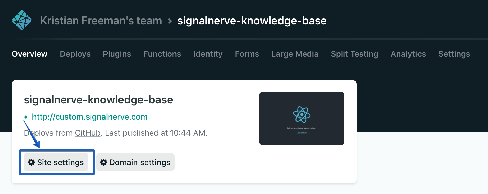
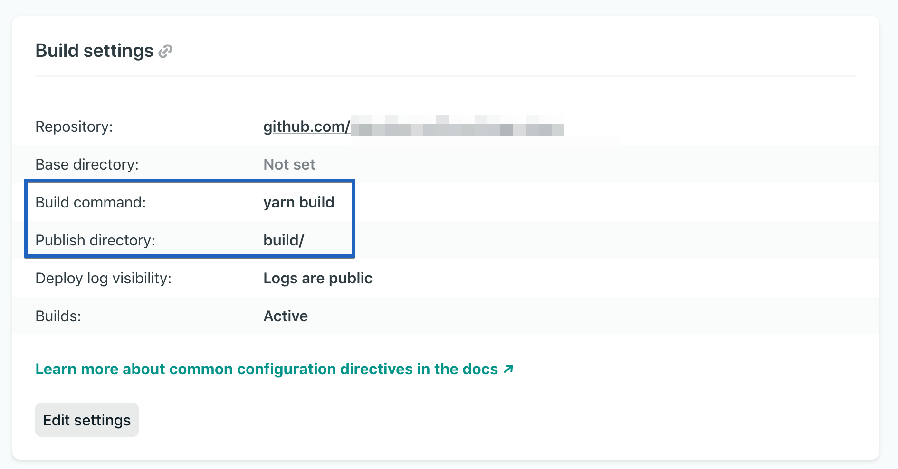

# Migrating from Netlify to Pages

In this tutorial, you will learn how to migrate your Netlify application to Cloudflare Pages.

## Finding your build command and build directory

To move your application to Cloudflare Pages, find your build command and build directory. Cloudflare Pages will use this information to build and deploy your application.

In your Netlify Dashboard, find the project that you want to deploy. It should be configured to deploy from a GitHub repository.

Inside of your site dashboard, select **Site Settings**, and then **Build & Deploy**.

In the **Build & Deploy** tab, find the **Build settings** panel, which will have the **Build command** and **Publish directory** fields. Save these for deploying to Cloudflare Pages. In the below image, **Build command** is `yarn build`, and **Publish directory** is `build/`.

## Migrating redirects and headers

If your site includes a `_redirects` file in your publish directory, you can use the same file in Cloudflare Pages and your redirects will execute successfully. If your redirects are in your `netlify.toml` file, you will need to add them to the `_redirects` folder. Cloudflare Pages currently offers limited [supports for advanced redirects](/pages/platform/redirects/). In the case where you have redirects rules over 100, it is recommended to use [Bulk Redirects](/rules/bulk-redirects/create-dashboard/).

Your header files can also be moved into a `_headers` folder in your publish directory. It is important to note that custom headers defined in the `_headers` file are not currently applied to responses from functions, even if the function route matches the URL pattern. To learn more about how to [handle headers, refer to Headers](/pages/platform/headers/).



Redirects execute before headers. In the case of a request matching rules in both files, the redirect will take precedence.



## Forms

In your form component, remove the `data-netlify = "true"` attribute or the Netlify attribute from the `<form>` tag. You can now put your form logic as a Pages Function and collect the entries to a database or an Airtable. Refer to the [handling form submissions with Pages Functions](/pages/tutorials/forms/) tutorial for more information.

## Serverless functions

Netlify functions and Pages Functions share the same filesystem convention using a `functions` directory in the base of your project to handle your serverless functions. However, the syntax and how the functions are deployed differs. Pages Functions run on Cloudflare Workers, which by default operate on the Cloudflare edge network, and do not require any additional code or configuration for edge deployment.

Cloudflare Pages Functions also provides middleware that can handle any logic you need to run before and/or after your function route handler.

### Functions syntax

Netlify functions export an async event handler that accepts an event and a context as arguments. In the case of Pages Functions, you will have to export a single `onRequest` function that accepts a `context` object. The `context` object contains all the information for the request such as `request`, `env`, `params`, and returns a new Response. Learn more about [writing your first function](/pages/platform/functions/#writing-your-first-function)

Hello World with Netlify functions:
<pre class="CodeBlock CodeBlock-with-rows CodeBlock-scrolls-horizontally CodeBlock-is-light-in-light-theme CodeBlock--language-js" language="js"><code>
exports.handler = async function (event, context) {

  return {

    statusCode: 200,

    body: JSON.stringify({ message: &quot;Hello World&quot; }),

  };

}

</code></pre>

Hello World with Pages Functions:
<pre class="CodeBlock CodeBlock-with-rows CodeBlock-scrolls-horizontally CodeBlock-is-light-in-light-theme CodeBlock--language-js" language="js"><code>
export async function onRequestPost(request) {

  return new Response(`Hello world`);

}

</code></pre>

## Other Netlify configurations

Your `netlify.toml` file might have other configurations that are supported by Pages, such as, preview deployment, specifying publish directory, and plugins. You can delete the file after migrating your configurations.

## Access management

You can migrate your access management to [Cloudflare Zero Trust](/cloudflare-one/) which allows you to manage user authentication for your applications, event logging and requests.

## Creating a new Pages project

Once you have found your build directory and build command, you can move your project to Cloudflare Pages.

The [Get started guide](/pages/get-started/) will instruct you how to add your GitHub project to Cloudflare Pages.

If you choose to use a custom domain for your Pages, you can set it to the same custom domain as your currently deployed Netlify application. When Pages finishes the initial deploy of your site, you will need to delete the Workers application to start sending requests to Cloudflare Pages.

## Cleaning up your old application and assigning the domain

In **DNS** on the Cloudflare dashboard, review that you have updated the CNAME record for your domain from Netlify to Cloudflare Pages. With your DNS record updated, requests will go to your Pages application.

With the above steps completed, you have successfully migrated your Netlify project to Cloudflare Pages.