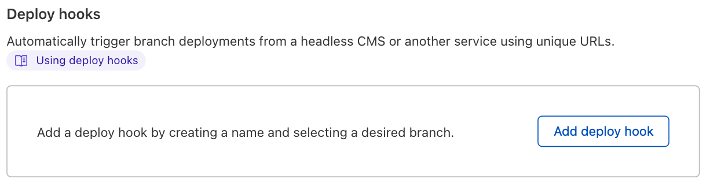
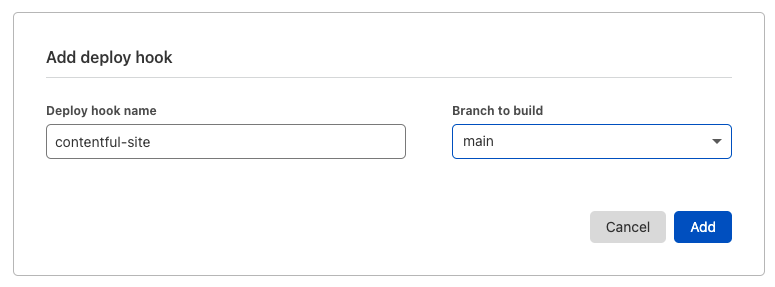
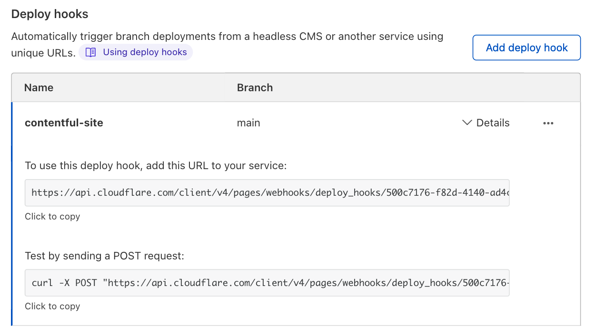
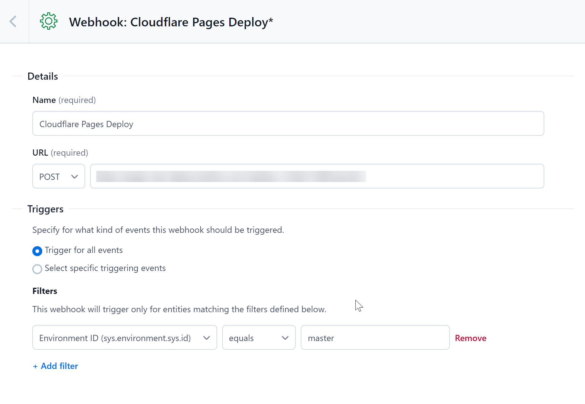
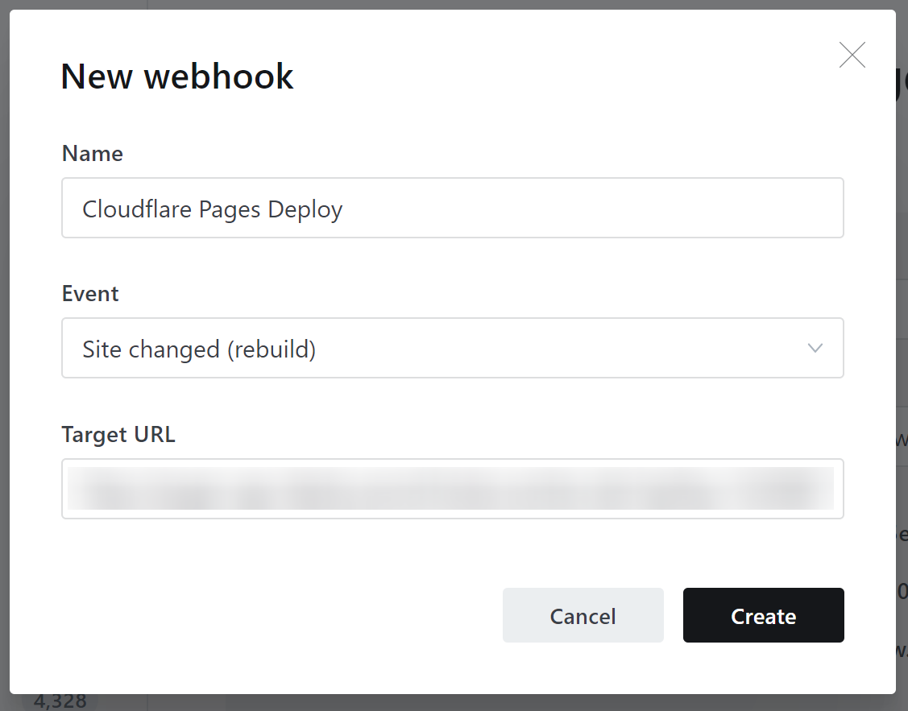
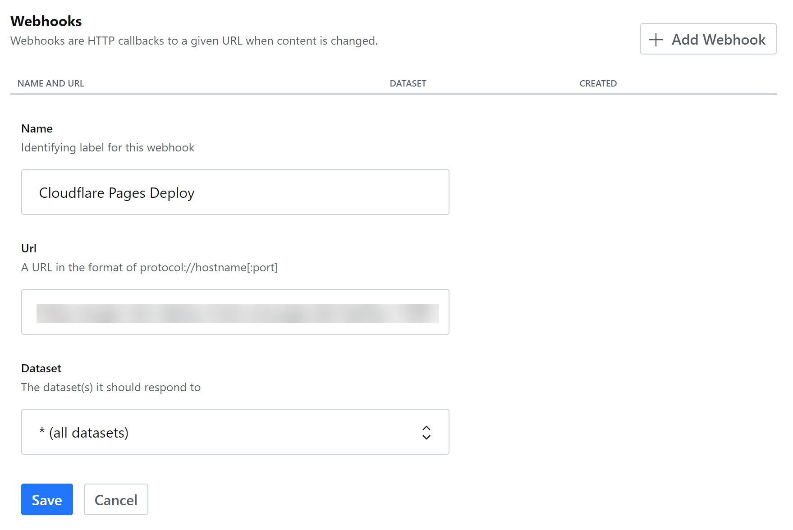
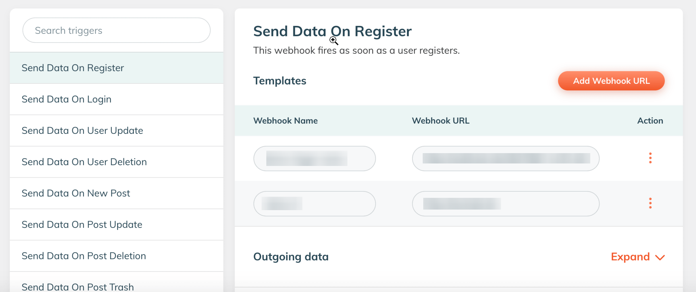
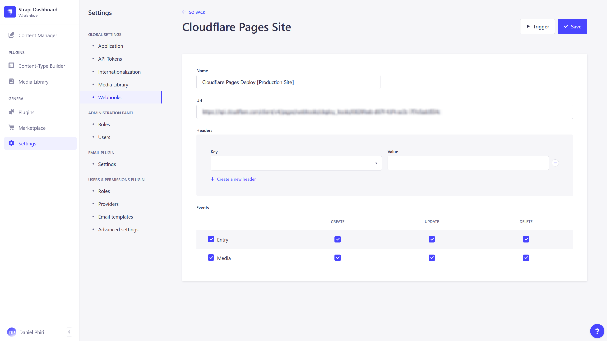

# Deploy Hooks

With Deploy Hooks, you can trigger deployments using event sources beyond commits in your source repository. Each event source may obtain its own unique URL, which will receive HTTP POST requests in order to initiate new deployments. This feature allows you to integrate Pages with new or existing workflows. For example, you may:

*   Automatically deploy new builds whenever content in a Headless CMS changes
*   Implement a fully customized CI/CD pipeline, deploying only under desired conditions
*   Schedule a CRON trigger to update your website on a fixed timeline

To create a Deploy Hook, navigate from **Account Home** to **Pages** and select your desired Pages project. Navigate to **Settings** > **Builds & deployments** and select **Add deploy hook** to start configuration.

## Parameters needed

To configure your Deploy Hook, you must enter two key parameters:

1.  **Deploy hook name:** a unique identifier for your Deploy Hook (for example, `contentful-site`)
2.  **Branch to build:** the repository branch your Deploy Hook should build

## Using your Deploy Hook

Once your configuration is complete, the Deploy Hook’s unique URL is ready to be used. You will see both the URL as well as the POST request snippet available to copy.

Every time a request is sent to your Deploy Hook, a new build will be triggered. Review the **Source** column of your deployment log to see which deployment were triggered by a Deploy Hook.

## Security Considerations

Deploy Hooks are uniquely linked to your project and do not require additional authentication to be used. While this does allow for complete flexibility, it is important that you protect these URLs in the same way you would safeguard any proprietary information or application secret.

If you suspect unauthorized usage of a Deploy Hook, you should delete the Deploy Hook and generate a new one in its place.

## Integrating Deploy Hooks with common CMS platforms

Every CMS provider is different and will offer different pathways in integrating with Pages' Deploy Hooks. The following section contains step-by-step instructions for a select number of popular CMS platforms.

### Contentful

Contentful supports integration with Cloudflare Pages via its **Webhooks** feature. In your Contentful project settings, go to **Webhooks**, create a new Webhook, and paste in your unique Deploy Hook URL in the **URL** field. Optionally, you can specify events that the Contentful Webhook should forward. By default, Contentful will trigger a Pages deployment on all project activity, which may be a bit too frequent. You can filter for specific events, such as Create, Publish, and many others.

### Ghost

You can configure your Ghost website to trigger Pages deployments by creating a new **Custom Integration**. In your Ghost website’s settings, create a new Custom Integration in the **Integrations** page.

Each custom integration created can have multiple **webhooks** attached to it. Create a new webhook with the **Add webhook** button and select **Site changed (rebuild)** as the **Event**. Then paste your unique Deploy Hook URL as the **Target URL** value. After creating this webhook, your Cloudflare Pages application will redeploy whenever your Ghost site changes.

### Sanity

In your Sanity project's Settings page, find the **Webhooks** section, and add the Deploy Hook URL, as seen below. By default, the Webhook will trigger your Pages Deploy Hook for all datasets inside of your Sanity project. You can filter notifications to individual datasets, such as production, using the **Dataset** field:

### WordPress

You can configure WordPress to trigger a Pages Deploy Hook by installing the free **WP Webhooks** plugin. The plugin includes a number of triggers, such as **Send Data on New Post, Send Data on Post Update** and **Send Data on Post Deletion**, all of which allow you to trigger new Pages deployments as your WordPress data changes. Select a trigger on the sidebar of the plugin settings and then [**Add Webhook URL**](https://wordpress.org/plugins/wp-webhooks/), pasting in your unique Deploy Hook URL.

### Strapi

In your Strapi Admin Panel, you can set up and configure webhooks to enhance your experience with Cloudflare Pages. In the Strapi Admin Panel:

1.  Navigate to **Settings**.
2.  Select **Webhooks**.
3.  Select **Add New Webhook**.
4.  In the **Name** form field, give your new webhook a unique name.
5.  In the **URL** form field, paste your unique Cloudflare Deploy Hook URL.

In the Strapi Admin Panel, you can configure your webhook to be triggered based on events. You can adjust these settings to create a new deployment of your Cloudflare Pages site automatically when a Strapi entry or media asset is created, updated, or deleted.

Be sure to add the webhook configuration to the [production](https://strapi.io/documentation/developer-docs/latest/setup-deployment-guides/installation.html) Strapi application that powers your Cloudflare site.

