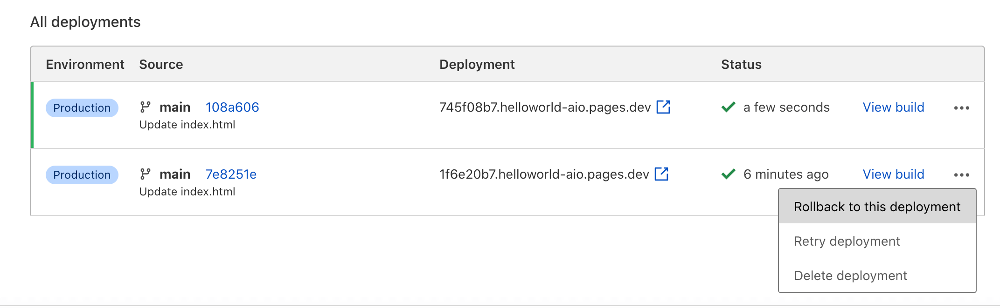

# Rollbacks

Rollbacks allow you to instantly revert your project to a previous production deployment.

Any production deployment that has been successfully built is a valid rollback target. When your project has rolled back to a previous deployment, you may still rollback to deployments that are newer than your current version. Note that preview deployments are not valid rollback targets.

In order to perform a rollback, go to **Deployments** in your Pages project. Browse the **All deployments** list and select  the three dotted actions menu for the desired target. Select **Rollback to this deployment** for a confirmation window to appear. When confirmed, your project's production deployment will change instantly.

## Related resources

*   [Preview Deployments](/platform/preview-deployments)
*   [Pausing Automatic Builds](/platform/git-integration#pausing-automatic-builds)
