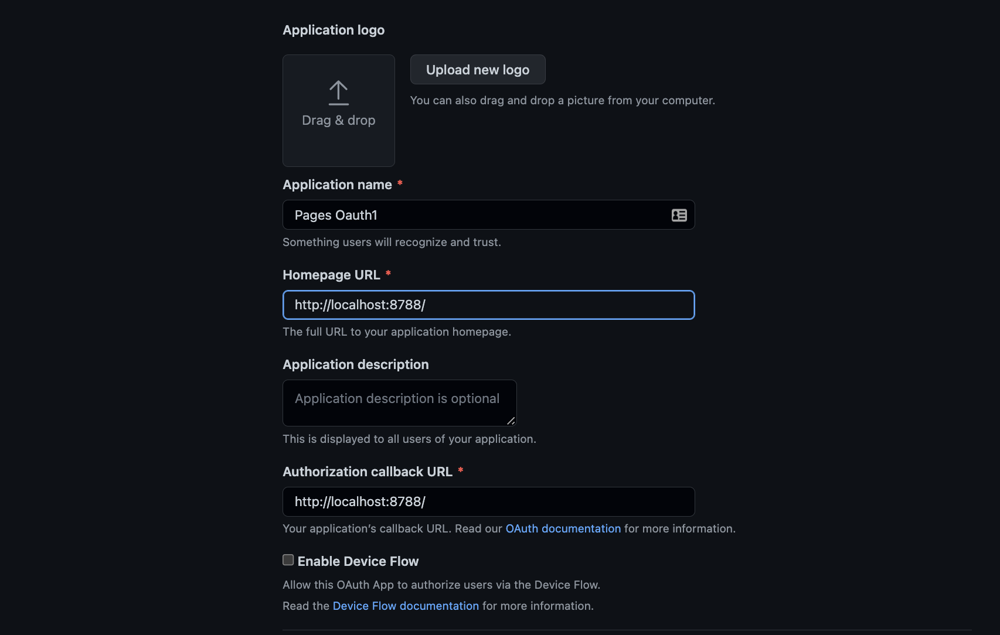

# Add GitHub Oauth authorization with Pages Functions

In most applications we use, there is usually an option to log in or sign up with a 3rd party application like Google, Twitter or GitHub. These options are powered by OAuth, which is an open standard for access delegation, commonly used as a way for internet users to grant websites or applications access to their information on other websites but without giving them the passwords. 

In this tutorial, you will learn how to build authentication into your application using OAuth, GitHub, and handle server requests using [Pages Functions](/pages/platform/functions/)and GitHub credentials.

You'll build an authorization flow to allow users to sign in with GitHub to your application. Once they've signed in, you'll use Pages Functions and Workers KV to store the user's information and make an authorized GitHub API request on their behalf.

You will then encode the user information gotten from GitHub using JSON Web Tokens(JWTs) which allows you to share user secrets securly by encrypting them with a secret key. Then finally show a list of their repositories in a web page.




This tutorial assumes you have registered a GitHub OAuth app. If you have not, [create a new GitHub OAuth app](https://github.com/settings/applications/new) and set your homepage URL and authorization callback URL to your project URL.

You will run your project locally using [Wrangler 2](/pages/platform/functions/#develop-and-preview-locally), which hosts your project at http://localhost:8788/.

Set both URLs to http://localhost:8788/ so you can test locally, this will be changed when you deploy your application to production later in the tutorial.





## Live example

The source code for this application is [available on GitHub](https://github.com/Ekwuno/Cloudflare-functions-Oauth-example). It is a live Pages application with a [live demo](https://test-functions.cloudflare-functions-oauth-example.pages.dev/) available, too. 

## Setup 

To begin, create a `client/index.html` file at the root of your project to serve the static part of your application. Then in the same client directory, create an `index.js` file; this is where you will have your client-side logic.

Before you continue, copy the following content into `client/index.html`: 

```html
---
filename: client/index.html
---
<!DOCTYPE html>
<html lang="en">
<head>
  <meta charset="UTF-8">
  <meta http-equiv="X-UA-Compatible" content="IE=edge">
  <meta name="viewport" content="width=device-width, initial-scale=1.0">
  <link rel="stylesheet" href="style.css">
  <title>Document</title>
</head>
<body>
  <section>
    <a class="btn">Authorize with GitHub</a>
    <button class="btn">Fetch repos</button>
  </section>
  <script src="./index.js" type="module" ></script>
</body>
</html>
```

To style the elements you have in your HTML file, create a `client/style.css` file and add code below:

```css
---
filename: client/style.css
---
body {
  margin: 40px auto;
}

section {
  display: flex;
  align-items: center;
  justify-content: center;
}

.btn {
  margin: 20px;
  font-family: 'Courier New', Courier, monospace;
  text-transform: uppercase;
  text-decoration: none;
  font-size: 16px;
  background-color: #fbeee088;
  border: 2px solid #111;
  border-radius: 5px;
  box-shadow: #111 4px 4px 0 0;
  color: #111;
  cursor: pointer;
  font-weight: 600;
  padding: 0 30px;
  line-height: 50px;
}

.btn:hover {
  background-color: #fff;
}

.btn:active {
  box-shadow: #111 2px 2px 0 0;
  transform: translate(2px, 2px);
}

```

Before setting up your client site functions, you will need to create a `config.js` file at the root of your project to handle all your GitHub app credentials. Then, you will export these credentials to access them anywhere in your application. 

```js
---
filename: /config.js
---
var client_credentials = {
  CLIENT_ID: "********",
  REDIRECT_URL: "http://localhost:8788/",
  AUTHORIZATION_ENDPOINT: "https://github.com/login/oauth/authorize",
  TOKEN_ENDPOINT: "https://github.com/login/oauth/access_token",
  RESOURCE_ENDPOINT: "https://api.github.com/",
};

var server_credentials =  {
  CLIENT_ID: "********",
  CLIENT_SECRET: "***********",
  REDIRECT_URL: "http://localhost:8788/",
  AUTHORIZATION_ENDPOINT: "https://github.com/login/oauth/authorize",
  TOKEN_ENDPOINT: "https://github.com/login/oauth/access_token",
  RESOURCE_ENDPOINT: "https://api.github.com/",
};

export {
  client_credentials,
  server_credentials
}
```




Your `REDIRECT_URL` should be the same URL you used as your callback URL while setting up your application. For the sake of this tutorial and testing locally the `REDIRECT_URL` is set to http://localhost:8788/. However, after testing locally you will update this to the URL of your deployed site.

Since your `CLIENT_SECRET` should not be exposed to the client you will have to define a  credential object specifically for the client and another for the server.




### Developing locally with Wrangler

[Wrangler](/pages/platform/functions/#develop-and-preview-locally) enables you to run your entire application locally and supports secrets, environment variables, KV and Durable Objects.

To be able to install Wrangler you will need a `package.json` file. At the root of your run `npm init -y` to genrate a `package.json` file, this will allow you install more packages later in this tutorial.

Set up Wrangler in your project by running `npm install wrangler@beta` at the root of your project. You can see your project locally by running the following command:

```sh
npx wrangler pages dev ./client 
# client is your output directory 
```

## Get Authorization from OAuth App

The HTML file contains a script that links it to the `index.js` file, where the client-side JavaScript for getting authorization and handling the code coming from your OAuth app will live. 

Before you continue, you will need to install [query-string](https://www.npmjs.com/package/query-string) package, which allows you to parse and stringify URL query strings. Do this by running `npm install query-string` at the root of your project.

In your `index.js` file, import the `config.js` file and `qs` from the query-string library, then set up your authorization logic. 

First, you will need to access your OAuth app through the `AUTHORIZATION_ENDPOINT` then your app will respond with a code that you will then send to the server. 

```js
---
filename: client/index.js
---
import  client_credentials from "../config";
import qs from "query-string";

function  getAppauthorization() {
  const oAuthQueryParams = {
    response_type: "code",
    scope: "user public_repo",
    redirect_url: client_credentials.REDIRECT_URL,
    client_id: client_credentials.CLIENT_ID,
    state: "random_state_string",
  };

  const query = qs.stringify(oAuthQueryParams);
  const url = `${client_credentials.AUTHORIZATION_ENDPOINT}?${query}`;
  const loginLink = document.querySelector("a");
  loginLink.setAttribute("href", url);
}


window.onload = function () {
    getAppauthorization()   
};
```

From the code block above, you will notice we called an onload method to the window, and we do this so the functions will be fired when the whole page has loaded, including all dependent resources such as stylesheets and images. 

Notice the response type is a code; you will need to send this code to the server to be able to get the access token. We need to get the response code from the URL to do this. In the same file create a `handleCode` function and update the `window.onload` function

```js
---
filename: client/index.js
---
function handleCode(){
  const parsedQuery = qs.parseUrl(window.location.href)

  if(parsedQuery.query.code){
    sendCodeToServer()
  }else{
    throw new Error("No code found in url")
  }

  async function sendCodeToServer(){
    const server = "/api/code"
    try {
      const res = await fetch(server,{
        method: "POST",
        body: JSON.stringify({
          code: parsedQuery.query.code,
          state: parsedQuery.query.state
        }),
        headers:{'Content-Type' :'application/json' }
      })
      
      const data = await res.json() 
      window.location.href = client_credentials.REDIRECT_URL;
      
    } catch (error) {
      console.log(error)
    }
  }
}

window.onload = function () {
    getAppauthorization();
    handleCode();   
};
```

Your `/client/index.js` file should now look like this:

```js
---
filename: client/index.js
---
import  client_credentials from "../config";
import qs from "query-string";

function  getAppauthorization() {
  const oAuthQueryParams = {
    response_type: "code",
    scope: "user public_repo",
    redirect_url: client_credentials.REDIRECT_URL,
    client_id: client_credentials.CLIENT_ID,
    state: "random_state_string",
  };

  const query = qs.stringify(oAuthQueryParams);
  const url = `${client_credentials.AUTHORIZATION_ENDPOINT}?${query}`;
  const loginLink = document.querySelector("a");
  loginLink.setAttribute("href", url);
}

function handleCode(){
  const parsedQuery = qs.parseUrl(window.location.href)

  if(parsedQuery.query.code){
    sendCodeToServer()
  }else{
    throw new Error("No code found in url")
  }

  async function sendCodeToServer(){
    const server = "/api/code"
    try {
      const res = await fetch(server,{
        method: "POST",
        body: JSON.stringify({
          code: parsedQuery.query.code,
          state: parsedQuery.query.state
        }),
        headers:{'Content-Type' :'application/json' }
      })
      
      const data = await res.json() 
      window.location.href = client_credentials.REDIRECT_URL;
      
    } catch (error) {
      console.log(error)
    }
  }
}

window.onload = function () {
    getAppauthorization();
    handleCode();   
};
```

In the code block above, you will notice that we send the code to `/api/code`. This is the route where our serverless code will be. 


## Setting up Server with Functions

Cloudflare Pages offers [Functions](/pages/platform/functions/) which enable you to run server-side code to enable dynamic functionality without running a dedicated server. You can handle tasks like authentication, querying databases or other applications.

In this tutorial, we will be using Functions to handle exchanging our code for an Access Token, signing JWTs, authenticating users, and querying GitHub for resources using the authenticated user's details.

To setup your Functions first create a `functions` folder. Functions are linked to the `functions` directory and conveniently construct URL request handlers in relation to the `functions` file structure. For example, the `functions/about.js` file will map to the `/about` URL. Refer to the [Functions routing](/pages/platform/functions/#functions-routing) documentation for more information.

The code from your OAuth App is sent to `/api/code`; you must create a `functions/api/code.js` file at the root of your project. Your file structure should look like this now:

```txt
├── ...
├── functions
|   └── api
|         └── Code.js
├── Client
|   └── index.html
|   └── index.js
├── config.js
└── ...
``` 

The `handleCode` function will send `POST` requests, which means that the `functions/api/code.js` file needs to export an `onRequestPost` handler:

```js
---
filename: functions/api/code.js
---
/**
 * POST /api/code
 */

export async function onRequestPost(context) {
  /** TODO:
   * 1. Exchange code for access token 
   * 2. Use access token to fetch user info
   * 3. encode user info as JWT
   */
}
```

The `context` parameter is an object filled with several values of potential interest. For this example, you only need the [`request`](/workers/runtime-apis/request/) and [`env`](/pages/platform/functions/#writing-your-first-function), properties:

In your client-side JavaScript code, you made a POST request to `/api/code`, sending the GitHub authorization code. In this file, you will set up the corresponding function, using `onRequestPost`. 

In that function, you can access the authorization code by parsing the request body as JSON. You can then pass the code to a function, to exchange it for a GitHub access token:

```js
---
filename: functions/api/code.js
---
export async function onRequestPost({ request, env }) {
  try {
    const body = await request.json();
    const token = await exchangeCodeForToken(body.code);
  } catch (error) {
    console.log(error);
    return new Response(JSON.stringify({ error }));
  }
}
```

### Exchanging the code from your OAuth app for Access token

In the same `code.js` file, you will create an async function called `exchangeCodeForToken` that will take the code as an argument. You will need to use the config file parameters to query the `TOKEN_ENDPOINT` and send the other parameters as the body. The response to this will be an object, you will use the query string package to parse the response. 

Import qs from "query-string" and called the `.parse` method on the response; you can get the access token by getting the value of `access_token`. As seen in the code block below: 

```js
---
filename: functions/api/code.js
---
import qs from "query-string";

//...

async function exchangeCodeForToken(code) {
  const TokenURL = server_credentials.TOKEN_ENDPOINT;
  const oAuthQueryParams = {
    grant_type: "authorization_code",
    redirect_url: server_credentials.REDIRECT_URL,
    client_id: server_credentials.CLIENT_ID,
    client_secret: server_credentials.CLIENT_SECRET,
    code: code,
  };

  const res = await fetch(TokenURL, {
    body: JSON.stringify(oAuthQueryParams),
    method: "POST",
    headers: { "Content-Type": "application/json" },
  });

  const data = await res.text();
  const parsedData = qs.parse(data);
  return parsedData.access_token;
}
```

### Use the Access token to fetch user information

Now that you have the access token, you can use it to query user information. As mentioned, your config file will be your access point to GitHub. Create a `fetchUser` function, and this will take the access token as an argument.

In the fetchUser function, you will need to construct a user URL using your `RESOURCE_ENDPOINT` and a user parameter like `server_credentials.RESOURCE_ENDPOINT + "user";`. The authorization object value will be your Access token. The `onRequestPost` function will need to be updated to await your `fetchUser` function.


```js
---
filename: functions/api/code.js
highlight: [5,32,33,34,35,36,37,38,39,40,41,42,43,44,45,46,47,48,49]
---
export async function onRequestPost({ request, env }) {
  try {
    const body = await request.json();
    const token = await exchangeCodeForToken(body.code);
    const user = await fetchUser(token); 
  } catch (error) {
    return new Response(JSON.stringify({ error }));
  }
}

async function exchangeCodeForToken(code) {
  const TokenURL = server_credentials.TOKEN_ENDPOINT;
  const oAuthQueryParams = {
    grant_type: "authorization_code",
    redirect_url: server_credentials.REDIRECT_URL,
    client_id: server_credentials.CLIENT_ID,
    client_secret: server_credentials.CLIENT_SECRET,
    code: code,
  };

  const res = await fetch(TokenURL, {
    body: JSON.stringify(oAuthQueryParams),
    method: "POST",
    headers: { "Content-Type": "application/json" },
  });

  const data = await res.text();
  const parsedData = qs.parse(data);
  return parsedData.access_token;
}

async function fetchUser(token) {
  const userURL = server_credentials.RESOURCE_ENDPOINT + "user";
  const res = await fetch(userURL, {
    headers: {
      Authorization: `token ${token}`,
      /* A User-Agent is required to let the servers identify the application. The value can be unqiue
      when communicating with 3rd party API like GitHub using Pages Functions add a user agent. 
      To learn more about this check https://developer.mozilla.org/en-US/docs/Web/HTTP/Headers/User-Agent
      */
      "User-Agent": "Pages Functions",
    },
  });

  const data = await res.json();
  return data;
}
```

### Encode User information with a JSON Web Token

A user's information is sensitive and will be used on the client-side. To ensure that this information is secure and isn't manipulated by a 3rd party, we will use JSON Web Tokens (JWTs).

A [JSON Web Token](https://jwt.io/introduction) is a proposed Internet standard for creating data with an optional signature, and optional encryption, whose payload holds JSON that asserts some number of claims to resources.

We will use [Cloudflare Worker JWT](https://www.npmjs.com/package/@tsndr/cloudflare-worker-jwt), a lightweight NPM package for JWT implementation. This package can be installed by running `npm i -D @tsndr/cloudflare-worker-jwt` at the root of your project.

After installing, in `/api/code` import `jwt` from the the Cloudflare-Worker-JWT package to encode and decode the JWT. 

JWTs are usually created by signing a Payload with a secret. The payload will be the user information, and you will assign the secret key. In this case, we will define a secret key, in your `.env` file.

```txt
---
filename: .env
---
myVerySecretString = "*********"
```

Your secret key can be any set of strings and will be available in the `code.js` file, using `env`.

```js
---
filename: functions/api/code.js
highlight: [11]
---
import jwt from "@tsndr/cloudflare-worker-jwt";
import server_credentials from "../config";
import qs from "query-string";

export async function onRequestPost({ request, env }) {
  try {
    const body = await request.json();
    console.log(body) 
    const token = await exchangeCodeForToken(body.code);
    const user = await fetchUser(token);
    const jwtencoded = await encodeJWT(user, env.myVerySecretString);
    return new Response(JSON.stringify({ jwtencoded }),
    {
      headers: {
        "Content-Type": "application/json",
      }
    });
  } catch (error) {
    console.log(error);
    return new Response(JSON.stringify({ error }));
  }
}

//....

async function encodeJWT(user, token) {
  const jwtPayload = {
    login: user.login,
    id: user.id,
    avatar_url: user.avatar_url,
  };
  
  return jwt.sign(jwtPayload, token);
}

```


## Cache user information in Workers KV

[Workers KV](/workers/runtime-apis/kv/) is a global low-latency, key-value data store. It can be used to cache information that has been received from a server, and in this case, you will use it to cache user information. 

You will use the `env` argument to access your Workers KV store. You can set data to Workers KV using the `.put` method. which takes the first value as a string which is callled a key, and then the next value can be a string as well but in this case JSON which is called a value. 

In the server we want to use the user ID as the key, and stringify the user information and access token as the value.

Since the user information is cached in Workers KV, we will not need to make any network request to GitHub for the user info if we want to fetch for repos, as you will see in the next section. With our user information cached in Workers KV, we can use it to an authorized request to GitHub for a list of the user's repositories.

```js
---
filename: functions/api/code.js
highlight: [8,9,10,11]
---
export async function onRequestPost({ request, env }) {
  try {
    const body = await request.json(); 
    const token = await exchangeCodeForToken(body.code);
    const user = await fetchUser(token);
    const jwtencoded = await encodeJWT(user, myVerySecretString);

    await env.kv_userDatabase.put(
      `${user.id}`,
      JSON.stringify({ user, token })
    ) 

    console.log(jwtencoded);
    return new Response(JSON.stringify({ jwtencoded }),
    {
      headers: {
        "Content-Type": "application/json",
      }
    });
  } catch (error) {
    console.log(error);
    return new Response(JSON.stringify({ error }));
  }
}
```

To access your Workers KV namespace when using Wrangler locally, update your run command to:

```sh
# Bind to a KV store
npx wrangler pages dev ./client --kv KV_NAMESPACE
```

## Use JWT for client login validation and fetching User Repos 

While you can use JWTs for validating users, you can also use them to know when a user is logged in or not and then give them access to other parts of your application based on this JWT. 

In your application, you can do this by setting the JWT to localStorage. In the `client/index.js` file, you will update your `handleCode` function to set the encoded JWT from the server to a JWT value: 

```js
---
filename: client/index.js
highlight: [22]
---
function handleCode(){
  const parsedQuery = qs.parseUrl(window.location.href)

  if(parsedQuery.query.code){
    sendCodeToServer()
  }else{
    throw new Error("No code found in url")
  }

  async function sendCodeToServer(){
    const server = "/api/code"
    try {
      const res = await fetch(server,{
        method: "POST",
        body: JSON.stringify({
          code: parsedQuery.query.code,
          state: parsedQuery.query.state
        }),
        headers:{'Content-Type' :'application/json' }
      })
      
      const data = await res.json() 
      localStorage.setItem("jwt", data.jwtencoded);
      window.location.href = client_credentials.REDIRECT_URL;
      
    } catch (error) {
      console.log(error)
    }
  }
}
```

### Allowing access to routes based on JWT

Since we authenticate using a JWT, we can create some restrictions based on the presence of this JWT. For example, in the `client/index.html` file, we have a "Fetch repos" button, and we can make this button inaccessible if the JWT isn't present. 

To do this, we'll create a new function that will conditionally show the "Fetch repos" button based on the presence of a `jwt` key in `localStorage`. If the `jwt` is found, we'll add a new event listener that calls the `fetchRepos` function when the button is clicked:

```js
---
filename: client/index.js
---
function ProtectedTask(){
  const requestButton = document.querySelector("button");

  requestButton.style.display = "none";

  if (localStorage.getItem("jwt")) {
    requestButton.style.display = "block";
    requestButton.addEventListener("click", function () {
      fetchRepos();
    });
  }
}
```

Make a new `fetchRepos` function, which makes a request to the `/api/repos` endpoint, using `jwt` as part of the `Authorization` header:

```js
async function fetchRepos() {
  const server = "/api/repos";
  try {
    const res = await fetch(server, {
      headers: { Authorization: `Bearer ${localStorage.getItem("jwt")}` },
    });

    const data = await res.json();
    /*
    Todo:
       We will get the list of Repos from the data layer later, first we need
       to set this up in the server . This function is not finished until we implement the server-side code
    */

  } catch (error) {
    console.log(error);
  }
}
```

### Fetch and list Repos 

You now have your user information and can now use that to get repos. Since you are making a `GET` request, you will need to send this request to another server route. The `fetchRepos` function will make a `GET` request to `/api/repos`, a function route that fetches the repos. 

Create a `functions/api/repos.js` file, and export an async `onRequestGet` function to match the `GET` request. 

```js
---
filename: functions/api/repos.js
---
export async function onRequestGet({ request, env }) {
   /** TODO:
   * 1. Get JWT from Localstorage
   * 2. Verify  and decode JWT
   * 3. Fetch repos
   */
}
```

First, you will get the JWT from the client, verify and decode it. You will then be allowed to fetch repos. 

The request header contains the JWT, and then you will verify it with the `.verify` method, which takes the JWT token and your secret string as an argument.

If the JWT isn't valid, you can return a `401` status code. If it is, use the `.decode` method to decode it, then use the ID from the payload as a key to fetch from Workers KV. You can then pass the user token to a `showRepo` function that fetches the repos.

```js
---
filename: functions/api/repos.js
---
import jwt from "@tsndr/cloudflare-worker-jwt";
import { myVerySecretString } from "./code";
import server_credentials from "../config";

export async function onRequestGet({ request, env }) {
  try {
    const token = request.headers.get("Authorization").split(" ")[1];

    // verify JWT
    const verifiedJWT = await jwt.verify(token, myVerySecretString)
    if (!verifiedJWT) {
      return new Response("Not valid JWT", {status: 401})
    }
    
    const decodedJwt = jwt.decode(token)

    const user = await env.kv_userDatabase.get(`${decodedJwt.id}`, "json")

    if (!user) {
      return new Response("User not found", {status: 404})
    }

    const repos = await showRepos(user.token);
    return new Response(JSON.stringify(repos));
  } catch (error) {
    return new Response(JSON.stringify({ error }));
  }
}

```

As mentioned, the `showRepos` function takes the user token as an argument, and then you will construct a URL with the `RESOURCE_ENDPOINT` and user repo query string. The response will return a list of repos as a JSON object.

```js
---
filename: functions/api/repos.js
---
async function showRepos(token) {
   const url = `${server_credentials.RESOURCE_ENDPOINT}user/repos?sort=created&direction=asc`;
   const res = await fetch(url, {
     headers: {
       Authorization: `Bearer ${token}`,
       "user-agent": "Pages Functions"
     },
   });

   const data = await res.json();
   return data;
 }

```

### Show list of repos 

The list of repos is now a JSON Object that can be used in the response in the client. By iterating over the response from the server, you will create an element using the `createElement` method and setting the HTML of the element created to the value of the response.

```js
---
filename: functions/api/repos.js
highlight: [10,11,12,13,14]
---
async function fetchRepos() {
  const server = "http://localhost:8788/api/repos";
  try {
    const res = await fetch(server, {
      headers: { Authorization: `Bearer ${localStorage.getItem("jwt")}` },
    });

    const data = await res.json();

    for( var i of data){
      const repo = document.createElement("div")
      repo.innerHTML = i.name
      document.body.appendChild(repo)
    }
  } catch (error) {
    console.log(error);
  }
}
```

## Deploy to Cloudflare Pages

So far, you have been testing locally with Wrangler. To have a production site you can deploy to Cloudflare Pages using GitHub or GitLab. After creating a new repository, prepare and push your local application to GitHub.

Deploy you site by logging into the [Cloudflare dashboard](https://dash.cloudflare.com/) > **Account Home** > **Pages** and selecting **Create a project**. Select the new GitHub repository that you created and, in the **Set up builds and deployments** section, provide the following information:

<div>

| Configuration option | Value           |
| -------------------- | --------------- |
| Production branch    | `main`          |
| Framework preset     | `None`          |
| Build command        | ``              |
| Build directory      | `client`        |

</div>

In the **Environment variables (advanced)** section add the variable name and value as it is in your `.env` file to be able to use in production and preview. Then click save and deploy

### Update Homepage and Authorization callback URL in OAuth app

In your OAuth App you have set the authorization callback URL and HomePage URL to `http://localhost:8788/` while working in dev mode, now you will have to update this URL to the URL of your deployed Pages project. 

By doing this, you will enable your OAuth app interact with your project as expected.

### Update KV bindings 

After you have deployed your application, you will have to update your KV bindings. Currently, there is no way to automatically move the binding from your `.mf` folder to the dashboard. 
 

To add your KV bindings Within Pages, first create your KV namespace by going to **Workers** > **KV** > **Create Namespace**. 



The KV Namespace on Pages must be the same as the Namespace used in your local environment.



After creating your namespace, choose from the list of KV namespaces that you created from the dashboard by going to **your Pages project** > **Settings** > **Functions** > **KV namespace bindings**. 

Select *Add binding* and input a Variable name, and select a KV namespace from the list of your existing Workers KV namespaces. You will need to repeat this for both the Production and Preview environments.

# Conclusion

In this tutorial, you built and deployed an OAuth app and its back-end logic using Cloudflare Pages with its Workers integration. You created serverless routes that handled Authentication, fetched user information, encoded user information as JWTs and used KV to cache the user information from GitHub. 


## Related resources

- [Functions](/pages/platform/functions/)
- [HTML Forms](/pages/tutorials/forms/)
- [Build API with Workers](/pages/tutorials/build-an-api-with-workers)
