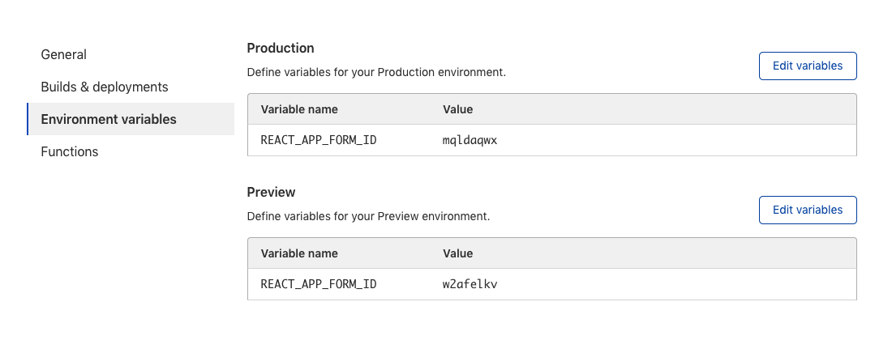

# Add a React form with Formspree

Almost every React website needs a form to collect user data. [Formspree](https://formspree.io/) is a back-end service that handles form processing and storage, allowing developers to include forms on their website without writing server-side code or functions.

In this tutorial, you will create a `<form>` component using React and add it to a single page application built with `create-react-app`. Though you are using `create-react-app` (CRA), the concepts will apply to any React framework including Next.js, Gatsby, and more. You will use Formspree to collect the submitted data and send out email notifications when new submissions arrive, without requiring any server-side coding.

You will deploy your site to Cloudflare Pages. Refer to the [Get started guide](/pages/get-started/) to familiarize yourself with the platform.

## Setup

To begin, create a new React project on your local machine with `create-react-app`. Then create a [new GitHub repository](https://repo.new/), and attach the GitHub location as a remote destination:
<pre class="CodeBlock CodeBlock-with-rows CodeBlock-scrolls-horizontally CodeBlock-is-light-in-light-theme CodeBlock--language-sh" language="sh"><code>
# create new project with create-react-app

$ npx create-react-app new-app

# enter new directory

$ cd new-app

# attach git remote

$ git remote add origin git@github.com:&ltusername&gt/&ltrepo&gt.git

# change default branch name

$ git branch -M main

</code></pre>

You may now modify the React application in the `new-app` directory you created.

## The front-end code

The starting point for `create-react-app` includes a simple Hello World website. You will be adding a Contact Us form that accepts a name, email address, and message. The form code is adapted from the HTML Forms tutorial. For a more in-depth explanation of how HTML forms work and additional learning resources, refer to the [HTML Forms tutorial](/pages/tutorials/forms/).

First, create a new react component called `ContactForm.js` and place it in the `src` folder alongside `App.js`.

    project-root/
    ├─ package.json
    └─ src/
       ├─ ContactForm.js
       ├─ App.js
       └─ ...

Next, you will build the form component using a helper library from Formspree, [`@formspree/react`](https://github.com/formspree/formspree-react). This library contains a `useForm` hook to simplify the process of handling form submission events and managing form state.

Install it with:
<pre class="CodeBlock CodeBlock-with-rows CodeBlock-scrolls-horizontally CodeBlock-is-light-in-light-theme CodeBlock--language-bash" language="bash"><code>
npm install --save @formspree/react
</code></pre>

Then paste the following code snippet into the `ContactForm.js` file:
<pre class="CodeBlock CodeBlock-with-rows CodeBlock-scrolls-horizontally CodeBlock-is-light-in-light-theme CodeBlock--language-jsx" language="jsx"><code>
import { useForm, ValidationError } from '@formspree/react';

export default function ContactForm() {

  const [state, handleSubmit] = useForm('YOUR_FORM_ID');

  if (state.succeeded) {

    return &ltp&gtThanks for your submission!&lt/p&gt;

  }

  return (

    &ltform method=&quot;POST&quot; onSubmit={handleSubmit}&gt

      &ltlabel htmlFor=&quot;name&quot;&gtFull Name&lt/label&gt

      &ltinput id=&quot;name&quot; type=&quot;text&quot; name=&quot;name&quot; required /&gt

      &ltValidationError prefix=&quot;Name&quot; field=&quot;name&quot; errors={state.errors} /&gt

      &ltlabel htmlFor=&quot;email&quot;&gtEmail Address&lt/label&gt

      &ltinput id=&quot;email&quot; type=&quot;email&quot; name=&quot;email&quot; required /&gt

      &ltValidationError prefix=&quot;Email&quot; field=&quot;email&quot; errors={state.errors} /&gt

      &ltlabel for=&quot;message&quot;&gtMessage&lt/label&gt

      &lttextarea id=&quot;message&quot; name=&quot;message&quot; required&gt&lt/textarea&gt

      &ltValidationError prefix=&quot;Message&quot; field=&quot;message&quot; errors={state.errors} /&gt

      &ltbutton type=&quot;submit&quot; disabled={state.submitting}&gt

        Submit

      &lt/button&gt

      &ltValidationError errors={state.errors} /&gt

    &lt/form&gt

  );

}
</code></pre>

Currently, the form contains a placeholder `YOUR_FORM_ID`. You replace this with your own form endpoint later in this tutorial.

The `useForm` hook returns a `state` object and a `handleSubmit` function which you pass to the `onSubmit` form attribute. Combined, these provide a way to submit the form data via AJAX and update form state depending on the response received.

For clarity, this form does not include any styling, but in the GitHub project (<https://github.com/formspree/formspree-example-cloudflare-react>) you can review an example of how to apply styles to the form.



`ValidationError` components are helpers that display error messages for field errors, or general form errors (if no `field` attribute is provided). For more information on validation, refer to the [Formspree React documentation](https://help.formspree.io/hc/en-us/articles/360055613373-The-Formspree-React-library#validation).



To add this form to your website, import the component:
<pre class="CodeBlock CodeBlock-with-rows CodeBlock-scrolls-horizontally CodeBlock-is-light-in-light-theme CodeBlock--language-jsx" language="jsx"><code>
import ContactForm from './ContactForm';
</code></pre>

Then insert the form into the page as a react component:
<pre class="CodeBlock CodeBlock-with-rows CodeBlock-scrolls-horizontally CodeBlock-is-light-in-light-theme CodeBlock--language-jsx" language="jsx"><code>
&ltContactForm /&gt
</code></pre>

For example, you can update your `src/App.js` file to add the form:
<pre class="CodeBlock CodeBlock-with-rows CodeBlock-scrolls-horizontally CodeBlock-is-light-in-light-theme CodeBlock--language-jsx" language="jsx"><code>
import ContactForm from './ContactForm'; // &lt-- import the form component

import logo from './logo.svg';

import './App.css';

function App() {

  return (

    &ltdiv className=&quot;App&quot;&gt

      &ltheader className=&quot;App-header&quot;&gt

        &ltimg src={logo} className=&quot;App-logo&quot; alt=&quot;logo&quot; /&gt

        &ltp&gt

          Edit &ltcode&gtsrc/App.js&lt/code&gt and save to reload.

        &lt/p&gt

        &lta

          className=&quot;App-link&quot;

          href=&quot;https://reactjs.org&quot;

          target=&quot;_blank&quot;

          rel=&quot;noopener noreferrer&quot;

        &gt

          Learn React

        &lt/a&gt

        {/* your contact form component goes here */}

        &ltContactForm /&gt

      &lt/header&gt

    &lt/div&gt

  );

}

export default App;
</code></pre>

Now you have a single-page application containing a Contact Us form with several fields for the user to fill out. However, you have not set up the form to submit to a valid form endpoint yet. You will do that in the [next section](#the-formspree-back-end).



The source code for this example is [available on GitHub](https://github.com/formspree/formspree-example-cloudflare-react). It is a live Pages application with a [live demo](https://formspree-example-cloudflare-react.pages.dev/) available, too.



## The Formspree back end

The React form is complete, however, when the user submits this form, they will get a `Form not found` error. To fix this, create a new Formspree form, and copy its unique ID into the form's `useForm` invocation.

To create a Formspree form, sign up for [an account on Formspree](https://formspree.io/register). Then create a new form with the **+ New form** button. Name your new form `Contact-us form` and update the recipient email to an email where you wish to receive your form submissions. Finally, select **Create Form**.

You will be presented with instructions on how to integrate your new form. Copy the form’s `hashid` (the last 8 alphanumeric characters from the URL) and paste it into the `useForm` function in the `ContactForm` component you created above.

Your component should now have a line like this:
<pre class="CodeBlock CodeBlock-with-rows CodeBlock-scrolls-horizontally CodeBlock-is-light-in-light-theme CodeBlock--language-jsx" language="jsx"><code>
const [state, handleSubmit] = useForm('mqldaqwx');

/* replace the random-like string above with your own form's ID */
</code></pre>

Now when you submit your form, you should be shown a Thank You message. The form data will be submitted to your account on [Formspree.io](https://formspree.io/).

From here you can adjust your form processing logic to update the [notification email address](https://help.formspree.io/hc/en-us/articles/115008379348-Changing-a-form-email-address), or add plugins like [Google Sheets](https://help.formspree.io/hc/en-us/articles/360036563573-Use-Google-Sheets-to-send-your-submissions-to-a-spreadsheet), [Slack](https://help.formspree.io/hc/en-us/articles/360045648933-Send-Slack-notifications), and more.

For more help setting up Formspree, refer to the following resources:

- For general help with Formspree, refer to the [Formspree help site](https://help.formspree.io/hc/en-us).
- For more help creating forms in React, refer to the [formspree-react documentation](https://help.formspree.io/hc/en-us/articles/360055613373-The-Formspree-React-library)
- For tips on integrating Formspree with popular platforms like Next.js, Gatsby and Eleventy, refer to the [Formspree guides](https://formspree.io/guides).

## Deployment

You are now ready to deploy your project.

If you have not already done so, save your progress within `git` and then push the commit(s) to the GitHub repository:
<pre class="CodeBlock CodeBlock-with-rows CodeBlock-scrolls-horizontally CodeBlock-is-light-in-light-theme CodeBlock--language-sh" language="sh"><code>
# Add all files

$ git add -A

# Commit w/ message

$ git commit -m &quot;working example&quot;

# Push commit(s) to remote

$ git push -u origin main

</code></pre>

Your work now resides within the GitHub repository, which means that Pages is able to access it too.

If this is your first Cloudflare Pages project, refer to the [Get started guide](/pages/get-started/) for a complete walkthrough. After selecting the appropriate GitHub repository, you must configure your project with the following build settings:

- **Project name** – Your choice
- **Production branch** – `main`
- **Framework preset** – Create React App
- **Build command** – `npm run build`
- **Build output directory** – `build`

After selecting **Save and Deploy**, your Pages project will begin its first deployment. When successful, you will be presented with a unique `*.pages.dev` subdomain and a link to your live demo.

## Using environment variables with forms

Sometimes it is helpful to set up two forms, one for development, and one for production. That way you can develop and test your form without corrupting your production dataset, or sending test notifications to clients.

To set up production and development forms first create a second form in Formspree. Name this form Contact Us Testing, and note the form's [`hashid`](https://help.formspree.io/hc/en-us/articles/360015130174-Getting-your-form-s-hashid-).

Then change the `useForm` hook in your `ContactForm.js` file so that it is initialized with an environment variable, rather than a string:
<pre class="CodeBlock CodeBlock-with-rows CodeBlock-scrolls-horizontally CodeBlock-is-light-in-light-theme CodeBlock--language-jsx" language="jsx"><code>
const [state, handleSubmit] = useForm(process.env.REACT_APP_FORM_ID);
</code></pre>

In your Cloudflare Pages project settings, add the `REACT_APP_FORM_ID` environment variable to both the Production and Preview environments. Use your original form's `hashid` for Production, and the new test form's `hashid` for the Preview environment:

Now, when you commit and push changes to a branch of your git repository, a new preview app will be created with a form that submits to the test form URL. However, your production website will continue to submit to the original form URL.



Create React App uses the prefix `REACT_APP_` to designate environment variables that are accessible to front-end JavaScript code. A different framework will use a different prefix to expose environment variables. For example, in the case of Next.js, the prefix is `NEXT_PUBLIC_`. Consult the documentation of your front-end framework to determine how to access environment variables from your React code.



In this tutorial, you built and deployed a website using Cloudflare Pages and Formspree to handle form submissions. You created a React application with a form that communicates with Formspree to process and store submission requests and send notifications.

If you would like to review the full source code for this application, you can find it on [GitHub](https://github.com/formspree/formspree-example-cloudflare-react).

## Related resources

- [Add an HTML form with Formspree](/pages/tutorials/add-an-html-form-with-formspree/)
- [HTML Forms](/pages/tutorials/forms/)
