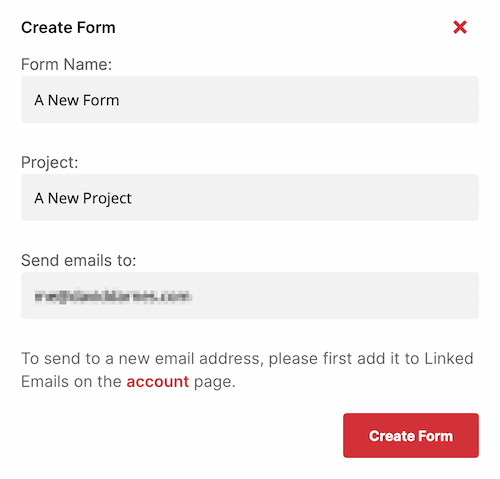
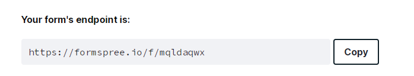

# Add an HTML form with Formspree

Almost every website, whether it is a simple HTML portfolio page or a complex JavaScript application, will need a form to collect user data. [Formspree](https://formspree.io) is a back-end service that handles form processing and storage, allowing developers to include forms on their website without writing server-side code or functions.

In this tutorial, you will create a `<form>` using plain HTML and CSS and add it to a static HTML website hosted on Cloudflare Pages. Refer to the [Get started guide](/pages/get-started/) to familiarize yourself with the platform. You will use Formspree to collect the submitted data and send out email notifications when new submissions arrive, without requiring any JavaScript or back-end coding.

## Setup

To begin, create a [new GitHub repository](https://repo.new/). Then create a new local directory on your machine, initialize git, and attach the GitHub location as a remote destination:
<pre class="CodeBlock CodeBlock-with-rows CodeBlock-scrolls-horizontally CodeBlock-is-light-in-light-theme CodeBlock--language-sh" language="sh"><code>
# create new directory

$ mkdir new-project

# enter new directory

$ cd new-project

# initialize git

$ git init

# attach remote

$ git remote add origin git@github.com:&ltusername&gt/&ltrepo&gt.git

# change default branch name

$ git branch -M main

</code></pre>

You may now begin working in the `new-project` directory you created.

## The website markup

You will only be using plain HTML for this example project. The home page will include a Contact Us form that accepts a name, email address, and message.



The form code is adapted from the HTML Forms tutorial. For a more in-depth explanation of how HTML forms work and additional learning resources, refer to the [HTML Forms tutorial](/pages/tutorials/forms/).



The form code:
<pre class="CodeBlock CodeBlock-with-rows CodeBlock-scrolls-horizontally CodeBlock-is-light-in-light-theme CodeBlock--language-html" language="html"><code>
&ltform method=&quot;POST&quot; action=&quot;/&quot;&gt

  &ltlabel for=&quot;name&quot;&gtFull Name&lt/label&gt

  &ltinput id=&quot;name&quot; type=&quot;text&quot; name=&quot;name&quot; pattern=&quot;[A-Za-z]+&quot; required /&gt

  &ltlabel for=&quot;email&quot;&gtEmail Address&lt/label&gt

  &ltinput id=&quot;email&quot; type=&quot;email&quot; name=&quot;email&quot; required /&gt

  &ltlabel for=&quot;message&quot;&gtMessage&lt/label&gt

  &lttextarea id=&quot;message&quot; name=&quot;message&quot; required&gt&lt/textarea&gt

  &ltbutton type=&quot;submit&quot;&gtSubmit&lt/button&gt

&lt/form&gt

</code></pre>

The `action` attribute determines where the form data is sent. You will update this later to send form data to Formspree. All `<input>` tags must have a unique `name` in order to capture the user's data. The `for` and `id` values must match in order to link the `<label>` with the corresponding `<input>` for accessibility tools like screen readers.



Refer to the [HTML Forms tutorial](/pages/tutorials/forms/#Overview) on how to build an HTML form.



To add this form to your website, first, create a `public/index.html` in your project directory. The `public` directory should contain all front-end assets, and the `index.html` file will serve as the home page for the website.

Copy and paste the following content into your `public/index.html` file, which includes the above form:
<pre class="CodeBlock CodeBlock-with-rows CodeBlock-scrolls-horizontally CodeBlock-is-light-in-light-theme CodeBlock--language-html" language="html"><code>
&lthtml lang=&quot;en&quot;&gt

  &lthead&gt

    &ltmeta charset=&quot;utf8&quot; /&gt

    &lttitle&gtForm Demo&lt/title&gt

    &ltmeta name=&quot;viewport&quot; content=&quot;width=device-width,initial-scale=1&quot; /&gt

  &lt/head&gt

  &ltbody&gt

    &lt!-- the form from above --&gt

    &ltform method=&quot;POST&quot; action=&quot;/&quot;&gt

      &ltlabel for=&quot;name&quot;&gtFull Name&lt/label&gt

      &ltinput id=&quot;name&quot; type=&quot;text&quot; name=&quot;name&quot; pattern=&quot;[A-Za-z]+&quot; required /&gt

      &ltlabel for=&quot;email&quot;&gtEmail Address&lt/label&gt

      &ltinput id=&quot;email&quot; type=&quot;email&quot; name=&quot;email&quot; required /&gt

      &ltlabel for=&quot;message&quot;&gtMessage&lt/label&gt

      &lttextarea id=&quot;message&quot; name=&quot;message&quot; required&gt&lt/textarea&gt

      &ltbutton type=&quot;submit&quot;&gtSubmit&lt/button&gt

    &lt/form&gt

  &lt/body&gt

&lt/html&gt

</code></pre>

Now you have an HTML document containing a Contact Us form with several fields for the user to fill out. However, you have not yet set the `action` attribute to a server that can handle the form data. You will do this in the next section of this tutorial.



The source code for this example is [available on GitHub](https://github.com/formspree/formspree-example-cloudflare-html). It is a live Pages application with a [live demo](https://formspree-example-cloudflare-html.pages.dev/) available, too.



## The Formspree back end

The HTML form is complete, however, when the user submits this form, the data will be sent in a `POST` request to the `/` URL. No server exists to process the data at that URL, so it will cause an error. To fix that, create a new Formspree form, and copy its unique URL into the form's `action`.

To create a Formspree form, sign up for [an account on Formspree](https://formspree.io/register).

Next, create a new form with the **+ New form** button. Name it `Contact-us form` and update the recipient email to an email where you wish to receive your form submissions. Then select **Create Form**.

<GatsbyImage image="./new-form-dialog.png" alt="Creating a Formspree form" />

You will then be presented with instructions on how to integrate your new form.

Copy the `Form Endpoint` URL and paste it into the `action` attribute of the form you created above.
<pre class="CodeBlock CodeBlock-with-rows CodeBlock-scrolls-horizontally CodeBlock-is-light-in-light-theme CodeBlock--language-html" language="html"><code>
&ltform method=&quot;POST&quot; action=&quot;https://formspree.io/f/mqldaqwx&quot;&gt

  &lt!-- replace with your own formspree endpoint --&gt

&lt/form&gt

</code></pre>

Now when you submit your form, you should be redirected to a Thank You page. The form data will be submitted to your account on [Formspree.io](https://formspree.io/).

You can now adjust your form processing logic to change the [redirect page](https://help.formspree.io/hc/en-us/articles/360012378333--Thank-You-redirect), update the [notification email address](https://help.formspree.io/hc/en-us/articles/115008379348-Changing-a-form-email-address), or add plugins like [Google Sheets](https://help.formspree.io/hc/en-us/articles/360036563573-Use-Google-Sheets-to-send-your-submissions-to-a-spreadsheet), [Slack](https://help.formspree.io/hc/en-us/articles/360045648933-Send-Slack-notifications) and more.

For more help setting up Formspree, refer to the following resources:

- For general help with Formspree, refer to the [Formspree help site](https://help.formspree.io/hc/en-us).
- For examples and inspiration for your own HTML forms, review the [Formspree form library](https://formspree.io/library).
- For tips on integrating Formspree with popular platforms like Next.js, Gatsby and Eleventy, refer to the [Formspree guides](https://formspree.io/guides).

## Deployment

You are now ready to deploy your project.

If you have not already done so, save your progress within `git` and then push the commit(s) to the GitHub repository:
<pre class="CodeBlock CodeBlock-with-rows CodeBlock-scrolls-horizontally CodeBlock-is-light-in-light-theme CodeBlock--language-sh" language="sh"><code>
# Add all files

$ git add -A

# Commit w/ message

$ git commit -m &quot;working example&quot;

# Push commit(s) to remote

$ git push -u origin main

</code></pre>

Your work now resides within the GitHub repository, which means that Pages is able to access it too.

If this is your first Cloudflare Pages project, refer to [Get started](/pages/get-started/) for a complete setup guide. After selecting the appropriate GitHub repository, you must configure your project with the following build settings:

- **Project name** – Your choice
- **Production branch** – `main`
- **Framework preset** – None
- **Build command** – None / Empty
- **Build output directory** – `public`

After selecting **Save and Deploy**, your Pages project will begin its first deployment. When successful, you will be presented with a unique `*.pages.dev` subdomain and a link to your live demo.

In this tutorial, you built and deployed a website using Cloudflare Pages and Formspree to handle form submissions. You created a static HTML document with a form that communicates with Formspree to process and store submission requests and send notifications.

If you would like to review the full source code for this application, you can find it on [GitHub](https://github.com/formspree/formspree-example-cloudflare-html).

## Related resources

- [Add a React form with Formspree](/pages/tutorials/add-a-react-form-with-formspree/)
- [HTML Forms](/pages/tutorials/forms/)
