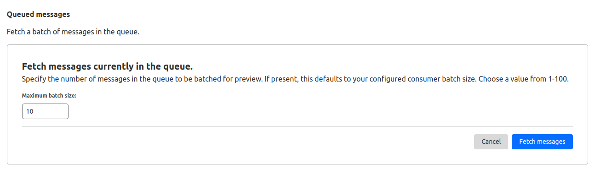
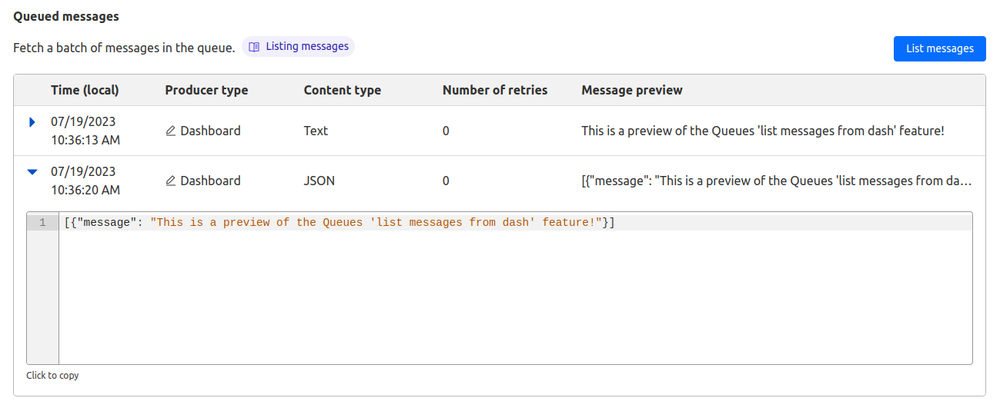

# List messages from the dashboard

Listing messages from the dashboard allows you to debug Queues or Queue producers without a consumer Worker. Fetching a batch of messages to preview will not acknowledge or retry the message or affect its position in the Queue. The Queue can still be consumed normally by a consumer Worker.

To list messages in the dashboard:

1. Log in to the [Cloudflare dashboard](https://dash.cloudflare.com) and select your account.
2. Select **Workers & Pages** > **Queues**.
3. Select the Queue to preview messages from.
4. Select the **Messages** tab.
5. Select **Queued Messages**.
6. Select a maximum batch size of messages to fetch. The size can be a number from 1 to 100. If a consumer Worker is configured, this defaults to your consumer Worker's maximum batch size.

7. Select **List messages**.
8. When the list of messages loads, select the blue arrow to the left of each row to expand the message preview.

This will preview a batch of messages currently in the Queue.

Refer to the [Get Started guide](/queues/get-started/) to learn how to process messages from a Queue in a Worker.
