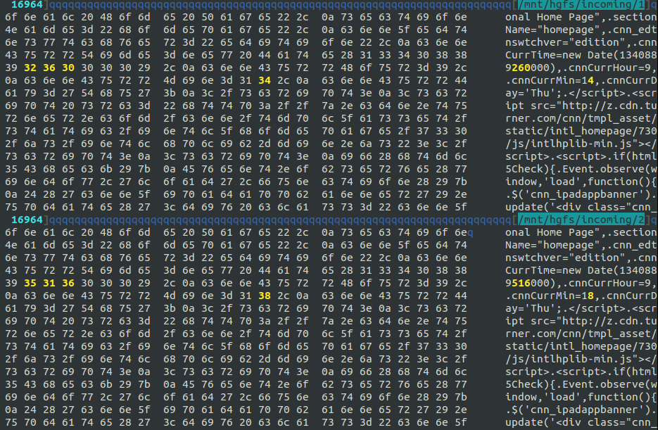

# Introduction

One of the major advantages of using Cloudflare is that cacheable content (such as images, JavaScript, CSS and HTML) is both cached by Cloudflare and delivered from our data centers around the world. Because Cloudflare has data centers covering the entire globe, cached content gets delivered quickly to web surfers wherever they are (and overcomes latency problems).

But only about 66% of content is cacheable. The other 34% must be obtained from the real origin web server. Railgun overcomes this problem by using a scheme that is able to cache dynamically generated or personalized web pages dramatically reducing bandwidth used and improving download times.

Railgun is a single daemon that runs on a 64-bit system which uses alternative compression techniques to dramatically speed up WAN performance.

It proxies traffic through a special protocol that would normally travel between Cloudflare and your origin server over HTTP.

Typically, the markup of websites, or the body a JSON API response, does not change that frequently from one request to the next. Instead of transferring the entire request between Cloudflare and your environment, Railgun will transfer only the changes in markup from one request to the next. This cuts down on bandwidth, transfer time, and overall page load times. Railgun caches these differences in memory to make page processing as fast as possible.

## Requirements

<TableWrap>
    <table>
        <tr>
            <th>&nbsp;</th>
            <th>Business and Enterprise Users</th>
            <th>Optimized Partners</th>
        </tr>
        <tr>
            <td><strong>Hardware</strong></td>
            <td>
                <ul>
                    <li>Dual core processor</li>
                    <li>4 GB RAM</li>
                    <li>64-bit Architecture</li>
                </ul>
            </td>
            <td>
                <ul>
                    <li>Quad core processor</li>
                    <li>8 GB RAM</li>
                    <li>64-bit Architecture</li>
                </ul>
            </td>
        </tr>
        <tr>
            <td><strong>Software</strong></td>
            <td>
                <ul>
                    <li>Memcache &gt;= 1.4 with at least 512 MB of storage (&gt;1 GB recommended)</li>
                </ul>
            </td>
            <td>
                <ul>
                    <li>Memcache &gt;= 1.4 with at least 1 GB of storage (&gt;2 GB recommended)</li>
                </ul>
            </td>
        </tr>
        <tr>
            <td><strong>Operating System</strong></td>
            <td>
                <ul>
                    <li>Debian 8, 9</li>
                    <li>Ubuntu Linux 12.04, 14.04, 16.04</li>
                    <li>Red Hat Enterprise Linux 6, 7</li>
                    <li>CentOS 6, 7</li>
                </ul>
            </td>
            <td>&nbsp;</td>
        </tr>
        <tr>
            <td><strong>Network</strong></td>
            <td>
                <ul>
                    <li>Port 2408 open to traffic from our <a href="https://www.cloudflare.com/ips">IPs</a></li>
                </ul>
            </td>
            <td>&nbsp;</td>
        </tr>
    </table>
</TableWrap>

## Support

When contacting [Cloudflare Support](https://support.cloudflare.com/hc/articles/200172476), provide the following information (if accessible):
* Your `railgun.conf` and `railgun-nat.conf` (if applicable) files.
* Output from `/var/log/messages` from Railgun.
* A copy of `/var/log/railgun/panic.log`, if not empty.

Providing the IP address or hostname of your Railgun server will also allow our Support team to test connectivity remotely. Please let us know if you have firewalled your Railgun server when lodging support request.

## Implementation Details

Railgun works by recognizing that uncacheable web pages do not change very rapidly. For example, we captured the CNN homepage HTML once, then again after five minutes and then again after one hour. The page sizes were 92,516, five minutes later still 92,516 and one hour later 93,727.

CNN sets the caching on this page to 60 seconds. After one minute it’s necessary to download the entire page again. But looking inside the page itself not much has changed. In fact, the change between versions is on order of 100s of bytes out of almost 100k. Here’s a screenshot of one of the small binary differences between the CNN home page at five minute intervals. The yellow bytes have changed, the rest have not:

Experiments at Cloudflare has revealed similar change values across the web. For example, reddit.com changes by about 2.15% over five minutes and 3.16% over an hour. The New York Times home page changes by about 0.6% over five minutes and 3% over an hour. BBC News changes by about 0.4% over five minutes and 2% over an hour.

Although the dynamic web is not cacheable, it’s also not changing quickly. That means that from moment to moment there’s only a small change between versions of a page. Railgun uses this fact to achieve very high rates of compression. This is very similar to how video compression looks for changes from frame to frame; Railgun looks for changes on a page from download to download.

Railgun consists of two components: the sender and the listener. The sender is installed at every Cloudflare data center around the world. The listener is a software component that premium customers install on their network.

The sender and listener establish a permanent TCP connection that’s secured by TLS. This TCP connection is used for the Railgun protocol. It’s an all binary multiplexing protocol that allows multiple HTTP requests to be run simultaneously and asynchronously across the link.

To a web client the Railgun system looks like a proxy server, but instead of being a server it’s a wide-area link with special properties. One of those properties is that it performs compression on non-cacheable content by synchronizing page versions.

Each end of the Railgun link keeps track of the last version of a web page that’s been requested. When a new request comes in for a page that Railgun has already seen, only the changes are sent across the link. The listener component make an HTTP request to the real, origin web server for the uncacheable page, makes a comparison with the stored version and sends across the differences.

The sender then reconstructs the page from its cache and the difference sent by the other side.

Of course, compression is used on web pages today. The most common technique is to gzip the page itself. CNN actually does this and sends 23,529 bytes of gzipped data which when decompressed become 92,516 bytes of page (so the page is compressed to 25.25% of its original size). And Google has proposed a somewhat complex dictionary based scheme called SDCH which is not widely deployed.

But the Railgun compression technique goes much further. The compression between versions 1 and 2 of the page above (at five minute intervals) results in just 266 bytes of difference data being sent (a compression to 0.29% of the original page size). The one hour difference (versions 2 to 3 above) is 2,885 bytes (a compression to 3% of the original page size). Clearly, Railgun compression outpeforms gzip enormously.

For pages that are frequently accessed the deltas are often so small that they fit inside a single TCP packet, and because the connection between the two parts of Railgun is kept active problems with TCP connection time and slow start are eliminated.