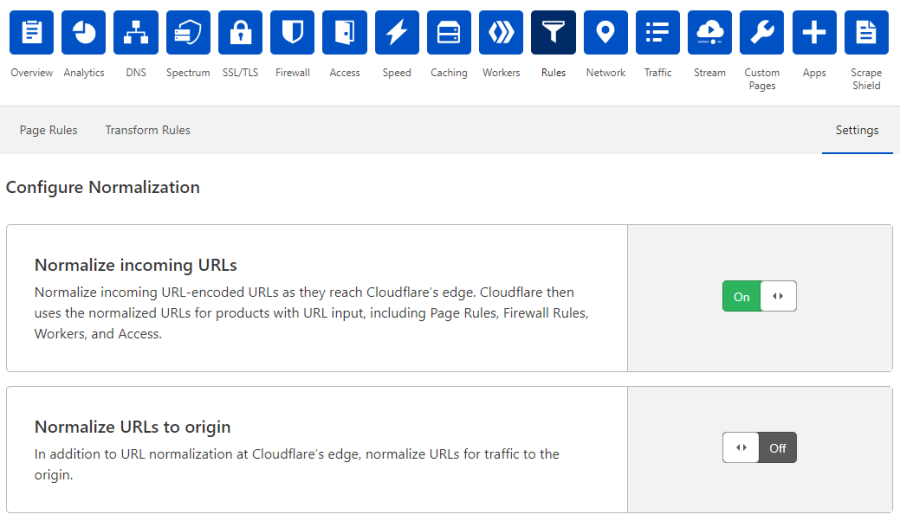

# Configure URL normalization in the dashboard

Use the **Rules** app in the Cloudflare dashboard to define [URL normalization](/normalization) settings.

1.  Log in to the [Cloudflare dashboard](https://dash.cloudflare.com/), and select your account and website.

2.  Go to **Rules** > **Settings**.

    

3.  Under **Configure Normalization**, enable or disable the [available URL normalization settings](/normalization/settings).
