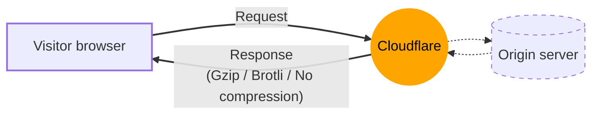
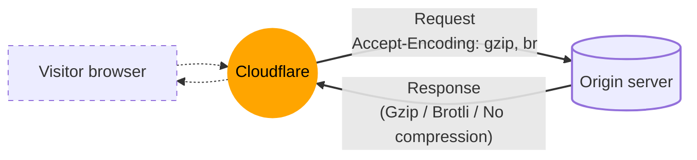

# How does Cloudflare compress content?

Cloudflare compresses content in two ways: between Cloudflare and your website visitors and between Cloudflare and your origin server.

## Compression between Cloudflare and website visitors

In addition to Cloudflare's [default caching behavior](/cache/concepts/default-cache-behavior/), Cloudflare supports Gzip and Brotli compression when delivering content to website visitors.



If supported by visitors' web browsers, Cloudflare will return Gzip or Brotli-encoded responses for the following content types:

```
text/html
text/richtext
text/plain
text/css
text/x-script
text/x-component
text/x-java-source
text/x-markdown
application/javascript
application/x-javascript
text/javascript
text/js
image/x-icon
image/vnd.microsoft.icon
application/x-perl
application/x-httpd-cgi
text/xml
application/xml
application/rss+xml
application/vnd.api+json
application/x-protobuf
application/json
multipart/bag
multipart/mixed
application/xhtml+xml
font/ttf
font/otf
font/x-woff
image/svg+xml
application/vnd.ms-fontobject
application/ttf
application/x-ttf
application/otf
application/x-otf
application/truetype
application/opentype
application/x-opentype
application/font-woff
application/eot
application/font
application/font-sfnt
application/wasm
application/javascript-binast
application/manifest+json
application/ld+json
application/graphql+json
application/geo+json
```

Cloudflare's global network can deliver content to website visitors using Gzip compression, Brotli compression, or no compression, according to the values visitors provide in the `Accept-Encoding` request header.

For responses with error status codes, Cloudflare will only compress responses if their error status code is `403` or `404`. For successful response status codes, Cloudflare will only compress responses if their status code is `200`. Responses with other status codes will not be compressed.

Enterprise customers can override Cloudflare's default compression behavior using [Compression Rules](/rules/compression-rules/).



Cloudflare will only apply compression to responses with a minimum size when sending them to website visitors:
* For Gzip, responses must have a minimum size of 48 bytes.
* For Brotli, responses must have a minimum size of 50 bytes.

Smaller responses will not be compressed, regardless of their content type.



---

## Content compression from origin servers to the Cloudflare network

When requesting content from your origin server, Cloudflare supports Gzip compression, Brotli compression, or no compression.



If your origin server responds to a Cloudflare request using Gzip/Brotli compression, we will keep the same compression in the response sent to the website visitor if:

* You include a `Content-Encoding` header in your server response mentioning the compression being used (`gzip` or `br`).
* The visitor browser (or client) supports the compression algorithm.
* You do not enable Cloudflare features that change the response content (refer to [Notes about end-to-end compression](#notes-about-end-to-end-compression) for details).

Cloudflare's reverse proxy can also convert between compressed formats and uncompressed formats. Cloudflare can receive content from your origin server with Gzip or Brotli compression and serve it to visitors uncompressed (or vice versa), independently of caching.

If you do not want a particular response from your origin to be encoded with Gzip/Brotli when delivered to website visitors, you can disable this by including a `cache-control: no-transform` HTTP header in the response from your origin web server.


Cloudflare will take into consideration the `Accept-Encoding` header value in website visitors' requests when sending responses to those visitors. However, when requesting content from your origin server, Cloudflare will send a different `Accept-Encoding` header, supporting Gzip and Brotli compression.


---


