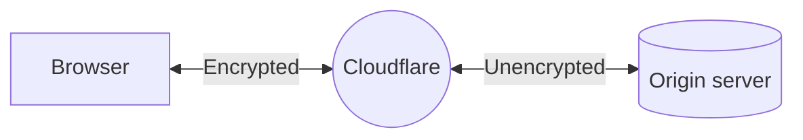

# Flexible - SSL/TLS encryption modes

Setting your encryption mode to **Flexible** makes your site partially secure. Cloudflare allows HTTPS connections between your visitor and Cloudflare, but all connections between Cloudflare and your origin are made through HTTP. As a result, an SSL certificate is not required on your origin.

## Use when

Choose this option when you cannot set up an SSL certificate on your origin or your origin does not support SSL/TLS.

## Required setup

### Prerequisites



### Process



 

 


 

 



## Limitations

Flexible mode is only supported for HTTPS connections on port 443 (default port). Other ports using HTTPS will fall back to [**Full** mode](/ssl/origin-configuration/ssl-modes/full/).

If your application contains sensitive information (personalized data, user login), use [**Full**](/ssl/origin-configuration/ssl-modes/full/) or [**Full (Strict)**](/ssl/origin-configuration/ssl-modes/full-strict/) modes instead.


 