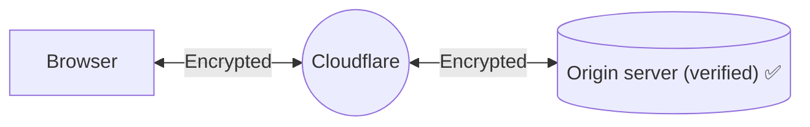

# Full (strict) - SSL/TLS encryption modes

When you set your encryption mode to **Full (strict)**, Cloudflare does everything in [Full mode](/ssl/origin-configuration/ssl-modes/full/) but also enforces more stringent requirements for origin certificates.

## Use when

For the best security, choose **Full (strict)** mode whenever possible (unless you are an [Enterprise customer](/ssl/origin-configuration/ssl-modes/ssl-only-origin-pull/)).

Your origin needs to be able to support an SSL certificate that is:

- Unexpired, meaning the certificate presents `notBeforeDate < now() < notAfterDate`.
- Issued by a [publicly trusted certificate authority](https://github.com/cloudflare/cfssl_trust) or [Cloudflare’s Origin CA](/ssl/origin-configuration/origin-ca/).
- Contains a Common Name (CN) or Subject Alternative Name (SAN) that matches the requested or target hostname.



In addition to **Full (strict)** encryption, you can also set up [Authenticated Origin Pulls](/ssl/origin-configuration/authenticated-origin-pull/) to ensure all requests to your origin are evaluated before receiving a response.



## Required setup

### Prerequisites

Before enabling **Full (strict)** mode, make sure your origin:

- Allows HTTPS connections on port `443`.
- Presents a certificate matching the requirements above.

Otherwise, your visitors may experience a [526 error](/support/troubleshooting/cloudflare-errors/troubleshooting-cloudflare-5xx-errors/#error-526-invalid-ssl-certificate).

### Process



 

 


 

 



## Limitations

