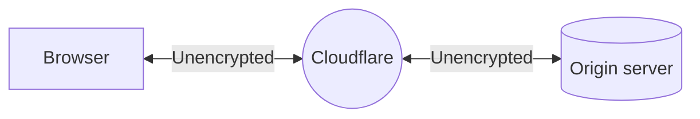

# Off - SSL/TLS encryption modes

Setting your encryption mode to **Off (not recommended)** redirects any HTTPS request to plaintext HTTP.

## Use when

Cloudflare does not recommend setting your encryption mode to **Off**.

## Required setup



 

 


 

 



## Limitations

When you set your encryption mode to **Off**, your application:

- Leaves your visitors and your application [vulnerable to attacks](https://www.cloudflare.com/learning/ssl/why-use-https/).
- Will be marked as "not secure" by Chrome and other browsers, reducing visitor trust.
- Will be penalized in [SEO rankings](https://webmasters.googleblog.com/2014/08/https-as-ranking-signal.html).

### Incompatible settings

When you set your SSL/TLS encryption mode to **Off**, you will not see the options for [**Always Use HTTPS**](/ssl/edge-certificates/additional-options/always-use-https/) or [**Onion Routing**](https://support.cloudflare.com/hc/articles/203306930).


 