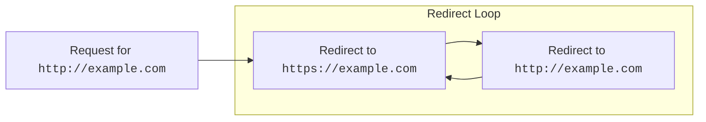
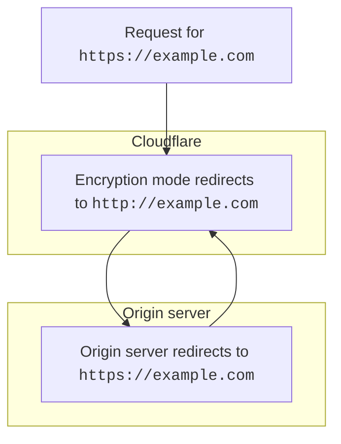
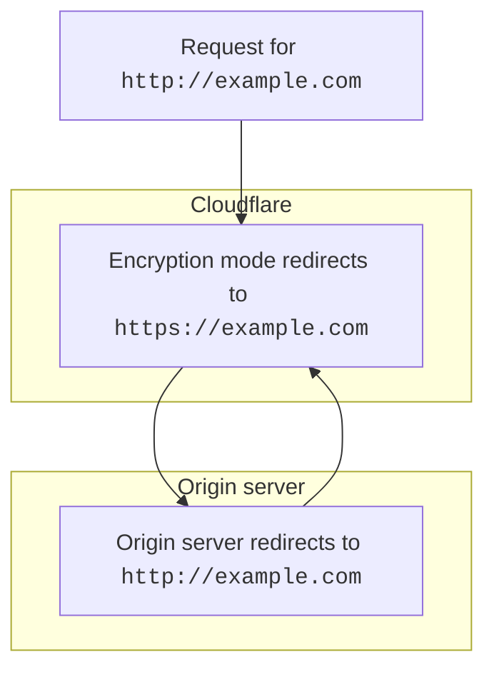
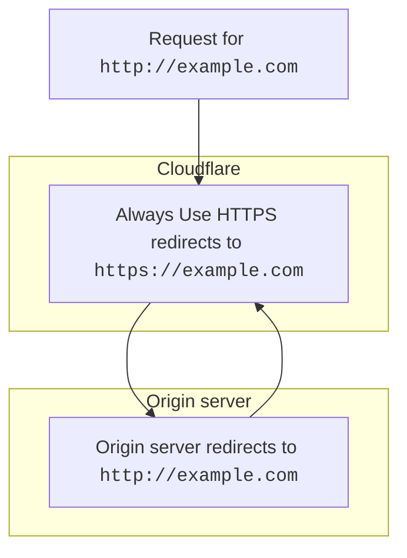
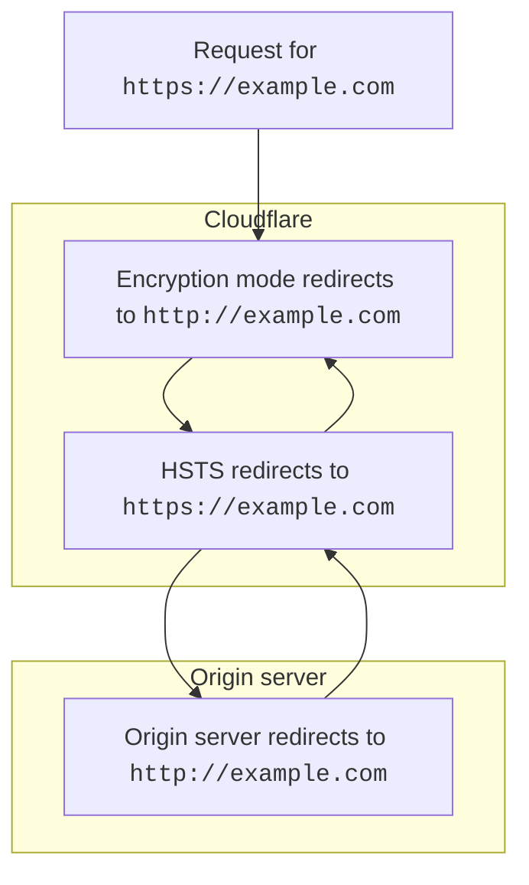
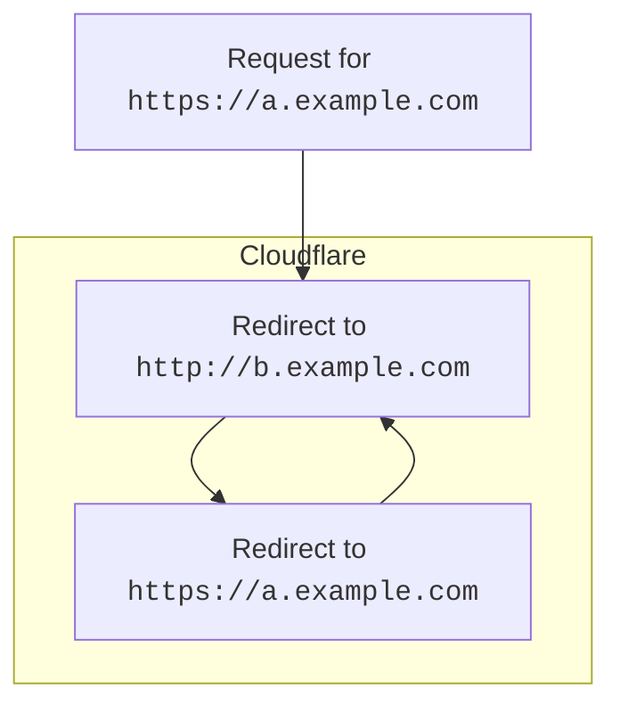

# ERR_TOO_MANY_REDIRECTS

After you [add a new domain](/fundamentals/get-started/setup/add-site/) to Cloudflare, your visitors' browsers might display `ERR_TOO_MANY_REDIRECTS` or `The page isn’t redirecting properly` errors. 

This error occurs when visitors get stuck in a redirect loop.

 

This error is commonly caused by:
- A misconfiguration of your [SSL/TLS Encryption mode](#encryption-mode-misconfigurations).
- Various settings in [**SSL/TLS** > **Edge Certificates**](#edge-certificate-settings).
- A misconfigured [redirect rule](#redirect-rules).



For assistance determining if your origin web server is responding with redirects, contact your hosting provider or site administrator.



---

## Encryption mode misconfigurations

Your domain's [SSL/TLS Encryption mode](/ssl/origin-configuration/ssl-modes/) controls how Cloudflare connects to your origin server and how SSL certificates presented by your origin will be validated.

This setting can cause redirect loops when the value you set in Cloudflare conflicts with the settings at your origin web server.

### Flexible encryption mode

If your domain's encryption mode is set to [**Flexible**](/ssl/origin-configuration/ssl-modes/flexible/), Cloudflare sends unencrypted requests to your origin server over HTTP.

Redirect loops will occur if your origin server automatically redirects all HTTP requests to HTTPS.

 

To solve this issue, either remove HTTPS redirects from your origin server or update your SSL/TLS Encryption Mode to be [**Full**](/ssl/origin-configuration/ssl-modes/full/) or higher (requires an SSL certificate configured at your origin server).

### Full or Full (strict) encryption mode

If your domain's encryption mode is set to [**Full**](/ssl/origin-configuration/ssl-modes/full/) or [**Full (strict)**](/ssl/origin-configuration/ssl-modes/full-strict/), Cloudflare sends encrypted requests to your origin server over HTTPS. 

Redirect loops will occur if your origin server automatically redirects all HTTPS requests to HTTP.

 

To solve this issue, remove HTTP redirects from your origin server.

---

## Edge certificate settings

### Always use HTTPS

If you have [**Always Use HTTPS**](/ssl/edge-certificates/additional-options/always-use-https/) enabled for your domain, Cloudflare redirects all `http` requests to `https` for all subdomains and hosts in your application.

Redirect loops will occur if your origin server automatically redirects all HTTPS requests to HTTP.

 

To solve this issue, remove HTTPS redirects from your origin server or [disable **Always Use HTTPS**](/ssl/edge-certificates/additional-options/always-use-https/).

### HSTS

If you have [**HTTP Strict Transport Security (HSTS)**](/ssl/edge-certificates/additional-options/http-strict-transport-security/) enabled for your domain, Cloudflare directs compliant web browsers to transform `http` links to `https` links.

Redirect loops will occur if your origin server automatically redirects all HTTPS requests to HTTP or if you have your domain's encryption mode set to [**Off**](/ssl/origin-configuration/ssl-modes/off/).

 

To solve this issue, remove HTTPS redirects from your origin server and make sure your domain's encryption mode is [**Flexible**](/ssl/origin-configuration/ssl-modes/flexible/) or higher.

Alternatively, [disable **HTTP Strict Transport Security (HSTS)**](/ssl/edge-certificates/additional-options/http-strict-transport-security/).

---

## Redirect rules

Redirect loops can also occur if you have conflicting URL redirects.

 

To solve this issue, review your various [URL forwarding rules](/rules/url-forwarding/) and [Page Rules](/support/page-rules/understanding-and-configuring-cloudflare-page-rules-page-rules-tutorial/) to make sure no rules are not in conflict with each other.



To reduce the potential for redirect loops and [mixed content errors](https://support.cloudflare.com/hc/articles/200170476), Cloudflare recommends Wordpress users to install the [Cloudflare WordPress plugin](https://wordpress.org/plugins/cloudflare/) at their origin web server and enable the *Automatic HTTPS rewrites* option within the plugin. Alternatively, Cloudflare recommends the [SSL insecure content fixer](https://en-gb.wordpress.org/plugins/ssl-insecure-content-fixer/) or [Really Simple SSL plugin](https://en-gb.wordpress.org/plugins/really-simple-ssl/).

