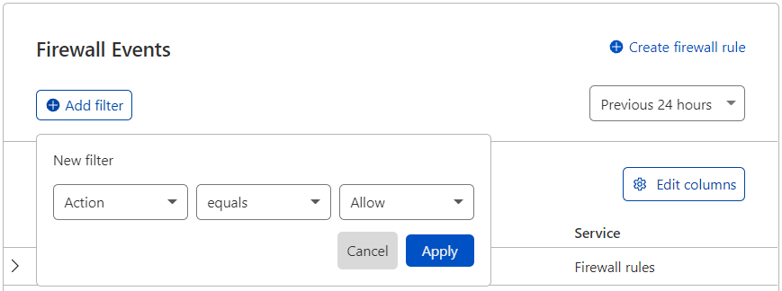

import FilterReportDuration from "../\_partials/\_analytics-filter-report-duration.md"
import ActivityLog from "../\_partials/\_analytics-activity-log.md"
import CreateFirewallRule from "../\_partials/\_analytics-create-firewall-rule.md"
import ShareFilters from "../\_partials/\_analytics-share-url.md"

# Firewall Analytics — Free plan

## Adjusting displayed data

You can apply multiple filters and exclusions to narrow the scope of Firewall Analytics, as well as adjust the report duration. Modifying the duration, filters, or exclusions affects the analytics data displayed in the **Activity Log**.

<FilterReportDuration/>

## Create Firewall Rule from current filters

<CreateFirewallRule/>

## Activity log

<ActivityLog/>

## Share Firewall Analytics filters

<ShareFilters/>
