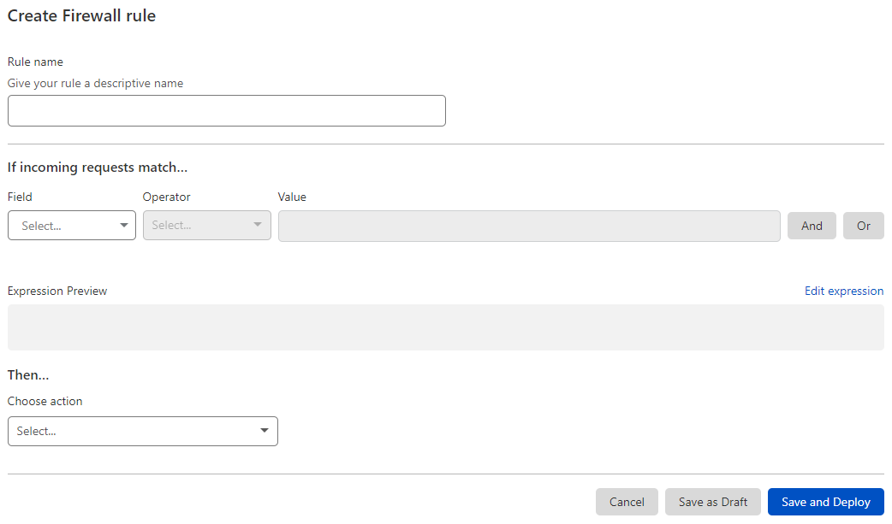

# Create Custom Firewall rules in the dashboard

Create Custom Firewall rules under the **Custom Rules** tab in the **Firewall** app.

<Aside type='warning' header='Important'>

This feature is only available for selected customers on an Enterprise plan.

</Aside>

## Create a Custom Firewall rule

To create a new Custom Firewall rule:

1.  Log in to the Cloudflare dashboard.

2.  Select the **Websites** tab and choose the site for which you want to create a rule.

3.  Navigate to **Firewall** > **Custom Rules**.

4.  Click **Create Custom rule** > **Firewall rule**.

5.  In the page that displays, enter a descriptive name for the rule in **Rule name**.

    

6.  Under **If incoming requests match...**, use the **Field** drop-down list to choose an HTTP property. For each request, the value of the property you choose for **Field** is compared to the value you specify for **Value** using the operator selected in **Operator**.

7.  Select the rule action from the **Choose action** drop-down list. For example, selecting *Block* tells Cloudflare to refuse requests that match the conditions you specified.

8.  To save and deploy your rule, click **Save and Deploy**. If you are not ready to deploy your rule, click **Save as Draft**.
