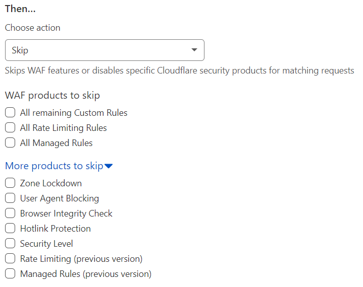

# Configure a Custom Rule with the Skip action

Use the *Skip* action in a Custom Firewall rule to skip one or more security features. A rule configured with the *Skip* action is also known as a skip rule.

For more information on the available options, refer to [Available skip options](/waf/custom-rules/custom-firewall/skip/options/).

## Using the dashboard

1.  Log in to the [Cloudflare dashboard](https://dash.cloudflare.com), and select your account and website.

2.  Go to **Firewall** > **Custom Rules**.

3.  [Create a Custom Firewall rule](/waf/custom-rules/custom-firewall/create-dashboard/) by clicking **Create custom rule** > **Firewall rule**, or edit an existing Custom Firewall rule.

4.  Define the rule name and the rule expression.

5.  Under **Choose action**, select *Skip* from the dropdown.

  

1.  Configure the desired [skip options](/waf/custom-rules/custom-firewall/skip/options/).

2.  Save your changes.

## Using the API

Use the [Rulesets API](/ruleset-engine/rulesets-api) to configure Custom Rules via API.

Refer to [API examples](/waf/custom-rules/custom-firewall/skip/api-examples/) for example API requests.
