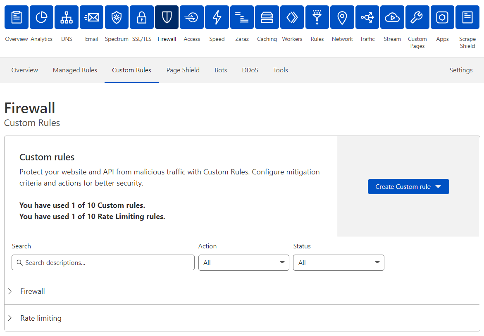

# Manage Custom Rules in the dashboard

You can manage Custom Rules under the **Custom Rules** tab in the **Firewall** app.

<Aside type='warning' header='Important'>

This feature is only available for selected customers on an Enterprise plan.

</Aside>

The Custom Rules interface allows you to:

*   [Create Custom Firewall rules](/custom-rules/custom-firewall/create-dashboard)
*   [Create Rate Limiting rules](/custom-rules/rate-limiting/create-dashboard)
*   Browse and filter rules
*   Edit and delete rules
*   Enable or disable rules

## Manage Custom Rules

Edit, delete, or enable/disable rules in the Custom Rules card.

### Enable or disable a rule

To enable/disable a rule, click the toggle button on the right of the rule you want to change.

### Edit a rule

To edit a rule:

1.  Click **Edit** on the right of the rule you want to change.
2.  Update the rule parameters.
3.  Click **Save**.

### Delete a rule

To delete a rule, click **Delete** on the right of the rule you want to delete and confirm the operation.
