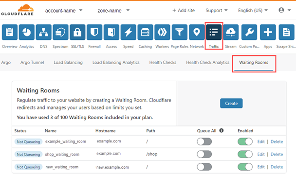

# Access waiting rooms

Use Cloudflare Waiting Room to create a holding area where users can queue to access a high-traffic area of your enterprise website. For an introduction, see [About Waiting Room](/about/).

To access **Waiting Rooms** on the Cloudflare dashboard:

1.  Log in to the Cloudflare dashboard and select your application.
2.  Click the **Traffic** > **Waiting Rooms**.

Use the dashboard to [create, edit, update, and delete](/how-to) waiting rooms.
