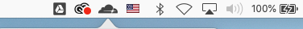

# macOS desktop client

1. [Download __Cloudflare_WARP.zip__](https://www.cloudflarewarp.com/Cloudflare_WARP.zip).
1. Navigate to the downloads folder.
1. Open **Cloudflare_WARP.zip**.
1. Open the **Cloudflare_WARP.pkg** file that was extracted.
1. Follow the instructions to complete installation. Cloudflare WARP will automatically launch and appear in your menu bar with the Cloudflare logo.



## What Cloudflare places on your device

### Cloudflare WARP.app

This is the main GUI application that you interact with. You can find it in`/Applications/Cloudflare WARP.app`.

### Cloudflare WARP Daemon

This is the daemon service responsible for establishing the wireguard tunnel and all interaction between our service endpoint and the Cloudflare WARP application. Here is where you can find:

* **Service**: `/Applications/Cloudflare WARP.app/Contents/Resources/CloudflareWARP`
* **Definition**: `/Library/LaunchDaemons/com.cloudflare.1dot1dot1dot1.macos.warp.daemon.plist`

### Log files

The macOS application places log files in two locations based on what part of the app is logging information. These logs are included with a feedback submission, when you click the checkbox in **Feedback** > **Share debug information**.

* **Daemon and install logs**: `/Library/Application Support/Cloudflare`.
* **Application GUI logs**: `/Users/<your local username>/Library/Logs/Cloudflare`.

## How to remove the application

We include an uninstall script as part of the macOS package you install. Type the following in a terminal window to uninstall WARP:

```sh
$ cd /Applications/Cloudflare\ WARP.app/Contents/Resources
$ ./uninstall.sh
```

<Aside type="note" header="Note">

You may be prompted to provide your credentials while removing the application.

</Aside>
