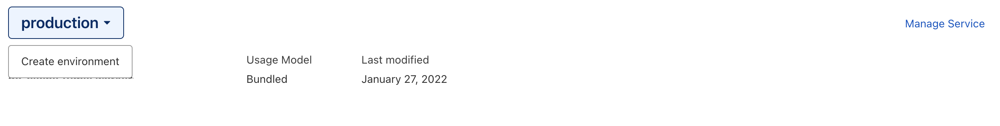
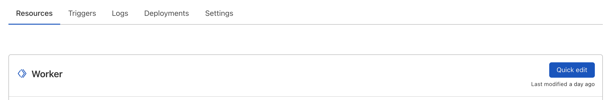
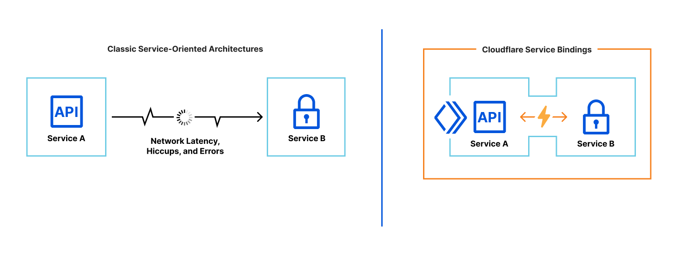

# Workers Services



We have temporarily disabled the creation of Service Environments while we are improving this feature.



Workers Services are the new building blocks for deploying applications on Cloudflare Workers. Workers Services are made of environments, which are scripts that can contain bindings to KV stores, Durable Objects, or even other services, as well as environment variables and secrets. Workers Services can have multiple environments and can set up pipelines for promoting a deployment from one environment to another.



Workers Services are synonymous with Workers. In the legacy Workers model, Workers were created by writing scripts. Workers scripts could not communicate with each other. In the Workers Services model, Workers Services are made up of Workers Environments that are a collection of bindings, environment variables, secrets, and script deployments. The introduction of Workers Services also adds Worker-to-Worker communication functionality via Workers Service bindings.



Unlike a traditional Workers script, a Workers Service is composable, which allows Workers services to talk to each other; allowing you to develop new kinds of services like routers, middlewares, deployment managers, or traffic gateways. Workers Services also support multiple environments, allowing you to test changes in a preview environment, then promote those changes to production when you are ready – or execute your own custom deployment strategies.



To enable a seamless transition to Workers Services, all scripts have been automatically migrated to Services with one production environment. No action is needed from the user.



Each Workers Service comes with a production environment and the ability to create or clone dozens of preview environments. Every aspect of an environment is overridable: the code, environment variables, and resource bindings, like KV namespaces and Durable Objects.

You can create and switch between environments in the dashboard:

1.  Go to **Workers**.
2.  Choose your **Worker**.
3.  Select **production** > **Create environment**.

## Service environments



As of January 2022, the dashboard is the only way to interact with Workers Service environments. Support in Wrangler is coming in [v2.1](https://github.com/cloudflare/wrangler2/issues/27)



Wrangler supports an older version of environments. With Wrangler environments, you create custom contexts for your code to run in by adding keys to your `wrangler.toml` file. Wrangler will then generate a separate Workers Service for each Wrangler environment. If you make a staging and production environment, for example, Wrangler will generate `my-worker-staging` and `my-worker-prod`.

Workers Service environments take a cleaner approach. You can create and edit environments directly in the dashboard:

1.  Log in to the [Cloudflare dashboard](https://dash.cloudflare.com/).
2.  Select your **Account**.
3.  Go to **Workers**.
4.  Select your **Workers Service**.
5.  Select **Quick edit**.

Unlike Wrangler environments, Workers Service environments do not create extra Workers Services. They are, however, able to connect to their own KV stores and Durable Objects. The code for any environment can be changed directly in the dashboard via the quick editor:

1.  Go to **Account Home**.
2.  Go to **Workers**.
3.  Choose your **Worker**.
4.  Select **Quick edit**.

A common workflow is to create an environment for a test feature, edit the code via the quick editor until you are satisfied with it, and then promote it to production when the code is ready.

Each environment is resolvable at a unique hostname, which is automatically generated when you create or rename the environment. There is no wait after you deploy. Everything you need, like DNS records and SSL certificates, is ready seconds later. If you would like a more advanced setup, you can add custom routes from your domain to an environment.

## Environment versions

Each environment in a Workers Service has its own version history. Every time there is a code change or an environment variable is updated, the version number of that environment is incremented. You can also append additional metadata to each version, like a `git commit` or a `deployment` tag.

## Workers Service Bindings

Workers Service bindings are an API that facilitate Worker-to-Worker communication.

A Workers Service binding allows you to send HTTP requests to another Worker without those requests going over the Internet. The request immediately invokes the downstream Worker, reducing latency as compared to a request to a third-party service. You can invoke other Workers directly from your code. Workers Service bindings allow for much more composability on the Workers platform.

Workers Service bindings use the standard [Fetch API](/workers/runtime-apis/fetch/). You can continue to use your existing utilities and libraries. A Workers Service binding will trigger a `FetchEvent`. You can also change the environment of a Workers Service binding, so you can test a new version of a Service.

While the interface among Workers Services is HTTP, the networking is not. Unlike the typical microservice architecture, where services communicate over a network and can suffer from latency or interruption, Workers Service bindings are a zero-cost abstraction. When one Worker invokes another, there is no network delay and the request is executed immediately.

Workers Service bindings allow you to:

- Segment multiple use cases into separate Services that can be explicitly invoked from your code.
- Achieve better composability on the Workers platform using Service-oriented architecture.
- Create private microservices, to be conditionally invoked from other edge-facing Services.

Read more about [Service bindings](../../platform/bindings/about-service-bindings).
