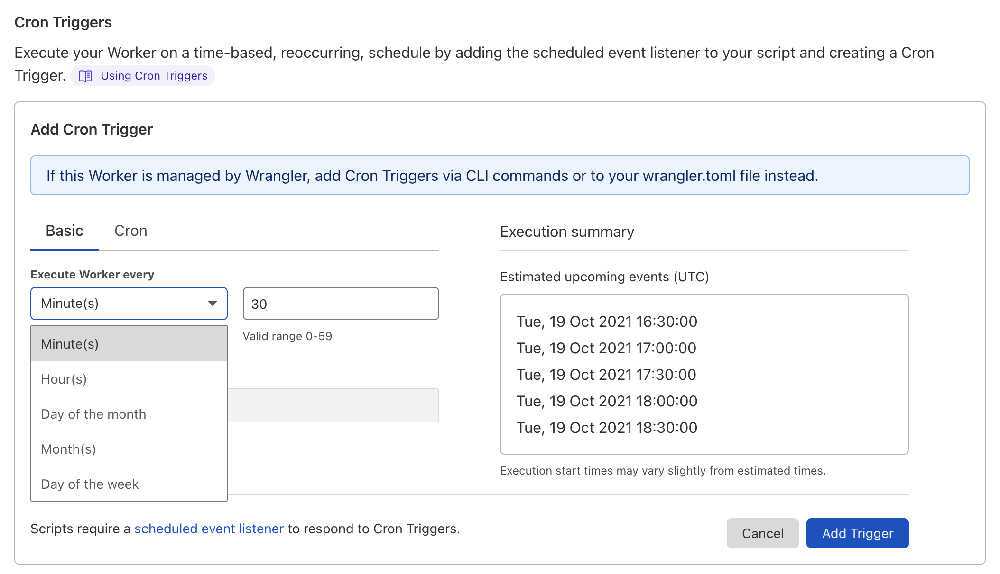
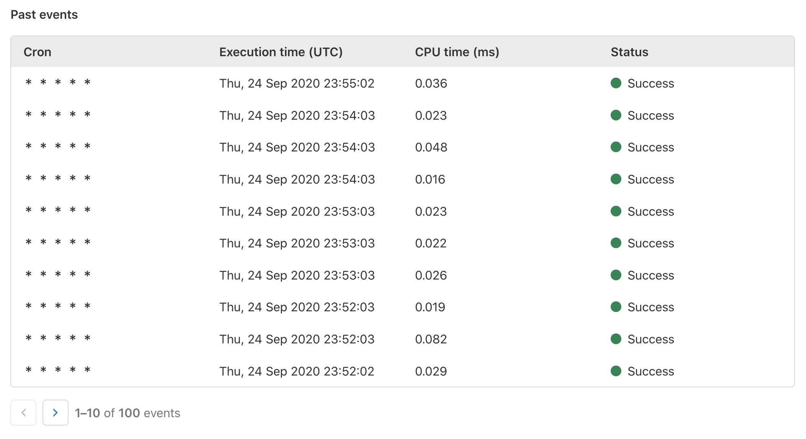

# Cron Triggers

## Background

Cron Triggers allow users to map a cron expression to a Worker script using a [ScheduledEvent](/workers/runtime-apis/scheduled-event/) listener that enables Workers to be executed on a schedule. Cron Triggers are ideal for running periodic jobs for maintenance or calling third-party APIs to collect up-to-date data. Workers scheduled by Cron Triggers will run on underutilized machines to make the best use of Cloudflare's capacity and route traffic efficiently.

## Add a Cron Trigger

You can add Cron Triggers to Workers with the Cloudflare API, or in the dashboard in **Workers** > **Manage Workers** > select **your Worker** > [**Triggers**](https://dash.cloudflare.com/?to=/:account/workers). Refer to [Limits](/workers/platform/limits/#number-of-schedules) to track the maximum number of Cron Triggers per Worker. If a Worker is managed with Wrangler, [Cron Triggers should be exclusively managed through the `wrangler.toml`](https://developers.cloudflare.com/workers/cli-wrangler/configuration/#triggers) file.



To respond to a Cron Trigger, you must add a [`"scheduled"` event](/workers/runtime-apis/scheduled-event/) listener to the Workers script.



## Supported cron expressions

Cloudflare supports cron expressions with five fields, along with most [Quartz scheduler](http://www.quartz-scheduler.org/documentation/quartz-2.3.0/tutorials/crontrigger.html#introduction)-like cron syntax extensions:



| Field         | Values                                                             | Characters   |
| ------------- | ------------------------------------------------------------------ | ------------ |
| Minute        | 0-59                                                               | \* , - /     |
| Hours         | 0-23                                                               | \* , - /     |
| Days of Month | 1-31                                                               | \* , - / L W |
| Months        | 1-12, case-insensitive 3-letter abbreviations ("JAN", "aug", etc.) | \* , - /     |
| Weekdays      | 1-7, case-insensitive 3-letter abbreviations ("MON", "fri", etc.)  | \* , - / L # |



### Examples

Some common time intervals that may be useful for setting up your Cron Trigger:



- `* * * * *`

  - Every minute

- `*/30 * * * *`

  - Every 30 minutes

- `0 17 * * sun` or `0 17 * * 1`

  - 5PM on Sunday

- `10 7 * * mon-fri` or `10 7 * * 2-6`

  - 7:10AM on weekdays

- `0 15 1 * *`

  - 3PM on first day of the month

- `0 18 * * 6L` or `0 18 * * friL`

  - 6PM on the last Friday of the month

- `23 59 LW * *`
  - 11:59PM on the last weekday of the month





A recommended way for testing your Cron Trigger is to first deploy it to a test domain. Adding a new Cron Trigger, updating an old Cron Trigger, or deleting a Cron Trigger may take minutes for changes to propagate to the Cloudflare network edge.



## Viewing past events

Users can review the execution history of their Cron Triggers in **Past Events** under [**Triggers**](https://dash.cloudflare.com/?to=/:account/workers) or through Cloudflare's [GraphQL Analytics API](/analytics/graphql-api).

It can take up to 30 minutes before events are displayed in **Past Events** when creating a new Worker or changing a Worker's name.

Refer to [Metrics and Analytics](/workers/learning/metrics-and-analytics/) for more information.



With Green Compute enabled, your Cron Triggers will only run on Cloudflare points of presence that are located in data centers that are powered purely by renewable energy. Organizations may claim that they are powered by 100 percent renewable energy if they have procured sufficient renewable energy to account for their overall energy use. Renewable energy can be purchased in a number of ways, including through on-site generation (wind turbines, solar panels), directly from renewable energy producers through contractual agreements called Power Purchase Agreements (PPA), or in the form of Renewable Energy Credits (REC, IRECs, GoOs) from an energy credit market.


