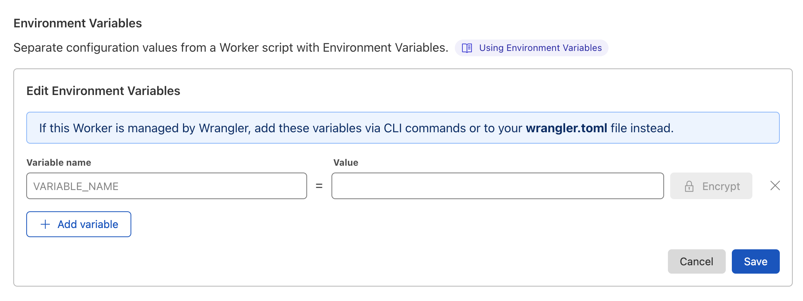
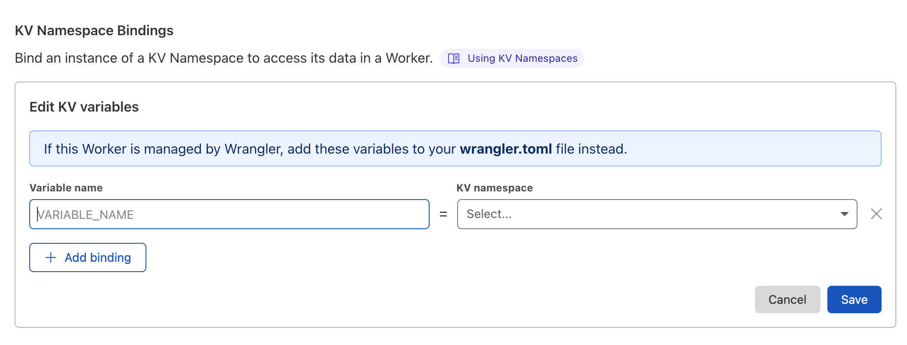
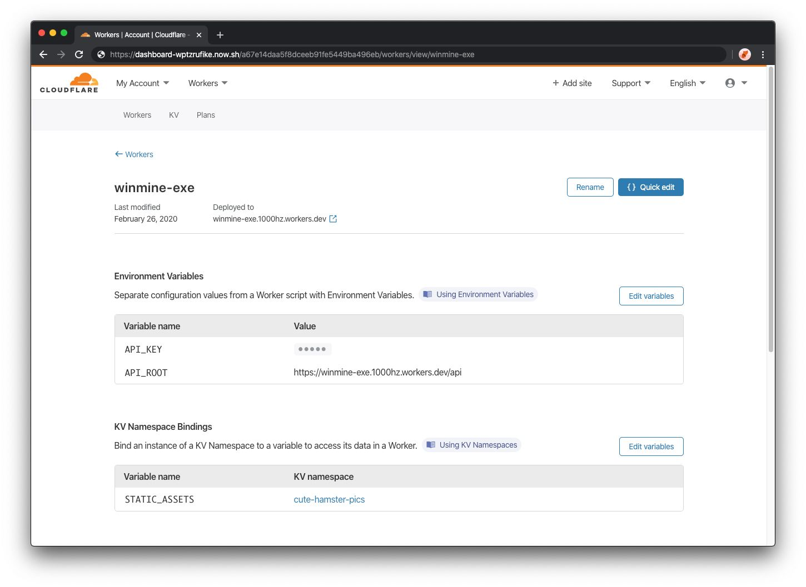

# Environment variables

In the Workers platform, environment variables, secrets, and KV namespaces are known as bindings. Regardless of type, bindings are always available as global variables within your Worker script.

## Environmental variables with module workers

When deploying a Module Worker, any [bindings](/platform/environment-variables) will not be available as global runtime variables. Instead, they are passed to the handler as a [parameter](#parameters) – refer to the `FetchEvent` [documentation for further comparisons and examples](/runtime-apis/fetch-event#bindings-1).

## Environment variables via wrangler

### Adding environment variables via wrangler

Environment variables are defined via the `[vars]` configuration in your `wrangler.toml` file and are always plaintext values.

```toml
---
filename: wrangler.toml
---
name = "my-worker-dev"
type = "javascript"

account_id = "<YOUR ACCOUNTID>"
workers_dev = true

# Define top-level environment variables
# under the `[vars]` block using
# the `key = "value"` format
[vars]
API_TOKEN = "example_dev_token"
STRIPE_TOKEN = "pk_xyz1234_test"

# Override values for `--env production` usage
[env.production]
name = "my-worker-production"
[env.production.vars]
API_TOKEN = "example_production_token"
STRIPE_TOKEN = "pk_xyz1234"
```

These environment variables can then be accessed within your Worker script as global variables. They will be plaintext strings.

```js
// Worker code:
console.log(API_TOKEN);
//=> (default) "example_dev_token"
//=> (env.production) "example_production_token"

console.log(STRIPE_TOKEN);
//=> (default) "pk_xyz1234_test"
//=> (env.production) "pk_xyz1234"
```

### Adding secrets via wrangler

Secrets are defined by running [`wrangler secret put <NAME>`](/cli-wrangler/commands#secret) in your terminal, where `<NAME>` is the name of your binding. You may assign environment-specific secrets by re-running the command `wrangler secret put <NAME> -e` or `wrangler secret put <NAME> --env`. Keep a list of the secrets used in your code in your `wrangler.toml` file, like the example under `[secrets]`:

```toml
---
filename: wrangler.toml
---
name = "my-worker-dev"
type = "javascript"

account_id = "<YOUR ACCOUNTID>"
workers_dev = true

# [secrets]
# SPARKPOST_KEY
# GTOKEN_PRIVKEY
# GTOKEN_KID
```

<Aside type="warning">

\* **Warning:** Do not use plaintext environment variables to store sensitive information. Use [`wrangler secret put`](/cli-wrangler/commands#secret) instead.

</Aside>

### Adding KV namespaces via wrangler

KV namespaces are defined via the [`kv_namespaces`](/cli-wrangler/configuration#kv_namespaces) configuration in your `wrangler.toml` and are always provided as [KV runtime instances](/runtime-apis/kv).

```toml
---
filename: wrangler.toml
---
name = "my-worker-dev"
type = "javascript"

account_id = "<YOUR ACCOUNTID>"
workers_dev = true

[[kv_namespaces]]
binding = "Customers"
preview_id = "<PREVIEW KV NAMESPACEID>"
id = "<DEV KV NAMESPACEID>"

[env.production]
name = "my-worker-production"
[[kv_namespaces]]
binding = "Customers"
id = "<PRODUCTION KV NAMESPACEID>"
```

## Environment variables via the dashboard

### Adding environment variables via the dashboard

Add environment variables by logging into [Cloudflare dashboard](https://dash.cloudflare.com/) > **Account Home** > **Workers** and select your **Workers script**.

To add environment variables, such as `vars` and `secret`:

1.  Go to your **Workers script** > **Settings** > **Add variable** under **Environment Variables**.
2.  Input a **Variable name** and its **value**, which will be made available to your Worker.
3.  If your variable is a secret, select  **Encrypt** to protect its value. This will prevent the value from being visible via `wrangler` and the dashboard.
4.  (Optional) To add multiple environment variables, select **Add variable**.
5.  Select **Save** to implement your changes.



<Aside type="warning" header="Plaintext strings and secrets">

Do not select **Encrypt** when adding environment variables if your variable is not a secret. Skip step 3 if your variable's value is a plaintext string and does not need to be encrypted.

</Aside>

### Adding KV namespace bindings via the dashboard

To add KV namespace bindings:

1.  Go to your **Workers script** > **Settings** > **Add binding** under **KV Namespace Bindings**.
2.  Choose a **Variable name**. This will be the way the variable name will be referenced in your Worker script.
3.  Next, select a **KV namespace** from the dropdown.
4.  Select **Add binding** to add multiple bindings.
5.  When you are finished, select **Save** to implement your changes.



Your completed Workers dashboard, with environment variables and KV namespace bindings added, will look like the following example reference.



## Comparing secrets and environment variables

Secrets are environment variables. The difference is secret values are not visible within `wrangler` or dashboard interfaces after you define them. This means that sensitive data, including passwords or API tokens, should always be encrypted to prevent data leaks. To your Worker, there is no difference between an environment variable and a secret. The secret's value is passed through as defined.
