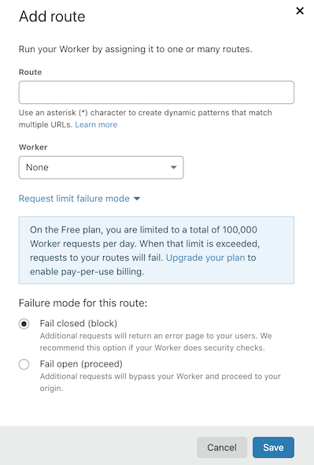

# Routes

## Background

Routes allow users to map a URL pattern to a Worker script to enable Workers to run in front of [Custom Domains](/workers/platform/routing/custom-domains) or their own application servers.

## Customize your routes

For zones proxied on Cloudflare, route patterns decide what (if any) script is matched based on the URL of that request. Requests are routed through a Workers script when the URL matches a route pattern assigned to that script. To add a Route, you need:

1. An active Cloudflare zone.
2. A proxied (orange-clouded) DNS record.
3. A Worker to invoke.

Route patterns can be added with the Cloudflare API or in **Account Home** > [**Workers**](https://dash.cloudflare.com/?zone=workers) > **your Worker** > **Triggers** > **Add route** in the Cloudflare dashboard.



Cloudflare Site routes are comprised of:

- Route URL (refer to [Matching Behavior](#matching-behavior))
- Worker script to execute on matching requests
- Failure mode for rate-limited accounts on the Free plan (refer to [daily request limits](/workers/platform/limits/#request-limits))

The Routes REST API documentation can be found [in the Workers API docs](https://api.cloudflare.com/#worker-routes-properties).

If your route is configured to a hostname, you will need to add a DNS record to Cloudflare to ensure that the hostname can be resolved externally. If your Worker acts as your origin (that is, the request terminates in a Worker), you must add a DNS record.

* _A zone that you have registered with some registrar (not workers.dev) and setup Cloudflare to serve as [a reverse proxy](https://www.cloudflare.com/learning/cdn/glossary/reverse-proxy/)._

## Routes with `*.workers.dev`

Cloudflare Workers accounts come with a `*.workers.dev` subdomain that is configurable in the Cloudflare dashboard. Your `*.workers.dev` subdomain allows you to deploy Workers [without attaching your domain as a Cloudflare zone](https://blog.cloudflare.com/announcing-workers-dev/).

To claim a `*.workers.dev` subdomain, such as `<YOUR_SUBDOMAIN>.workers.dev`, go to **Account Home** > [**Workers**](https://dash.cloudflare.com/?zone=workers) > **Your subdomain**. The `name` field in your Worker configuration is used as the secondary subdomain for the deployed script, (for example, `my-worker.<YOUR_SUBDOMAIN>.workers.dev.`).

### Matching Behavior

Route patterns look like this:

```txt
https://*.example.com/images/*
```

This pattern would match all HTTPS requests destined for a subhost of
example.com and whose paths are prefixed by `/images/`.

A pattern to match all requests looks like this:

```txt
*example.com/*
```

While they look similar to a [regex](https://en.wikipedia.org/wiki/Regular_expression) pattern, route patterns follow specific rules:

- The only supported operator is the wildcard (`*`), which matches zero or more of any character.

- Route patterns may not contain infix wildcards or query parameters. For example, neither `example.com/*.jpg` nor `example.com/?foo=*` are valid route patterns.

- When more than one route pattern could match a request URL, the most specific route pattern wins. For example, the pattern `www.example.com/*` would take precedence over `*.example.com/*` when matching a request for `https://www.example.com/`. The pattern `example.com/hello/*` would take precedence over `example.com/*` when matching a request for `example.com/hello/world`.

- Route pattern matching considers the entire request URL, including the query parameter string. Since route patterns may not contain query parameters, the only way to have a route pattern match URLs with query parameters is to terminate it with a wildcard, `*`.

- Route patterns are case sensitive, for example, `example.com/Images/*` and `example.com/images/*` are two distinct routes.

A route can be specified without being associated with a Worker. This will act to negate any less specific patterns. For example, consider this pair of route patterns, one with a Workers script and one without:

```txt
*example.com/images/cat.png -> <no script>
*example.com/images/*       -> worker-script
```

In this example, all requests destined for example.com and whose paths are prefixed by `/images/` would be routed to `worker-script`, _except_ for `/images/cat.png`, which would bypass Workers completely. Requests with a path of `/images/cat.png?foo=bar` would be routed to `worker-script`, due to the presence of the query string.

## Configure your `wrangler.toml`

To configure a route in your `wrangler.toml`, add the following to your environment:

```toml
routes = [
    { pattern = "example.com/about", zone_id = "<YOUR_ZONE_ID>" }
]
```

If you have specified your zone ID in the environment of your `wrangler.toml`, you will not need to write it again in object form.

### Validity

The following set of rules govern route pattern validity.

#### Route patterns must include your zone

If your zone is `example.com`, then the simplest possible route pattern you can have is `example.com`, which would match `http://example.com/` and `https://example.com/`, and nothing else. As with a URL, there is an implied path of `/` if you do not specify one.

#### Route patterns may not contain any query parameters

For example, `https://example.com/?anything` is not a valid route pattern.

#### Route patterns may optionally begin with http:// or https://

If you omit a scheme in your route pattern, it will match both `http://` and `https://` URLs. If you include `http://` or `https://`, it will only match HTTP or HTTPS requests, respectively.

- `https://*.example.com/` matches `https://www.example.com/` but not `http://www.example.com/`.

- `*.example.com/` matches both `https://www.example.com/` and `http://www.example.com/`.

#### Hostnames may optionally begin with `*`

If a route pattern hostname begins with `*`, then it matches the host and all subhosts. If a route pattern hostname begins with `*.`, then it only matches all subhosts.

- `*example.com/` matches `https://example.com/` and `https://www.example.com/`.

- `*.example.com/` matches `https://www.example.com/` but not `https://example.com/`.

#### Paths may optionally end with `*`

If a route pattern path ends with `*`, then it matches all suffixes of that path.

- `https://example.com/path*` matches `https://example.com/path` and `https://example.com/path2` and `https://example.com/path/readme.txt`



There is a well-known bug associated with path matching concerning wildcards (`*`) and forward slashes (`/`) that is documented in [Known issues](/workers/platform/known-issues/).



#### Subdomains must have a DNS Record

All subdomains must have a [DNS record](https://support.cloudflare.com/hc/en-us/articles/360019093151#h_60566325041543261564371) to be proxied on Cloudflare and used to invoke a Worker. For example, if you want to put a worker on `myname.example.com`, and you have added `example.com` to Cloudflare but have not added any DNS records for `myname.example.com`, any request to `myname.example.com` will result in the error `ERR_NAME_NOT_RESOLVED`.



If you have previously used the Cloudflare dashboard to add an `AAAA` record for `myname` to `example.com`, pointing to `100::` (the [reserved IPv6 discard prefix](https://tools.ietf.org/html/rfc6666)), Cloudflare recommends creating a [Custom Domain](/workers/platform/routing/custom-domains) pointing to your Worker instead.

