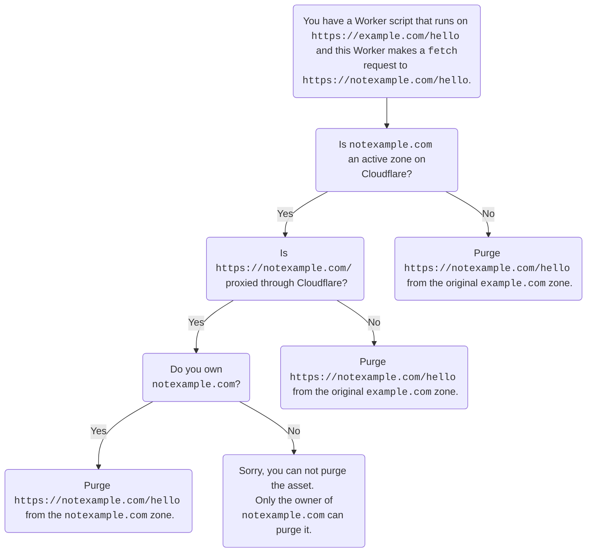

# How the cache works

Workers was designed and built on top of Cloudflare's global network to allow developers to interact directly with the Cloudflare cache. The cache can provide ephemeral, data center-local storage, as a convenient way to frequently access static or dynamic content.

By allowing developers to write to the cache, Workers provide a way to customize cache behavior on Cloudflare’s CDN. To learn about the benefits of caching, refer to the Learning Center’s article on [What is Caching?](https://www.cloudflare.com/learning/cdn/what-is-caching/).

Cloudflare Workers run before the cache but can also be utilized to modify assets once they are returned from the cache. Modifying assets returned from cache allows for the ability to sign or personalize responses while also reducing load on an origin and reducing latency to the end user by serving assets from a nearby location.

## Interact with the Cloudflare Cache

Conceptually, there are two ways to interact with Cloudflare’s Cache using a Worker:

- Call to [`fetch()`](/workers/runtime-apis/fetch/) in a Workers script. Requests proxied through Cloudflare are cached even without Workers according to a zone’s default or configured behavior (for example, static assets like files ending in `.jpg` are cached by default). Workers can further customize this behavior by:

  - Setting Cloudflare cache rules (that is, operating on the `cf` object of a [request](/workers/runtime-apis/request/)).

- Store responses using the [Cache API](/workers/runtime-apis/cache/) from a Workers script. This allows caching responses that did not come from an origin and also provides finer control by:

  - Customizing cache behavior of any asset by setting headers such as `Cache-Control` on the response passed to `cache.put()`.

  - Caching responses generated by the Worker itself through `cache.put()`.



The Cache API is not compatible with tiered caching. To take advantage of tiered caching, use the [fetch API](/workers/runtime-apis/fetch/).



### Single file purge  assets cached by a worker

When using single-file purge to purge assets cached by a Worker, make sure not to purge the end user URL. Instead, purge the URL that is in the `fetch` request. For example, you have a Worker that runs on `https://example.com/hello` and this Worker makes a `fetch` request to `https://notexample.com/hello`.

As far as cache is concerned, the asset in the `fetch` request (`https://notexample.com/hello`) is the asset that is cached (`https://notexample.com/hello`). To purge it, you need to purge `https://notexample.com/hello`.

Purging the end user URL, `https://example.com/hello`, will not work because that is not the URL that cache sees. You need to confirm in your Worker which URL you are actually fetching, so you can purge the correct asset.

In the previous example, `https://notexample.com/hello` is not proxied through Cloudflare. If `https://notexample.com/hello` was proxied ([orange-clouded](/dns/manage-dns-records/reference/proxied-dns-records/#proxied-records)) through Cloudflare, then you must own `notexample.com` and purge `https://notexample.com/hello` from the `notexample.com` zone.

To better understand the example, review the following diagram:

### Purge assets stored with the Cache API

Assets stored in the cache through [Cache API](/workers/runtime-apis/cache/) operations can be purged in a couple of ways:

- Call `cache.delete` within a Worker to invalidate the cache for the asset with a matching request variable.

  - Assets purged in this way are only purged locally to the data center the Worker runtime was executed.

- To purge an asset globally, you must use the standard cache purge options. Based on cache API implementation, not all cache purge endpoints function for purging assets stored by the Cache API.

  - All assets on a zone can be purged by using the [Purge Everything](/cache/how-to/purge-cache/purge-everything/) cache operation. This purge will remove all assets associated with a Cloudflare zone from cache in all data centers regardless of the method set.

  - Available to Enterprise Customers, [Cache Tags](/cache/how-to/purge-cache/purge-by-tags/#add-cache-tag-http-response-headers) can be added to requests dynamically in a Worker by calling `response.headers.append()` and appending `Cache-Tag` values dynamically to that request. Once set, those tags can be used to selectively purge assets from cache without invalidating all cached assets on a zone.

- Currently, it is not possible to purge a URL stored through Cache API that uses a custom cache key set by a Worker. Instead, use a [custom key created via Cache Rules](/cache/how-to/cache-rules/settings/#cache-key). Alternatively, purge your assets using purge everything, purge by tag, purge by host or purge by prefix.

## Edge versus browser caching

The browser cache is controlled through the `Cache-Control` header sent in the response to the client (the response passed or promised to `event.respondWith()`). Workers can customize browser cache behavior by setting this header on the response.

Other means to control Cloudflare’s cache that are not mentioned in this documentation include: Page Rules and Cloudflare cache settings. Refer to the [How to customize Cloudflare’s cache](/cache/concepts/customize-cache/) if you wish to avoid writing JavaScript with still some granularity of control.



For requests where Workers are behaving as middleware (that is, Workers are sending a subrequest via `fetch`) it is recommended to use `fetch`. This is because preexisting settings are in place that optimize caching while preventing unintended dynamic caching. For projects where there is no backend (that is, the entire project is on Workers as in [Workers Sites](/workers/configuration/sites/start-from-scratch)) the Cache API is the only option to customize caching.

The asset will be cached under the hostname specified within the Worker's subrequest — not the Worker's own hostname. Therefore, in order to purge the cached asset, the purge will have to be performed for the hostname included in the Worker subrequest.



### `fetch`

In the context of Workers, a [`fetch`](/workers/runtime-apis/fetch/) provided by the runtime communicates with the Cloudflare cache. First, `fetch` checks to see if the URL matches a different zone. If it does, it reads through that zone’s cache (or Worker). Otherwise, it reads through its own zone’s cache, even if the URL is for a non-Cloudflare site. Cache settings on `fetch` automatically apply caching rules based on your Cloudflare settings. `fetch` does not allow you to modify or inspect objects before they reach the cache, but does allow you to modify how it will cache.

When a response fills the cache, the response header contains `CF-Cache-Status: HIT`. You can tell an object is attempting to cache if one sees the `CF-Cache-Status` at all.

This [template](/workers/examples/cache-using-fetch/) shows ways to customize Cloudflare cache behavior on a given request using fetch.

### Cache API

The [Cache API](/workers/runtime-apis/cache/) can be thought of as an ephemeral key-value store, whereby the `Request` object (or more specifically, the request URL) is the key, and the `Response` is the value.

There are two types of cache namespaces available to the Cloudflare Cache:

- **`caches.default`** – You can access the default cache (the same cache shared with `fetch` requests) by accessing `caches.default`. This is useful when needing to override content that is already cached, after receiving the response.
- **`caches.open()`** – You can access a namespaced cache (separate from the cache shared with `fetch` requests) using `let cache = await caches.open(CACHE_NAME)`. Note that [`caches.open`](https://developer.mozilla.org/en-US/docs/Web/API/CacheStorage/open) is an async function, unlike `caches.default`.

When to use the Cache API:

- When you want to programmatically save and/or delete responses from a cache. For example, say an origin is responding with a `Cache-Control: max-age:0` header and cannot be changed. Instead, you can clone the `Response`, adjust the header to the `max-age=3600` value, and then use the Cache API to save the modified `Response` for an hour.

- When you want to programmatically access a Response from a cache without relying on a `fetch` request. For example, you can check to see if you have already cached a `Response` for the `https://example.com/slow-response` endpoint. If so, you can avoid the slow request.

This [template](/workers/examples/cache-api/) shows ways to use the cache API. For limits of the cache API, refer to [Limits](/workers/platform/limits/#cache-api-limits).


Cache API within Workers does not support tiered caching. Tiered Cache concentrates connections to origin servers so they come from a small number of data centers rather than the full set of network locations. Cache API is local to a data center, this means that `cache.match` does a lookup, `cache.put` stores a response, and `cache.delete` removes a stored response only in the cache of the data center that the Worker handling the request is in. Because these methods apply only to local cache, they will not work with tiered cache.


## Related resources

- [Cache API](/workers/runtime-apis/cache/)