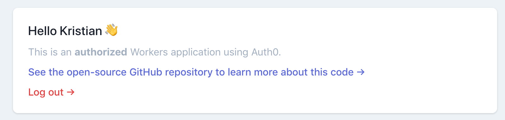
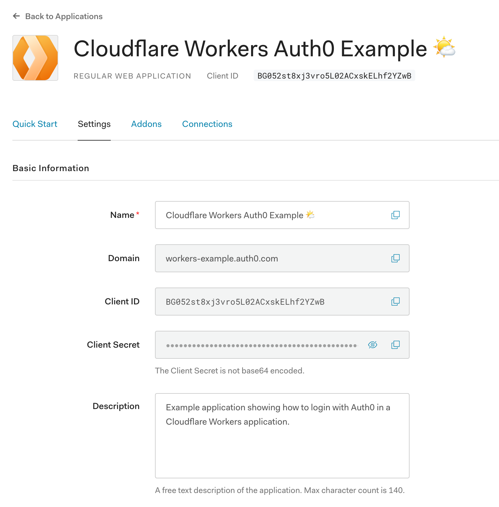

# Authorize users with Auth0



## Overview

In this tutorial, you will integrate [Auth0](https://auth0.com), an identity management platform, into a Cloudflare Workers application. Adding authorization and authentication to an application is a common task for developers. By implementing it using Cloudflare Workers, you can take advantage of the Workers platform to simplify how and when your application needs user data.

### What you will learn

*   How to authorize and authenticate users in Workers.
*   How to persist authorization credentials inside of Workers KV.
*   How to use Auth0 user information inside of your Workers application.

## Set up Auth0

If you do not already have an Auth0 account, sign up for a free account at [auth0.com](https://www.auth0.com). This tutorial supports integration with Auth0’s free tier.

### Configure an Auth0 application

Every Auth0 account contains applications, which allow developers to create login/signup flows that are verified by Auth0. To integrate Auth0 with Workers, create an application in your Auth0 dashboard. If you have created an account for this tutorial, the **Default (Generic)** application provided by Auth0 will work; otherwise, create a new application with the type **Regular Web Application**.

Inside of your application’s settings, the client ID and client secret are keys that you will provide to your Workers application to authenticate with Auth0. There are several settings and configuration options, but relevant to this tutorial are the **Allowed Callback URLs** and **Allowed Web Origins** options. In the [**Publish** section](/workers/tutorials/authorize-users-with-auth0/#publish) of this tutorial, you will later fill in these values with the final deployed URL of your application.

## Generate a new project

Using wrangler’s `generate` command, begin building a new application using a Workers template. For this tutorial, you will modify the default template for [Workers Sites](/workers/platform/sites/), which deploys a static HTML application:
<pre class="CodeBlock CodeBlock-with-rows CodeBlock-scrolls-horizontally CodeBlock-is-light-in-light-theme CodeBlock--language-sh" language="sh">Generate a new project<code>
$ wrangler generate --site my-auth-example

</code></pre>

## Building an authorizer

Before implementing an authorizer in your application, which will verify that a user is logged in, it is useful to understand how Auth0’s login flow works. The condensed version of this flow is below (review a [longer writeup in Auth0’s documentation](https://auth0.com/docs/flows/concepts/auth-code)):

1.  A user makes a request to the Workers application.
2.  If the user is not logged in, they are redirected to the login page.
3.  After logging in, the user is redirected back to the Workers application with a login `code` query parameter.
4.  The Workers application takes the login `code` parameter and exchanges it with Auth0 for authorization tokens.

In a traditional application that is attached to a database, the authorization tokens Auth0 returns are often persisted in a database. This will allow users to return to the application and continue to use it without the need for re-authorization. With a Workers application, you have access to a quick and easy-to-use data storage solution that lives right next to your serverless application: Workers KV. Using Workers KV, you will store authorization tokens and tie them to a user using an authorization cookie.

<small>Auth0 Flow Diagram courtesy of <a href="https://auth0.com/docs/flows/concepts/auth-code">Auth0</a></small>

### Authenticating a user

Begin implementing the login flow described in the previous section. When a user makes a request to the Workers application, you should verify that the user is authenticated. To define this logic, create a new file — `workers-site/auth0.js`- which will contain the authorization logic for your application:
<pre class="CodeBlock CodeBlock-with-rows CodeBlock-scrolls-horizontally CodeBlock-is-light-in-light-theme CodeBlock--language-js" language="js">workers-site/auth0.js<code>
const auth0 = {

  domain: AUTH0_DOMAIN,

  clientId: AUTH0_CLIENT_ID,

  clientSecret: AUTH0_CLIENT_SECRET,

  callbackUrl: AUTH0_CALLBACK_URL,

}

const redirectUrl = state =&gt `${auth0.domain}/authorize?response_type=code&amp;client_id=${auth0.clientId}&amp;redirect_uri=${auth0.callbackUrl}&amp;scope=openid%20profile%20email&amp;state=${encodeURIComponent(state)}`

const generateStateParam = () =&gt &quot;stub&quot;

const verify = async event =&gt {

  // Verify a user based on an auth cookie and Workers KV data

  return { accessToken: &quot;123&quot; }

}

// Returns an array with the format

//   [authorized, context]

export const authorize = async event =&gt {

  const authorization = await verify(event)

  if (authorization.accessToken) {

    return [true, { authorization }]

  } else {

    const state = await generateStateParam()

    return [false, { redirectUrl: redirectUrl(state) }]

  }

}

</code></pre>

The `auth0` object wraps several secrets, which are encrypted values that can be defined and used by your script. In the [**Publish** section](/workers/tutorials/authorize-users-with-auth0/#publish) of this tutorial, you will define these secrets using the [`wrangler secret`](/workers/cli-wrangler/commands/#secret) command.

The `generateStateParam` function will be used to prevent [Cross-Site Request Forgery (CSRF) attacks](https://auth0.com/docs/protocols/oauth2/mitigate-csrf-attacks). For now, you will return a string stub but later in the tutorial, `generateStateParam` will generate a random state parameter that you will store in Workers KV to verify incoming authorization requests.

The `verify` function, which you will stub out in your first pass through this file, will check for an authorization key and look up a corresponding value in Workers KV. For now, you will simply return an object with an `accessToken` string to simulate an authorized request.

The `authorize` function, which should be exported from `./auth0.js`, will wait for the response from the `verify` function, and return an array that can be used to determine how the application should proceed.

In `workers-site/index.js`, import the `authorize` function from `./auth0.js` and use it inside of your `handleEvent` function. Note that by default the Workers Sites template contains code for rendering your Workers Site from Workers KV. To keep that code functioning, make sure that you replace `handleEvent` as defined below:
<pre class="CodeBlock CodeBlock-with-rows CodeBlock-scrolls-horizontally CodeBlock-is-light-in-light-theme CodeBlock--language-js" language="js">workers-site/index.js<code>
import { authorize } from &quot;./auth0&quot;

addEventListener(&quot;fetch&quot;, event =&gt event.respondWith(handleEvent(event)))

async function handleEvent(event) {

  let request = event.request

  let response = new Response(null)

  const url = new URL(request.url)

  try {

    const [authorized, { authorization, redirectUrl }] = await authorize(event)

    // BEGINNING OF WORKERS SITES

    // Make sure to not touch this code for the majority of the tutorial.

    response = getAssetFromKV(event)

    // END OF WORKERS SITES

    return response

  } catch (e) {

    return new Response(e.message || e.toString(), { status: 500 })

  }

}

</code></pre>

The `authorize` function returns an array with a boolean `authorized` and a context object which will contain either an `authorization` object or a `redirectUrl`.

Building on the past code sample, you can check that a user is `authorized` and that the `authorization` object contains an `accessToken`. Then update the incoming `request` to contain an `Authorization` header:
<pre class="CodeBlock CodeBlock-with-rows CodeBlock-scrolls-horizontally CodeBlock-is-light-in-light-theme CodeBlock--language-js" language="js">workers-site/index.js<code>
async function handleEvent(event) {

  try {

    const [authorized, { authorization, redirectUrl }] = await authorize(event)

    if (authorized &amp;&amp; authorization.accessToken) {

      request = new Request(request, {

        headers: {

          Authorization: `Bearer ${authorization.accessToken}`,

        },

      })

    }

    // END OF AUTHORIZATION CODE BLOCK

    // BEGINNING OF WORKERS SITES

  }

}

</code></pre>

If a user is not authorized, redirect them to Auth0’s login page by calling `Response.redirect` and passing in the `redirectUrl`:
<pre class="CodeBlock CodeBlock-with-rows CodeBlock-scrolls-horizontally CodeBlock-is-light-in-light-theme CodeBlock--language-js" language="js">workers-site/index.js<code>
async function handleEvent(event) {

  try {

    const [authorized, { authorization, redirectUrl }] = await authorize(event)

    // END OF AUTHORIZATION CODE BLOCK

    // BEGINNING OF REDIRECT CODE BLOCK

    if (!authorized) {

      return Response.redirect(redirectUrl)

    }

    // END OF REDIRECT CODE BLOCK

    // BEGINNING OF WORKERS SITES

  }

}

</code></pre>

When a user logs in via Auth0’s login form, they will be redirected back to the callback URL specified by your application. [In the next section](/workers/tutorials/authorize-users-with-auth0/#handling-a-login-redirect), you will handle that redirect and get a user access token as part of the login code flow.

### Handling a login redirect

To handle the login code flow as defined by Auth0, you will handle an incoming request to the `/auth` path, which will contain a `code` parameter. By making another API request to Auth0, providing your applications’s client ID and secret, you can exchange the login code for an access token.

To begin, add a new block of code to `handleEvent`, which will parse the request URL, and if the URL path matches `/auth`, call the newly imported `handleRedirect` function from `./auth0`.
<pre class="CodeBlock CodeBlock-with-rows CodeBlock-scrolls-horizontally CodeBlock-is-light-in-light-theme CodeBlock--language-js" language="js">workers-site/index.js<code>
import { authorize, handleRedirect } from &quot;./auth0&quot;

async function handleEvent(event) {

  try {

    // BEGINNING OF HANDLE AUTH REDIRECT CODE BLOCK

    if (url.pathname === &quot;/auth&quot;) {

      const authorizedResponse = await handleRedirect(event)

    }

    // END OF HANDLE AUTH REDIRECT CODE BLOCK

    // BEGINNING OF REDIRECT CODE BLOCK

  }

}

</code></pre>

The `handleRedirect` function, which you will export from `workers-site/auth0.js`, will parse the incoming URL, and pass the `code` login parameter to `exchangeCode`. Check for a `state` parameter, which you will use to prevent CSRF attacks. This `state` parameter should be matched to a known key in KV, indicating that the authorization request is valid:
<pre class="CodeBlock CodeBlock-with-rows CodeBlock-scrolls-horizontally CodeBlock-is-light-in-light-theme CodeBlock--language-js" language="js">workers-site/auth0.js<code>
export const handleRedirect = async event =&gt {

  const url = new URL(event.request.url)

  const state = url.searchParams.get(&quot;state&quot;)

  if (!state) {

    return null

  }

  const storedState = await AUTH_STORE.get(`state-${state}`)

  if (!storedState) {

    return null

  }

  const code = url.searchParams.get(&quot;code&quot;)

  if (code) {

    return exchangeCode(code)

  }

  return {}

}

</code></pre>

Define `exchangeCode`, which will take the `code` parameter, and make a request back to Auth0, exchanging it for an access token:
<pre class="CodeBlock CodeBlock-with-rows CodeBlock-scrolls-horizontally CodeBlock-is-light-in-light-theme CodeBlock--language-js" language="js">workers-site/auth0.js<code>
const exchangeCode = async code =&gt {

  const body = JSON.stringify({

    grant_type: &quot;authorization_code&quot;,

    client_id: auth0.clientId,

    client_secret: auth0.clientSecret,

    code,

    redirect_uri: auth0.callbackUrl,

  })

  // We’ll define persistAuth in the next section

  return persistAuth(

    await fetch(AUTH0_DOMAIN + &quot;/oauth/token&quot;, {

      method: &quot;POST&quot;,

      headers: { &quot;content-type&quot;: &quot;application/json&quot; },

      body,

    })

  )

}

</code></pre>

### Persisting authorization data in Workers KV

Define the `persistAuth` function to handle the request and parse the appropriate authorization information from it. Begin by parsing the JSON body returned back from Auth0:
<pre class="CodeBlock CodeBlock-with-rows CodeBlock-scrolls-horizontally CodeBlock-is-light-in-light-theme CodeBlock--language-js" language="js">workers-site/auth0.js<code>
const persistAuth = async exchange =&gt {

  const body = await exchange.json()

  if (body.error) {

    throw new Error(body.error)

  }

  console.log(body) // { access_token: &quot;...&quot;, id_token: &quot;...&quot;, ... }

}

</code></pre>

The `body` object — assuming no errors — will contain an `access_token`, `id_token`, and [other fields](https://auth0.com/docs/flows/guides/auth-code/add-login-auth-code#request-tokens) that you should persist inside of Workers KV, a key-value store that you can access inside of your Workers scripts. When you store data inside Workers KV, you need to persist it using a key. The `id_token` field, which is returned by Auth0, is a [JSON Web Token (JWT)](https://jwt.io) that contains a `sub` field, a unique identifier for each user. Decode the JSON Web Token and parse it into an object:
<pre class="CodeBlock CodeBlock-with-rows CodeBlock-scrolls-horizontally CodeBlock-is-light-in-light-theme CodeBlock--language-js" language="js">workers-site/auth0.js<code>
// https://github.com/pose/webcrypto-jwt/blob/master/workers-site/index.js

const decodeJWT = function(token) {

  var output = token

    .split(&quot;.&quot;)[1]

    .replace(/-/g, &quot;+&quot;)

    .replace(/_/g, &quot;/&quot;)

  switch (output.length % 4) {

    case 0:

      break

    case 2:

      output += &quot;==&quot;

      break

    case 3:

      output += &quot;=&quot;

      break

    default:

      throw &quot;Illegal base64url string!&quot;

  }

  const result = atob(output)

  try {

    return decodeURIComponent(escape(result))

  } catch (err) {

    console.log(err)

    return result

  }

}

const persistAuth = async exchange =&gt {

  const body = await exchange.json()

  if (body.error) {

    throw new Error(body.error)

  }

  const decoded = JSON.parse(decodeJWT(body.id_token))

}

</code></pre>

To ensure that the ID token you have received is valid, you should do a number of checks on the decoded token object, as per the [OpenID Connect Core 1.0 spec](https://openid.net/specs/openid-connect-core-1_0.html#IDTokenValidation). Update the `persistAuth` function to validate the token — if it is not valid, return an object indicating that the response is invalid:
<pre class="CodeBlock CodeBlock-with-rows CodeBlock-scrolls-horizontally CodeBlock-is-light-in-light-theme CodeBlock--language-js" language="js">workers-site/auth0.js<code>
const validateToken = token =&gt {

  // Stubbed function

}

const persistAuth = async exchange =&gt {

  // Previous code

  const decoded = JSON.parse(decodeJWT(body.id_token))

  const validToken = validateToken(decoded)

  if (!validToken) {

    return { status: 401 }

  }

}

</code></pre>

Inside of `validateToken` examine fields inside of the decoded token, ensuring that:

*   The `iss` field matches the `AUTH0_DOMAIN` secret
*   The `aud` field matches the `AUTH0_CLIENT_ID` secret
*   The `exp` field is after the current time
*   The `iat` field was issued in the last day

The code for this will use a `try/catch` block, throwing an error and returning false if any of the above criteria are not true:
<pre class="CodeBlock CodeBlock-with-rows CodeBlock-scrolls-horizontally CodeBlock-is-light-in-light-theme CodeBlock--language-js" language="js">workers-site/auth0.js<code>
const validateToken = token =&gt {

  try {

    const dateInSecs = d =&gt Math.ceil(Number(d) / 1000)

    const date = new Date()

    let iss = token.iss

    // ISS can include a trailing slash but should otherwise be identical to

    // the AUTH0_DOMAIN, so we should remove the trailing slash if it exists

    iss = iss.endsWith(&quot;/&quot;) ? iss.slice(0, -1) : iss

    if (iss !== AUTH0_DOMAIN) {

      throw new Error(

        `Token iss value (${iss}) doesn’t match AUTH0_DOMAIN (${AUTH0_DOMAIN})`,

      )

    }

    if (token.aud !== AUTH0_CLIENT_ID) {

      throw new Error(

        `Token aud value (${token.aud}) doesn’t match AUTH0_CLIENT_ID (${AUTH0_CLIENT_ID})`,

      )

    }

    if (token.exp &lt dateInSecs(date)) {

      throw new Error(`Token exp value is before current time`)

    }

    // Token should have been issued within the last day

    date.setDate(date.getDate() - 1)

    if (token.iat &lt dateInSecs(date)) {

      throw new Error(`Token was issued before one day ago and is now invalid`)

    }

    return true

  } catch (err) {

    console.log(err.message)

    return false

  }

}

</code></pre>

With the decoded JWT available and validated, you can hash and salt the `sub` value and use it as a unique identifier for the current user. To do this, use the [Web Crypto API](https://developer.mozilla.org/en-US/docs/Web/API/Web_Crypto_API) available inside the Workers runtime. Combine the `SALT` value, a secret that you will set later in the tutorial, with the `sub` value. After creating a SHA-256 digest of these combined strings, use the digest as the key for storing the user’s JWT in Workers KV:
<pre class="CodeBlock CodeBlock-with-rows CodeBlock-scrolls-horizontally CodeBlock-is-light-in-light-theme CodeBlock--language-js" language="js">workers-site/auth0.js<code>
const persistAuth = async exchange =&gt {

  // ...

  const text = new TextEncoder().encode(`${SALT}-${decoded.sub}`)

  const digest = await crypto.subtle.digest({ name: &quot;SHA-256&quot; }, text)

  const digestArray = new Uint8Array(digest)

  const id = btoa(String.fromCharCode.apply(null, digestArray))

  await AUTH_STORE.put(id, JSON.stringify(body))

}

</code></pre>

Once the user’s authentication data has been stored in KV, you need to associate the user with that data. To do this, set a cookie, setting the value to the encrypted `id` string you just defined.

This cookie will be used as you fill out the `verify` function defined [earlier in the tutorial](/workers/tutorials/authorize-users-with-auth0/#authenticating-a-user). Set the cookie to expire in a day (though this is easily customizable to your application’s needs). To persist this cookie, return an object containing some data for a [Response](https://developer.mozilla.org/en-US/docs/Web/API/Response) instance, redirecting the user via an [HTTP `302` response](https://developer.mozilla.org/en-US/docs/Web/HTTP/Status/302) to the `/` path, with a `Set-cookie` header:
<pre class="CodeBlock CodeBlock-with-rows CodeBlock-scrolls-horizontally CodeBlock-is-light-in-light-theme CodeBlock--language-js" language="js">workers-site/auth0.js<code>
const cookieKey = &quot;AUTH0-AUTH&quot;

const persistAuth = async exchange =&gt {

  // previous code

  const date = new Date()

  date.setDate(date.getDate() + 1)

  const headers = {

    Location: &quot;/&quot;,

    &quot;Set-cookie&quot;: `${cookieKey}=${id}; Secure; HttpOnly; SameSite=Lax; Expires=${date.toUTCString()}`,

  }

  return { headers, status: 302 }

}

</code></pre>

With your authorization logic defined, finish the corresponding code in `workers-site/index.js`. Knowing that the `handleRedirect` function will pass back an object with `Response` options, you can make a new `Response` object, passing in the information from the existing `response`, and adding the new headers and status code from `handleRedirect`. This will redirect the user to the applications’s root path, setting a cookie to indicate that they are authorized for future requests:
<pre class="CodeBlock CodeBlock-with-rows CodeBlock-scrolls-horizontally CodeBlock-is-light-in-light-theme CodeBlock--language-js" language="js">workers-site/index.js<code>
async function handleEvent(event) {

  try {

    // BEGINNING OF HANDLE AUTH REDIRECT CODE BLOCK

    if (url.pathname === &quot;/auth&quot;) {

      const authorizedResponse = await handleRedirect(event)

      if (!authorizedResponse) {

        return new Response(&quot;Unauthorized&quot;, { status: 401 })

      }

      response = new Response(response.body, {

        response,

        ...authorizedResponse,

      })

      return response

    }

    // END OF HANDLE AUTH REDIRECT CODE BLOCK

    // BEGINNING OF WORKERS SITES

  }

}

</code></pre>

## Implementing Cross-Site Request Forgery (CSRF) protection

To correctly protect against CSRF attacks, your application needs to provide a `state` parameter to the Auth0 login URL. When the user logs in and is redirected back to your application, you can compare the `state` parameter in the redirect URL to your previous piece of `state`, confirming that the user is beginning and ending the login flow via your application.

Generate this piece of state using `csprng.xyz`, a Cloudflare API service for generating random data. The API endpoint `csprng.xyz/v1/api` returns a JSON object with the key `Data` that you will use as the random value:
<pre class="CodeBlock CodeBlock-with-rows CodeBlock-scrolls-horizontally CodeBlock-is-light-in-light-theme CodeBlock--language-json" language="json"><code>
{

  &quot;Data&quot;: &quot;PTBsWkQ7Zg5pAXAq5/YJS1mtFL97q1k/qUVJNdirEl0=&quot;,

  &quot;Time&quot;: &quot;2020-05-29T13:22:54.840Z&quot;,

  &quot;Status&quot;: 200

}

</code></pre>

The application will use Workers KV to persist this random data for one day (86,400 seconds), which is configured via the `expirationTtl` option. After one day, KV will automatically discard the `state-${state}` key. Replace the stubbed `generateStateParam` function in `workers-site/auth0.js`
<pre class="CodeBlock CodeBlock-with-rows CodeBlock-scrolls-horizontally CodeBlock-is-light-in-light-theme CodeBlock--language-js" language="js">workers-site/auth0.js<code>
const generateStateParam = async () =&gt {

  const resp = await fetch(&quot;https://csprng.xyz/v1/api&quot;)

  const { Data: state } = await resp.json()

  await AUTH_STORE.put(`state-${state}`, true, { expirationTtl: 86400 })

  return state

}

</code></pre>

## Verifying the token and retrieving user info

With your application persisting authentication data in Workers KV and associating it to the current user via a cookie, you are now prepared to fill out the `verify` function defined [earlier in the tutorial](/workers/tutorials/authorize-users-with-auth0/#authenticating-a-user). This function will look at the `Cookie` header and try to locate the authentication information that you persisted in Workers KV.

To begin, install the NPM package [`cookie`](https://www.npmjs.com/package/cookie), which you will use to simplify parsing the `Cookie` header in the `request`:
<pre class="CodeBlock CodeBlock-with-rows CodeBlock-scrolls-horizontally CodeBlock-is-light-in-light-theme CodeBlock--language-sh" language="sh">Install cookie package<code>
$ cd workers-site &amp;&amp; npm install cookie

</code></pre>

In `workers-site/auth0.js`, you can begin to write the contents of the `verify` function. Start by parsing the `Cookie` header, looking for your `cookieKey` as defined earlier in the tutorial:
<pre class="CodeBlock CodeBlock-with-rows CodeBlock-scrolls-horizontally CodeBlock-is-light-in-light-theme CodeBlock--language-js" language="js">workers-site/auth0.js<code>
import cookie from &quot;cookie&quot;

const verify = async event =&gt {

  const cookieHeader = event.request.headers.get(&quot;Cookie&quot;)

  if (cookieHeader &amp;&amp; cookieHeader.includes(cookieKey)) {

    const cookies = cookie.parse(cookieHeader)

    if (!cookies[cookieKey]) return {}

    const sub = cookies[cookieKey]

  }

  return {}

}

</code></pre>

With the unique ID `sub` parsed from the `Cookie` header, use it to retrieve the user information you previously stored in KV. First, do a lookup to Workers KV using the `sub` field as a key — if it is not found, throw an `Error`. Next, take that data from Workers KV and attempt to parse it as JSON — if that fails, another `Error` will be thrown:
<pre class="CodeBlock CodeBlock-with-rows CodeBlock-scrolls-horizontally CodeBlock-is-light-in-light-theme CodeBlock--language-js" language="js">workers-site/auth0.js<code>
const verify = async event =&gt {

  const cookieHeader = event.request.headers.get(&quot;Cookie&quot;)

  if (cookieHeader &amp;&amp; cookieHeader.includes(cookieKey)) {

    const cookies = cookie.parse(cookieHeader)

    if (!cookies[cookieKey]) return {}

    const sub = cookies[cookieKey]

    const kvData = await AUTH_STORE.get(sub)

    if (!kvData) {

      throw new Error(&quot;Unable to find authorization data&quot;)

    }

    let kvStored

    try {

      kvStored = JSON.parse(kvData)

    } catch (err) {

      throw new Error(&quot;Unable to parse auth information from Workers KV&quot;)

    }

    const { access_token: accessToken, id_token: idToken } = kvStored

  }

}

</code></pre>

Finally, decode the `idToken` stored in KV. This includes the `profile` and `email` scopes you requested from Auth0 when the user logged in, which you will return as `userInfo`, along with `accessToken` and `idToken`:
<pre class="CodeBlock CodeBlock-with-rows CodeBlock-scrolls-horizontally CodeBlock-is-light-in-light-theme CodeBlock--language-js" language="js">workers-site/auth0.js<code>
const verify = async event =&gt {

  const cookieHeader = event.request.headers.get(&quot;Cookie&quot;)

  if (cookieHeader &amp;&amp; cookieHeader.includes(cookieKey)) {

    const cookies = cookie.parse(cookieHeader)

    if (!cookies[cookieKey]) return {}

    const sub = cookies[cookieKey]

    const kvData = await AUTH_STORE.get(sub)

    if (!kvData) {

      throw new Error(&quot;Unable to find authorization data&quot;)

    }

    let kvStored

    try {

      kvStored = JSON.parse(kvData)

    } catch (err) {

      throw new Error(&quot;Unable to parse auth information from Workers KV&quot;)

    }

    const { access_token: accessToken, id_token: idToken } = kvStored

    const userInfo = JSON.parse(decodeJWT(idToken))

    return { accessToken, idToken, userInfo }

  }

  return {}

}

</code></pre>

As a summary, this `verify` function will now correctly verify your application’s users based on the `Cookie` field and make any authorization information available as part of the `authorization` object:
<pre class="CodeBlock CodeBlock-with-rows CodeBlock-scrolls-horizontally CodeBlock-is-light-in-light-theme CodeBlock--language-js" language="js">workers-site/auth0.js<code>
export const authorize = async event =&gt {

  const authorization = await verify(event)

  if (authorization.accessToken) {

    return [true, { authorization }]

  } else {

    const state = await generateStateParam()

    return [false, { redirectUrl: redirectUrl(state) }]

  }

}

</code></pre>

By implementing this function, you have now completed the authorization/authentication portion of the tutorial. Your application will authorize any incoming users, redirecting them to Auth0 and verifying their access tokens before they are allowed to see your Workers Site content.

To configure your deployment and publish the application, you can go to the [**Publish** section](/workers/tutorials/authorize-users-with-auth0/#publish), but in the next few portions of the tutorial you will focus on some of the more interesting aspects of this project; for example, accessing user information within your application, edge state hydration, logging out users, and making the application more production-ready with some improvements and customizations.

### Improvements and customizations

This tutorial introduces concepts for implementing authentication in Workers using Auth0. There are several potential customizations and improvements to this codebase that are out-of-scope for this tutorial. This tutorial will briefly mention a few in this section, along with links to learn more.

### Using user data in your application

In the previous section of the tutorial, you made a request to Auth0’s `/userinfo` endpoint, which provides information such as name and email address for use in your application. Using Workers’ [HTML Rewriter](/workers/runtime-apis/html-rewriter/), you can embed the `userInfo` object that you received from Auth0 directly into your site by creating an instance of the `HTMLRewriter` class and attaching a `hydrateState` handler to any found `head` tags that pass through the rewriter. The `hydrateState` handler will add a new `script` tag with an ID of `edge_state`, which you can parse and utilize in any front-end JavaScript code you will deploy with your application. Instead of simply returning `response` in `handleEvent`, replace it with the HTML rewriter code and return a transformed version of `response`:
<pre class="CodeBlock CodeBlock-with-rows CodeBlock-scrolls-horizontally CodeBlock-is-light-in-light-theme CodeBlock--language-js" language="js">workers-site/index.js<code>
const hydrateState = (state = {}) =&gt ({

  element: head =&gt {

    const jsonState = JSON.stringify(state)

    const scriptTag = `&ltscript id=&quot;edge_state&quot; type=&quot;application/json&quot;&gt${jsonState}&lt/script&gt`

    head.append(scriptTag, { html: true })

  },

})

async function handleEvent(event) {

  try {

    // BEGINNING OF WORKERS SITES

    // Note the addition of the `await` keyword

    response = await getAssetFromKV(event)

    // END OF WORKERS SITES

    // Remove the line of code below

    // return response

    // BEGINNING OF STATE HYDRATION CODE BLOCK

    return new HTMLRewriter()

      .on(&quot;head&quot;, hydrateState(authorization.userInfo))

      .transform(response)

    // END OF STATE HYDRATION CODE BLOCK

  }

  // ...

}

</code></pre>

For a more detailed example of this functionality, refer to the [source code](https://github.com/signalnerve/workers-auth0-example/) for this tutorial, which shows how to integrate this information using the JavaScript framework Alpine.js. In this example, the `userInfo` object is embedded into the `script#edge_state` tag, and when the site is rendered in the client’s browser, the user’s name (or email address, if the user’s name is not provided) is displayed:

### Logging out users

While a user’s authentication cookie expires after a day, you may want to offer the ability for a user to log out manually. To implement this feature, instead of letting the cookie expire automatically, your Workers application should pass a `Set-cookie` header that nulls out the `cookieKey` you previously defined. Create a `logout` function in `workers-site/auth0.js` and import it in `workers-site/index.js`, calling it when a user requests `/logout`:
<pre class="CodeBlock CodeBlock-with-rows CodeBlock-scrolls-horizontally CodeBlock-is-light-in-light-theme CodeBlock--language-js" language="js">workers-site/auth0.js<code>
export const logout = event =&gt {

  const cookieHeader = event.request.headers.get(&quot;Cookie&quot;)

  if (cookieHeader &amp;&amp; cookieHeader.includes(cookieKey)) {

    return {

      headers: {

        &quot;Set-cookie&quot;: `${cookieKey}=&quot;&quot;; SameSite=Lax; Secure;`,

      },

    }

  }

  return {}

}

</code></pre>
<pre class="CodeBlock CodeBlock-with-rows CodeBlock-scrolls-horizontally CodeBlock-is-light-in-light-theme CodeBlock--language-js" language="js">workers-site/index.js<code>
import { ..., logout } from &quot;./auth0.js&quot;

async function handleEvent(event) {

  try {

    // END OF WORKERS SITES CODE BLOCK

    // BEGINNING OF LOGOUT CODE BLOCK

    if (url.pathname === &quot;/logout&quot;) {

      const { headers } = logout(event)

      return headers

        ? new Response(response.body, {

            ...response,

            headers: Object.assign({}, response.headers, headers)

          })

        : Response.redirect(url.origin)

    }

    // END OF LOGOUT CODE BLOCK

    // BEGINNING OF STATE HYDRATION CODE BLOCK

  }

}

</code></pre>

In your Workers Site, you can add a **Log out** link, which will send users to the `/logout` route, and clear their auth cookie via the `Set-cookie` header:
<pre class="CodeBlock CodeBlock-with-rows CodeBlock-scrolls-horizontally CodeBlock-is-light-in-light-theme CodeBlock--language-html" language="html"><code>
&lta href=&quot;/logout&quot;&gtLog out&lt/a&gt

</code></pre>



By design, the placement of the `LOGOUT CODE BLOCK` in `workers-site/index.js` is placed after the `WORKERS SITES CODE BLOCK`. This is intentional: it allows users to continue to your application’s deployed Workers Site code, meaning that you can provide a corresponding `logout/index.html` template with a `You’re logged out!` message, or something similar.



An example logout HTML page could look like this:
<pre class="CodeBlock CodeBlock-with-rows CodeBlock-scrolls-horizontally CodeBlock-is-light-in-light-theme CodeBlock--language-html" language="html">public/logout/index.html<code>
&lth1&gtYou’re logged out&lt/h1&gt

&ltdiv&gt&lta href=&quot;/&quot;&gtLog back in&lt/a&gt&lt/div&gt

</code></pre>

When the user refreshes the page, they will be identified as an unauthorized user, and be redirected to Auth0’s login page. For a more advanced implementation of logout functionality, you may choose to always return a redirect to your application’s root path. This redirect will force every user to sign in again immediately after logging out:
<pre class="CodeBlock CodeBlock-with-rows CodeBlock-scrolls-horizontally CodeBlock-is-light-in-light-theme CodeBlock--language-js" language="js">workers-site/auth0.js<code>
export const logout = event =&gt {

  const cookieHeader = event.request.headers.get(&quot;Cookie&quot;)

  if (cookieHeader &amp;&amp; cookieHeader.includes(cookieKey)) {

    return {

      headers: {

        &quot;Location&quot;: &quot;/&quot;,

        &quot;Set-cookie&quot;: `${cookieKey}=&quot;&quot;;`

      },

      status: 302

    }

  }

  return {}

}

</code></pre>

#### Deploying to origin/originless

While this tutorial assumes that you are deploying a Workers Sites application, you may want to put this authorization logic in front of an existing domain. This concept, known as deploying to an origin, is in contrast to the originless deploy, where your Workers deployment is the final destination for any requests from users of your application.

The next section of this tutorial, [**Publish**](/workers/tutorials/authorize-users-with-auth0/#publish), assumes deployment to Workers’ built-in deployment target, `*.workers.dev`, but if you want to handle deploying to an existing domain, known commonly as a zone, you will need to take the following steps:

1.  Update the `handleEvent` function to make a request to your origin.

While you are currently using Workers Sites, update `workers-site/index.js` and replace the Workers Site code with a request to your origin:
<pre class="CodeBlock CodeBlock-with-rows CodeBlock-scrolls-horizontally CodeBlock-is-light-in-light-theme CodeBlock--language-js" language="js">workers-site/index.js<code>
async function handleEvent(event) {

  try {

    // BEGINNING OF WORKERS SITES

    // ↳ this can now be thought of as &quot;BEGINNING OF ORIGIN REQUEST&quot;

    // Replace the below line of code

    // response = await getAssetFromKV(event)

    // With a fetch request to your origin

    response = await fetch(request)

    // END OF WORKERS SITES

    // ↳ this can now be thought of as &quot;END OF ORIGIN REQUEST&quot;

  }

}

</code></pre>

Given an example configuration and deployment of `https://my-auth.signalnerve.com`, your Workers script will continue to authorize users, but when it comes time to return a response back to the user, the code will now make a request to `my-auth.signalnerve.com`, and, if you have set up the edge state hydration concept explored [earlier in this tutorial](/workers/tutorials/authorize-users-with-auth0/#using-user-data-in-our-application), you will still receive the same user information in your HTML response as originally configured.

2.  Configure your `wrangler.toml` file to associate your Workers script with a zone.

Associating a configured zone from your Cloudflare account is covered in the section [Configure for deploying to a registered domain](/workers/get-started/guide/#optional-configure-for-deploying-to-a-registered-domain) section of [Get started](/workers/get-started/guide/). In the [**Publish** section](/workers/tutorials/authorize-users-with-auth0/#publish) of this guide, you will learn how to configure the file `wrangler.toml` to deploy to `*.workers.dev` — make sure you review the [Get started guide](/workers/get-started/guide/#optional-configure-for-deploying-to-a-registered-domain) linked above so you can understand how these approaches differ.

You will need to ensure that the `zone_id` and `route` keys are defined in your `wrangler.toml` and that the `workers_dev` key is disabled. You may also choose to entirely remove the `[site]` block from your `wrangler.toml` file, which will stop `wrangler` from uploading the contents of your project’s `public` folder to Workers KV:
<pre class="CodeBlock CodeBlock-with-rows CodeBlock-scrolls-horizontally CodeBlock-is-light-in-light-theme CodeBlock--language-toml" language="toml">wrangler.toml<code>
workers_dev = false

zone_id = &quot;123abc&quot;

route = &quot;https://my-auth.signalnerve.com/*&quot;

## The below information can be removed

[site]

bucket = &quot;./public&quot;

</code></pre>

Take note of the `route` field in your `wrangler.toml` file, as this determines when your Workers script will run on your zone. For compatibility with the code you have written so far in this tutorial, the wildcard route `/*` should be used, which will match every request to your site and pass it through your Workers script.

Deploying an origin version of this code can be a useful approach for users who want to utilize this functionality in an existing codebase or site.

#### Using the open-source version of this package

[The open-source example repository for this tutorial](https://github.com/signalnerve/workers-auth0-example) showcases all the functionality outlined in this tutorial — such as originless/origin deploys and edge state hydration. If you want to get started with this project, refer to the linked GitHub repository.

## Publish

You are ready to deploy your application to Workers. Before you can deploy your application, you need to set some configuration values both in Workers and Auth0.

### Configuring `wrangler.toml`

The `wrangler.toml` generated as part of your application tells wrangler how and where to deploy your application. Using the [Configuring your project section of the Get started](/workers/get-started/guide/#6d-configuring-your-project) as a guide, populate `wrangler.toml` with your account ID, which will allow you to deploy your application to your Cloudflare account:
<pre class="CodeBlock CodeBlock-with-rows CodeBlock-scrolls-horizontally CodeBlock-is-light-in-light-theme CodeBlock--language-toml" language="toml">wrangler.toml<code>
account_id = &quot;$accountId&quot;

</code></pre>

### Creating a Workers KV namespace

In the code for this tutorial, you have used the constant `AUTH_STORE` to refer to a Workers KV namespace where you store authorization information for your users. Before you can deploy this project, create a Workers KV namespace and attach it to your Workers application. Using `wrangler`, create this Workers KV namespace directly from the command line:
<pre class="CodeBlock CodeBlock-with-rows CodeBlock-scrolls-horizontally CodeBlock-is-light-in-light-theme CodeBlock--language-sh" language="sh">Create a new KV namespace with Wrangler<code>
$ wrangler kv:namespace create AUTH_STORE

</code></pre>

The output of running that command will be a block of code that you can paste directly into `wrangler.toml`, which will bind your new Workers KV namespace to your application. It should look something like this:
<pre class="CodeBlock CodeBlock-with-rows CodeBlock-scrolls-horizontally CodeBlock-is-light-in-light-theme CodeBlock--language-toml" language="toml">wrangler.toml<code>
## ...existing account and zone information

kv_namespaces = [

  { binding = &quot;AUTH_STORE&quot;, id = &quot;$YOURNAMESPACEID&quot; }

]

## ...existing workers site configuration

</code></pre>

### Secrets

In `workers-site/auth0.js`, this tutorial referred to several Auth0 constants, such as client ID, and secret. Before you can deploy your application, set up these secrets, using wrangler’s [`secret`](/workers/cli-wrangler/commands/#secret) command, which will make them available to reference as constants in the codebase.

Below is the complete list of secrets that the Workers script will look for when it processes a client request:

| `wrangler secret` key | Value                                                                                                                        |
| --------------------- | ---------------------------------------------------------------------------------------------------------------------------- |
| AUTH0\_DOMAIN          | Your Auth0 domain (for example, `https://myapp.auth0.com`). It must include the scheme `https://` and should be a valid URL |
| AUTH0\_CLIENT\_ID       | Your Auth0 client ID                                                                                                         |
| AUTH0\_CLIENT\_SECRET   | Your Auth0 client secret                                                                                                     |
| AUTH0\_CALLBACK\_URL    | The callback url for your application (refer to [Setting the callback URL](/workers/tutorials/authorize-users-with-auth0/#setting-the-callback-url) below)                                                 |
| SALT                  | A secret string used to encrypt user `sub` values (refer to [Setting the salt](/workers/tutorials/authorize-users-with-auth0/#setting-the-salt) below)                                             |

For each key, find the corresponding value in your Auth0 application settings page.



Due to an issue with Wrangler’s publishing feature, you will need to publish your project before you are able to set these secrets. To do this successfully, add a line stubbing out each of the above secrets in `auth0.js`:


<pre class="CodeBlock CodeBlock-with-rows CodeBlock-scrolls-horizontally CodeBlock-is-light-in-light-theme CodeBlock--language-js" language="js">workers-site/auth0.js<code>
let AUTH0_DOMAIN, AUTH0_CLIENT_ID, AUTH0_CLIENT_SECRET, AUTH0_CALLBACK_URL, SALT

</code></pre>

With these constants stubbed, you can publish your application:
<pre class="CodeBlock CodeBlock-with-rows CodeBlock-scrolls-horizontally CodeBlock-is-light-in-light-theme CodeBlock--language-sh" language="sh">Publish your project<code>
$ wrangler publish

</code></pre>

After your application has successfully published, remove the constants line from `auth0.js`:
<pre class="CodeBlock CodeBlock-with-rows CodeBlock-scrolls-horizontally CodeBlock-is-light-in-light-theme CodeBlock--language-js" language="js">workers-site/auth0.js<code>
// Delete the below line.

// let AUTH0_DOMAIN, AUTH0_CLIENT_ID, AUTH0_CLIENT_SECRET, AUTH0_CALLBACK_URL, SALT

</code></pre>

Using `wrangler secret`, set each secret directly in the command line:
<pre class="CodeBlock CodeBlock-with-rows CodeBlock-scrolls-horizontally CodeBlock-is-light-in-light-theme CodeBlock--language-sh" language="sh">Set secret values<code>
$ wrangler secret put AUTH0_DOMAIN

$ wrangler secret put AUTH0_CLIENT_ID

$ wrangler secret put AUTH0_CLIENT_SECRET

$ wrangler secret put AUTH0_CALLBACK_URL

$ wrangler secret put SALT

</code></pre>

#### Setting the callback url

To correctly set the callback URL for your application, you will need to determine where your application will be deployed. Regardless of whether you are setting up an originless or origin-based deploy, the callback handler for this project is defined at `/auth`. This means that if you are testing or deploying a staging version of this project, your callback URL will likely be something like `https://my-auth-example.signalnerve.workers.dev/auth`, or for production, you should set it to something like `https://my-production-app.com/auth`.

This tutorial assumes the usage of a `*.workers.dev` subdomain, which is provided for free to all developers using Workers. You can determine your callback URL by combining the name of your application (chosen during the `wrangler generate` phase -- in this tutorial, `my-auth-example` was used) and your `*.workers.dev` subdomain, as seen below:
<pre class="CodeBlock CodeBlock-with-rows CodeBlock-scrolls-horizontally CodeBlock-is-light-in-light-theme CodeBlock--language-txt" language="txt"><code>
https://$applicationName.$subdomain.workers.dev/auth
</code></pre>

Following this example, the callback URL for my application is `https://my-auth-test.signalnerve.workers.dev/auth`.

#### Setting the salt

In order to safely store user IDs (the sub value from Auth0) in the cookie we set in the browser, you should always refer to them by a value that cannot be easily guessed by someone else. To do this, generate a unique value based on the user’s ID and a salt: a secret value provided by the application.

To generate a salt: make a new, random string, and save it as a secret for your application. Previously, this tutorial used `csprng.xyz` API to generate a random piece of `state` to protect against CSRF attacks. Open `https://csprng.xyz/v1/api` in your browser, and copy the `Data` field to your clipboard. If you would like to generate a string yourself, remember that it is important that the salt cannot easily be guessed.

With a random string generated, set it using `wrangler secret`:
<pre class="CodeBlock CodeBlock-with-rows CodeBlock-scrolls-horizontally CodeBlock-is-light-in-light-theme CodeBlock--language-sh" language="sh">Set the SALT secret<code>
$ wrangler secret put SALT

</code></pre>

#### Allowed origin/callback URLs

Note that Auth0 has security defaults and any callback URLs or origins that you will use as sources to log in from need to be explicitly provided in the Auth0 dashboard as part of your application configuration. Using the above `*.workers.dev` example, ensure the following values are set in the application settings page of your Auth0 dashboard, along with any additional URLs used as part of testing (for example, `localhost:8787` for \[wrangler dev]\[/cli-wrangler/commands#dev] usage):

| URL                                                  | Description          |
| ---------------------------------------------------- | -------------------- |
| https://$applicationName.$subdomain.workers.dev/auth | Allowed Callback URL |
| https://$applicationName.$subdomain.workers.dev      | Allowed Origin       |

### Publishing your application

With your `wrangler.toml` file successfully configured, use wrangler’s `publish` command to deploy your application:
<pre class="CodeBlock CodeBlock-with-rows CodeBlock-scrolls-horizontally CodeBlock-is-light-in-light-theme CodeBlock--language-sh" language="sh">Publish your project<code>
$ wrangler publish

</code></pre>

Wrangler will compile your code, upload the associated Workers Sites folder (`public`, by default), and begin handling requests sent to your `*.workers.dev` application, or to your zone. To confirm everything works as expected, you should:

1.  Visit your application (for example, [my-auth-test.signalnerve.workers.dev](https://my-auth-test.signalnerve.workers.dev)), which should redirect you to Auth0’s login page.
2.  Log in with an email/password or the social identity provider of your choice, if enabled.
3.  Let Auth0 redirect you to `/auth`, and then to `/`. As this is happening, your Workers application has exchanged a login `code` with Auth0 for an access token, persisted it to Workers KV, and registered you as an authorized user via a cookie.
4.  If you see your site, you have successfully authorized users to your Workers application, using Auth0.

## Conclusion

By completing this tutorial, you have successfully built an application that authorizes and authenticates users on the edge using Cloudflare Workers. To see the final version of the project you built in this tutorial, refer to the example GitHub repository: [signalnerve/workers-auth0-example](https://github.com/signalnerve/workers-auth0-example/).

## Related resources

You can build a lot more with Workers, such as serving static and JAMstack-style applications using Workers Sites, or transforming HTML responses using HTMLRewriter. Below are some more tutorials for you to review and experiment with.

*   [Build a Slack bot](/workers/tutorials/build-a-slackbot/)
*   [Deploy a React app using Workers Sites](/workers/tutorials/deploy-a-react-app-with-create-react-app/)
*   [Localize a website using HTMLRewriter](/workers/tutorials/localize-a-website/)
