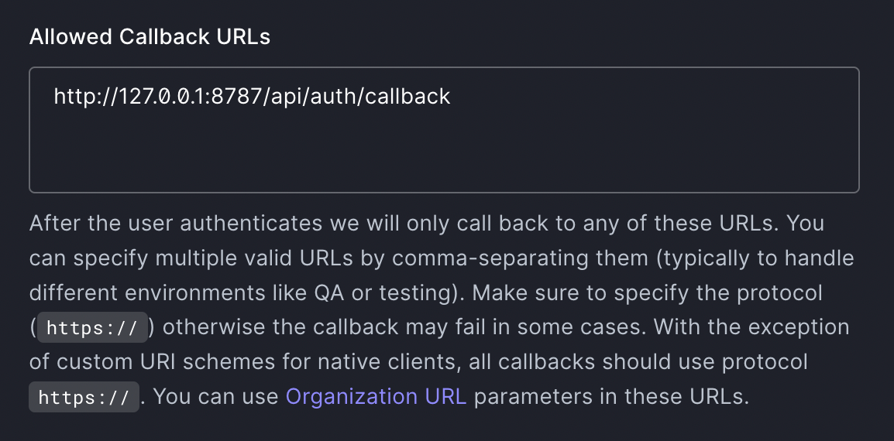

# Authorize users with Auth0



## Overview

In this tutorial, you will integrate [Auth0](https://auth0.com), an identity management platform, into a Cloudflare Workers application. Adding authorization and authentication to an application is a common task for developers. By implementing it using Cloudflare Workers, you can take advantage of the Workers platform to simplify how and when your application needs user data.

Assumptions:

- `wrangler version` -> ⛅️ wrangler 2.12.0
- `node --version` -> v16.13.0
- [`ESModule` syntax for Workers](https://blog.cloudflare.com/workers-javascript-modules/)

### What you will learn

- How to authorize and authenticate users in Workers.
- How to persist authorization credentials inside of Workers KV.
- How to protect routes using `itty-router` middleware configured to authorize requests.
- How to use Auth0 user information inside of your Workers application.

## Set up Auth0

If you do not already have an Auth0 account, sign up for a free account at [auth0.com](https://auth0.com). This tutorial supports integration with Auth0’s free tier.

### Configure an Auth0 application

Every Auth0 account contains applications, which allow developers to create login/signup flows that are verified by Auth0. To integrate Auth0 with Workers, create an application in your Auth0 dashboard. If you have created an account for this tutorial, the **Default (Generic)** application provided by Auth0 will work; otherwise, create a new application with the type **Regular Web Application**.


Inside of your application’s settings, the "Domain", "Client ID" and "Client Secret" are keys that you will provide to your Workers application to authenticate with Auth0. There are several settings and configuration options, but relevant to this tutorial are the **Allowed Callback URLs** and **Allowed Web Origins** options. In the **Publish** section of this tutorial, you will later fill in these values with the final deployed URL of your application.

## Generate a new project

Using wrangler’s `generate` command, begin building a new application using a Workers template. For this tutorial, you will modify the default template for [Workers Sites](/workers/platform/sites/), which deploys a static HTML application:

```sh
---
header: Generate a new project
---
$ wrangler generate my-auth-example worker-sites

⛅️ wrangler 2.12.0
--------------------
Creating a worker in my-auth-example from worker-sites
✨ Success!
```

## Building an authorizer

Before implementing an authorizer in your application, which will verify that a user is logged in, it is useful to understand how Auth0’s login flow works. The condensed version of this flow is below (review a [longer writeup in Auth0’s documentation](https://auth0.com/docs/get-started/authentication-and-authorization-flow/authorization-code-flow)):

1.  A user makes a request to the Workers application.
2.  If the user is not logged in, they are redirected to the login page. By default this is hosted by Auth0.
3.  After logging in, the user is redirected back to the Workers application with a login `code` query parameter.
4.  The Workers application takes the login `code` parameter and exchanges it with Auth0 for authorization tokens.
5.  The Workers application verifies the tokens and extracts information about the user from them.

In a traditional application that is attached to a database, the authorization tokens Auth0 returns are often persisted in a database. This will allow users to return to the application and continue to use it without the need for re-authorization. With a Workers application, you have access to a quick and easy-to-use data storage solution that lives right next to your serverless application: Workers KV. Using Workers KV, you will store authorization tokens and tie them to a user using an authorization cookie.

[](https://auth0.com/docs/flows/concepts/auth-code)

<small>Auth0 Flow Diagram courtesy of <a href="https://auth0.com/docs/flows/concepts/auth-code">Auth0</a></small>

### Authenticating a user

Begin implementing the login flow described in the previous section. When a user makes a request to the Workers application, you should verify that the user is authenticated. To define this logic, create a new file — `src/auth0.mjs`- which will contain the authorization logic for your application:

```js
---
filename: src/auth0.mjs
---
import cookie from 'cookie'
import * as jose from 'jose'

/**
 * Gets the supplied date in seconds
 * @param {Date} d
 * @returns number
 */
export const dateInSecs = d => Math.ceil(Number(d) / 1000)

/**
 * Class for authenticating users with Auth0 within the Workers runtime
 * @param {Object} env Pass in the environment from module-style Workers
 */
export default class Auth0 {
  #env = null // module-style Workers environment
  #clientSecret = null // Auth0 client secret
  constructor(env) {
    this.#env = env
    this.domain = env.AUTH0_DOMAIN                  // Auth0 tenant domain
    this.clientId = env.AUTH0_CLIENT_ID             // Auth0 client ID
    this.#clientSecret = env.AUTH0_CLIENT_SECRET    // Auth0 client secret
    this.callbackUrl = env.AUTH0_CALLBACK_URL       // Current application's callback URL
    this.cookieKey = env.AUTH0_COOKIE_KEY           // Key for auth cookie, non-secret string
    this.cookieDomain = env.AUTH0_COOKIE_DOMAIN     // Domain for auth cookie, e.g. example.com

    this.logoutUrl =
      `https://${this.domain}/v2/logout` +
      `?client_id=${this.clientId}&returnTo=${env.AUTH0_LOGOUT_URL}`
  }

  // Validate a token like those described here:
  // https://auth0.com/docs/secure/tokens/access-tokens#sample-access-token
  async validateToken(token) {
    // Get remote keyset
    const jwks = jose.createRemoteJWKSet(
      new URL(`https://${this.domain}/.well-known/jwks.json`),
    )

    // Verify JWT. Auth0 recommends jose: https://jwt.io/libraries?language=JavaScript
    const { payload } = await jose.jwtVerify(token, jwks, {
      audience: this.clientId, // verify audience claim
      maxTokenAge: '12 hours', // verify max age of token
    })

    // Verify issuer claim
    const iss = new URL(payload.iss).hostname
    if (iss !== this.domain) {
      throw new Error(
        `Token iss value (${iss}) doesn't match configured AUTH0_DOMAIN`,
      )
    }

    // Verify expires time
    const date = new Date()
    if (payload.exp < dateInSecs(date)) {
      throw new Error(`Token exp value is before current time`)
    }

    // Return payload
    return payload
  }

  // Utility to store a state param in KV
  // Predominantly the value is the URL requested by the user when this.authorize is called
  async generateStateParam(data) {
    const resp = await fetch('https://csprng.xyz/v1/api')
    const { Data: state } = await resp.json()
    await this.#env.KV.put(`state-${state}`, data, {
      expirationTtl: 600,
    })
    return state
  }

  /**
   * Verify a user's session against the KV store
   * @param {Request} request
   * @returns object with auth info or null
   */
  async verifySession(request) {
    const cookieHeader = request.headers.get('Cookie')
    // Check existing cookie
    if (cookieHeader && cookieHeader.includes(this.cookieKey)) {
      const cookies = cookie.parse(cookieHeader)
      if (typeof cookies[this.cookieKey] !== 'string') {
        return null
      }

      const id = cookies[this.cookieKey]
      const kvData = await this.getSession(id)

      if (!kvData) {
        // We have a cookie but the KV data is missing or expired
        return null
      }

      let kvStored = null
      let userInfo = null
      try {
        // this is the response body from the Auth0 token endpoint, saved by persistAuth()
        kvStored = JSON.parse(kvData)
        userInfo = await this.validateToken(kvStored.id_token)
      } catch (err) {
        // Invalid stored session
        await this.deleteSession(id)
        throw new Error('Unable to parse auth information from Workers KV')
      }
      if (!userInfo || !userInfo.sub) {
        return null
      }

      const { access_token: accessToken, id_token: idToken } = kvStored
      return { accessToken, idToken, userInfo }
    }
    return null
  }

  // Utility functions to handle session-storage in KV
  // If we want an extra layer of security, we can encrypt the values in KV
  async deleteSession(id) {
    await this.#env.KV.delete(`id-${id}`)
  }

  async getSession(id) {
    return this.#env.KV.get(`id-${id}`)
  }

  // Store session data and return the id
  async putSession(data) {
    const id = crypto.randomUUID()
    await this.#env.KV.put(`id-${id}`, data, {
      expirationTtl: 86400, // 1 day
    })
    return id
  }

  /**
   * Gateway method to handle all auth requests, calls multiple other methods in this class
   * @param {Request} request
   * @param {string} successPath Return path after auth
   * @returns Array of [result: boolean, payload: object]
   */
  async authorize(request, successPath) {
    const auth = await this.verifySession(request)
    if (auth && auth.accessToken) {
      return [true, auth]
    } else {
      const url = new URL(request.url)
      const target = new URL(successPath, url.origin)
      const state = await this.generateStateParam(target.href)
      return [false, { redirectUrl: this.redirectUrl(state) }]
    }
  }
}
```

The `Auth0` class gets instantiated with the Workers `environment` object, from which the class can access several secrets. Those are encrypted values that can be defined and used by your script. In the **Publish** section of this tutorial, you will define these secrets using the [`wrangler secret`](/workers/cli-wrangler/commands/#secret) command.

The `validateToken` method verifies a JWT token against the JWKs hosted in your Auth0 tenant. This step is critical, as it allows your application to trust the contents of the JWT. For more information about JWT best practices, refer to the [the Auth0 documentation](https://auth0.com/docs/secure/tokens/token-best-practices).

It also examines the `iss`, `aud` and `exp` fields inside of the decoded token. You SHOULD also verify the `iat` field. Ensure that:

- The `iss` field matches the `AUTH0_DOMAIN`
- The `aud` field matches the `AUTH0_CLIENT_ID`
- The `exp` field is after the current time
- The `iat` field was issued in the last day

Finally, `validateToken` unpacks the JWT and returns the payload. This includes the `profile` and `email` scopes you requested from Auth0 when the user logged in, which you will return as `userInfo`, along with `accessToken` and `idToken`

The `generateStateParam` method will be used to prevent [Cross-Site Request Forgery (CSRF) attacks](https://auth0.com/docs/secure/attack-protection/state-parameters). `generateStateParam` generates a random state parameter that you will store in Workers KV to verify incoming authorization requests.

To correctly protect against CSRF attacks, your application needs to provide a `state` parameter to the Auth0 login URL. When the user logs in and is redirected back to your application, you can compare the `state` parameter in the redirect URL to your previously stored `state`, confirming that the user is beginning and ending the login flow via your application.

In the example, this piece of state is generated using `csprng.xyz`, a Cloudflare API service for generating random data. The API endpoint `csprng.xyz/v1/api` returns a JSON object with the key `Data` that you will use as the random value:

```json
{
  "Data": "PTBsWkQ7Zg5pAXAq5/YJS1mtFL97q1k/qUVJNdirEl0=",
  "Time": "2020-05-29T13:22:54.840Z",
  "Status": 200
}
```

The application will use Workers KV to persist this random data for 600 seconds, which is configured via the `expirationTtl` option. After the expires time, KV will automatically discard the `state-${state}` key.

The `verifySession` method checks for an authorization cookie, and gets a corresponding value from the Workers KV. This is similar to the cookie-based approached described in [Auth0's documentation](https://auth0.com/docs/secure/tokens/token-best-practices#tokens-vs-cookies).

We're treating the KV as a session-handler, and as such there are a few utility methods to interact with it. Notably, `putSession` uses `crypto.randomUUID()` to generate a random ID for the session. This ID is used as the key in Workers KV, and is also set as a cookie in the response, later.

The `authorize` method waits for the response from the `verifySession`. It returns an array that can be used to determine how the application should proceed.

```js
---
filename: /index.js
---
import { Router } from 'itty-router'
import Auth0 from './src/auth0'
import manifestJSON from '__STATIC_CONTENT_MANIFEST'
const assetManifest = JSON.parse(manifestJSON)

// Create a new router
const router = Router()

// Auth middleware
const withAuth = async (request, env) => {
  const auth0 = new Auth0(env)
  const sessionData = await auth0.verifySession(request)
  if (!sessionData) {
    return respondWithError(401)
  }
  request.userInfo = sessionData.userInfo
}

// User info endpoint @withAuth
router.get('/userinfo', withAuth, async (request, env) => {
  return Response.json(request.userInfo)
})

// Login
router.get('/login', async (request, env) => {
  const auth0 = new Auth0(env)
  const returnPath = '/userinfo'
  // We're just forwarding to the userinfo endpoint for now
  const [authorized, payload] = await auth0.authorize(request, returnPath)
  if (!authorized) {
    // User is not authenticated. We're in the login flow
    // If the authorize method returns a payload with a redirectUrl, redirect the user
    if (payload && payload.redirectUrl) {
      return new Response('', {
        status: 302,
        headers: {
          Location: payload.redirectUrl,
        },
      })
    } else {
      return respondWithError(500, 'Unable to authenticate')
    }
  }
  // This takes the user to an arbitrary page in the app.
  // In this example, it's the /userinfo endpoint
  return new Response('', {
    status: 302,
    headers: {
      Location: returnPath,
    },
  })
})

// Catch-all route
router.all('*', () => respondWithError(404))

export default {
  async fetch(request, env, ctx) {
    if (
      request.method === 'GET' &&
      new URL(request.url).pathname.startsWith('/assets')
    ) {
      try {
        return await getAssetFromKV(
          {
            request,
            waitUntil(promise) {
              return ctx.waitUntil(promise)
            },
          },
          {
            ASSET_NAMESPACE: env.__STATIC_CONTENT,
            ASSET_MANIFEST: assetManifest,
          },
        )
      } catch (err) {
        if (err instanceof NotFoundError) {
          return respondWithError(404)
        } else {
          return respondWithError(500)
        }
      }
    } else {
      try {
        return router.handle(request, env)
      } catch (err) {
        // Handle exceptions thrown from router calls
        return respondWithError(500)
      }
    }
  }
}
```

In `/index.js`, import the `Auth0` class from `./src/auth0.mjs` and use it inside of your route handlers. The default catch-all route responds with a `404 Not Found`. `respondWithError` and `respondWithRedirect` are utiltiy functions that return a `Response` object configured accordingly. For brevity we won't go into detail on those functions here. [MDN has thorough documentation on Response objects](https://developer.mozilla.org/en-US/docs/Web/API/Response).

The `default export` defines the `fetch`  event handler for your Worker. The `fetch` event is fired when a client makes a request to the Worker. The `fetch` handler checks if the request is for an asset, and if so, it will return the asset from Workers KV. If the request is not for an asset, the request is passed to the router.

When the `/login` endpoint is requested, the `Auth0.authorize` method is called, which in turn calls `Auth0.verifySession` to check for an existing valid session. If one is found, it returns an array with a boolean `authorized` as `true` and an `authorization` object constaining an `accessToken`, `idToken`, and `userInfo` object. If no valid session is found, `authorized` will be `false` and the object will contain a `redirectUrl` property, which sends the user to Auth0’s login form.

When a user logs in via Auth0’s login form, they will be redirected back to the callback URL specified by your application. In the next section, you will handle that redirect and get a user access token as part of the login code flow.


Once the user is logged-in, they can request protected routes. Notice that the `/userinfo` route handler gets the `withAuth` middleware passed-in as the second argument.

The `withAuth` middleware calls `Auth0.verifySession`. If valid sessionData is returned, the `userInfo` object is added to the `request` object. This is a common pattern in Express and other frameworks, and it allows you to easily access the user's information in your route handlers. In our simple `/userinfo` example, we reflect the `userInfo` object as JSON to the logged-in user. In practice, you probably wouldn't do this.

If `verifySession` fails to validate a session, a `401 Unauthorized` response is returned. You can choose to handle this based on your neeeds. Beware that if your application automatically redirects users to the `/login` endpoint on a `401`, there is the risk of an infinite redirect loop.

### Handling a login redirect

To handle the login code flow as defined by Auth0, a `/auth/callback` endpoint will be set up to receive the authorization `code` parameter. By making another API request to Auth0, providing your applications’s client ID and secret, you can exchange the login code for an access token. The token can be persisted in the Workers KV store, identified by a unique session ID that is stored in a cookie, in the user's browser.

In the `Auth0` class, we'll add the required methods.

```js
---
filename: src/auth0.mjs
---
  //...
  // Returns initialization object for Response
  async handleCallback(request) {
    const url = new URL(request.url)

    // Check state param
    let state = url.searchParams.get('state')
    if (!state) {
      return null
    }
    state = decodeURIComponent(state)
    // Fetch stored state (from this.generateStateParam)
    const storedState = await this.#env.KV.get(`state-${state}`)
    if (!storedState) {
      return null
    }

    // We're using code type flow, exchange for auth token
    const code = url.searchParams.get('code')
    if (code) {
      // Return value is defined by this.persistAuth
      return this.exchangeCode(code, storedState)
    }
    return null
  }

  // Make a request for an auth token and store it in KV
  async exchangeCode(code, storedState) {
    const body = JSON.stringify({
      grant_type: 'authorization_code',
      client_id: this.clientId,
      client_secret: this.#clientSecret,
      code,
      redirect_uri: this.callbackUrl,
    })
    // Persist in KV
    return this.persistAuth(
      await fetch(`https://${this.domain}/oauth/token`, {
        method: 'POST',
        headers: { 'content-type': 'application/json' },
        body,
      }),
      storedState,
    )
  }

  /**
   * Calls this.validateToken and persists the token in KV session store
   * @param {Promise} exchange Response from the token exchange endpoint
   * @param {*} storedState Stored state from original auth request
   * @returns object with status and headers for setting the cookie
   */
  async persistAuth(exchange, storedState) {
    // Get the token exchange response
    const body = await exchange.json()
    if (body.error) {
      throw new Error(body.error)
    }

    // Validate and decode the token
    let decoded = null
    try {
      decoded = await this.validateToken(body.id_token)
    } catch (err) {
      return { status: 401 }
    }
    if (!decoded || !decoded.sub) {
      return { status: 401 }
    }

    // Store exchange response body in KV (session handling) after validation
    const id = await this.putSession(JSON.stringify(body))
    const date = new Date()
    date.setDate(date.getDate() + 1) // 1 day

    // Make headers and set cookie with session ID
    const headers = {
      Location: new URL(storedState).href || '/',
      'Set-Cookie': this.serializedCookie(this.cookieKey, id, {
        expires: date,
      }),
    }
    return { headers, status: 302 }
  }

  // Returns a serialized cookie string ready to be set in headers
  serializedCookie(key, value, options = {}) {
    options = {
      domain: this.cookieDomain,
      httpOnly: true,
      path: '/',
      secure: true, // requires SSL certificate
      sameSite: 'lax',
      ...options,
    }
    return cookie.serialize(key, value, options)
  }

```

Then a route handler for the callback.

```js
---
filename: /index.js
---
// Auth0 callback
router.get('/auth/callback', async (request, env) => {
  const auth0 = new Auth0(env)
  const resultHeaders = await auth0.handleCallback(request)
  return new Response('', resultHeaders)
})

```

The `handleCallback` method extracts and verifies the `state` parameter from the incoming request against the stored states in your Workers KV. If the `state` is valid, the `code` parameter is extracted and passed to `exchangeCode`. The `exchangeCode` method makes a request to Auth0's token exchange endpoint, and returns a response body with an `id_token`, assuming no errors. It will also contain an `access_token` and [other fields](https://auth0.com/docs/flows/guides/auth-code/add-login-auth-code#request-tokens).

The `persistAuth` method validates the token, and if valid, stores the response body in Workers KV using a unique session ID generated by `crypto.randomUUID()`. The [Web Crypto API](https://developer.mozilla.org/en-US/docs/Web/API/Web_Crypto_API) is available inside the Workers runtime. It's important that this ID is cryptographically unique. A request bearing this ID in the cookie header will assume ownership of the stored `id_token`.

On succesful authentication, the user is redirected to the URL that was stored in the Workers KV record identified by the `state` parameter, with a cookie set, containing the session ID. On future requests, whenever a route is called that uses the `withAuth` middleware, the `Auth0.verifySession` method will be called again, which checks the cookie for a valid session ID.

You have now completed the authorization/authentication portion of the tutorial. Your application will authorize any incoming users, redirecting them to Auth0 and verifying their access tokens before they are allowed to access protected routes.

To configure your deployment and publish the application, you can go to the **Publish** section. The next few portions of the tutorial will review some interesting additions to this project.

### Improvements and customizations

This tutorial introduces concepts for implementing authentication in Workers using Auth0. There are several potential customizations and improvements to this codebase that are out-of-scope for this tutorial. This tutorial will briefly mention a few in this section, along with links to learn more.

#### Using user data in your application

In the previous section of the tutorial, you made middleware for your instance of `itty-router`, which provides information such as name and email address for use in your protected routes. Using Workers’ [HTML Rewriter](/workers/runtime-apis/html-rewriter/), you can embed the `userInfo` object directly into your site by creating an instance of the `HTMLRewriter` class and attaching a handler to any found `head` tags that pass through the rewriter. The handler will add a new `script` tag with an ID of `edge_state`, which you can parse and utilize in any front-end JavaScript code you might deploy with your application.

#### Logging out users

While a user’s authentication cookie expires after a day, you may want to offer the ability for a user to log out manually. To implement this feature, instead of letting the cookie expire automatically, your Workers application should pass a `Set-cookie` header that nulls out the `cookieKey` you previously defined.

We can add a `logout` method to the `Auth0` class, which will be called by a route handler for the `/logout` route. This method will delete the existing cookie, and also delete the session from Workers KV.

```js
---
filename: src/auth0.mjs
---
  // Logs user out locally and at Auth0
  async logout(request) {
    // Get cookies
    const cookieHeader = request.headers.get('Cookie')
    // Set up headers
    let headers = {
      Location: this.logoutUrl,
    }
    // Delete existing cookie
    if (cookieHeader && cookieHeader.includes(this.cookieKey)) {
      // Reset cookie in response header
      headers['Set-Cookie'] = this.serializedCookie(this.cookieKey, '', {
        expires: new Date(), // expire now
      })
      // Parse incoming cookie to identify session
      const cookies = cookie.parse(cookieHeader)
      // We have an existing session, so delete it
      if (typeof cookies[this.cookieKey] !== 'undefined') {
        const id = cookies[this.cookieKey]
        await this.deleteSession(id)
      }
    }
    return { headers, status: 302 }
  }

```

```js
---
filename: /index.js
---
router.get('/logout', async (request, env) => {
  const auth0 = new Auth0(env)
  const resultHeaders = await auth0.logout(request)
  return new Response('', resultHeaders)
})
```

#### Deploying to origin/originless

While this tutorial assumes that you are deploying a Workers Sites application, you may want to put this authorization logic in front of an existing domain. This concept, known as deploying to an origin or proxying an origin, is in contrast to the originless deploy, where your Workers deployment _is_ the final destination for any requests from users of your application.

The **Publish** section of this tutorial assumes deployment to Workers’ built-in deployment target, `*.workers.dev`, but if you want to handle deploying to an existing domain, you will need to update the catch-all route handler with a request to your origin:

```js
---
filename: /index.js
---

// Catch-all route
router.all('*', () => {
  return await fetch(request)
})

```

The router will intercept any defined routes and pass them to the appropriate handler, but if no route is matched, the request will be passed to the `fetch` event handler, which will make a request to your origin.

## Publish

You are ready to deploy your application to Workers. Before you can deploy your application, you need to set some configuration values both in Workers and Auth0.

### Secrets

In `src/auth0.js`, this tutorial referred to several Auth0 constants, such as "Client ID", and "Client Secret". Before you can deploy your application, set up these secrets, using wrangler’s [`secret`](/workers/cli-wrangler/commands/#secret) command, which will make them available to reference as constants in the Workers runtime environment.

Using `wrangler secret`, set each secret directly in the command line:

```sh
---
header: Set secret values
---
$ wrangler secret put AUTH0_DOMAIN
$ wrangler secret put AUTH0_CLIENT_ID
$ wrangler secret put AUTH0_CLIENT_SECRET
$ wrangler secret put AUTH0_CALLBACK_URL
$ wrangler secret put AUTH0_COOKIE_KEY
$ wrangler secret put AUTH0_COOKIE_DOMAIN
$ wrangler secret put AUTH0_LOGOUT_URL
```

#### Setting the callback url

To correctly set the callback URL for your application, you will need to determine where your application will be deployed. Regardless of whether you are setting up an originless or origin-based deploy, the callback handler for this project is defined at `/auth/callback`. This means that if you are testing or deploying a staging version of this project, your callback URL will likely be something like `https://my-auth-example.<your_subdomain>.workers.dev/auth/callback`, or for production, you should set it to something like `https://example.com/auth/callback`.

This tutorial assumes the usage of a `*.workers.dev` subdomain, which is provided for free to all developers using Workers. You can determine your callback URL by combining the name of your application (chosen during the `wrangler generate` phase -- in this tutorial, `my-auth-example` was used) and your `*.workers.dev` subdomain:

```js
`https://${applicationName}.${subdomain}.workers.dev/auth/callback`
```

#### Allowed origin/callback URLs

Auth0 has security defaults and any callback URLs or origins that you will use as sources to log in from need to be explicitly provided in the Auth0 dashboard as part of your application configuration. Using the above `*.workers.dev` example, ensure the following values are set in the application settings page of your Auth0 dashboard, along with any additional URLs used as part of testing (for example, `localhost:8787`)



### Publishing your application

With your `wrangler.toml` file successfully configured, use wrangler’s `publish` command to deploy your application:

```sh
---
header: Publish your project
---
$ wrangler publish
```

Wrangler will compile your code, upload the associated Workers Sites folder (`public`, by default), and begin handling requests sent to your `*.workers.dev` application, or to your zone. To confirm everything works as expected, you should:

1.  Visit your application (for example, `https://my-auth-example.<your_subdomain>.workers.dev/login`).
2.  Log in with an email/password or an identity provider enabled for your Auth0 application.
3.  Let Auth0 redirect you to `/auth/callback`, and then to `/userinfo`. As this is happening, your Workers application has exchanged a login `code` with Auth0 for an access token, persisted it to Workers KV, and registered you as an authorized user via a cookie.
4.  If you see your `/userinfo` endpoint, you have successfully authorized users to your Workers application, using Auth0.


## Related resources

You can build a lot more with Workers, such as serving static and JAMstack-style applications using Workers Sites, or transforming HTML responses using HTMLRewriter. Below are some more tutorials for you to review and experiment with.

- [Build a Slack bot](/workers/tutorials/build-a-slackbot/)
- [Handle form submissions with Airtable](/workers/tutorials/handle-form-submissions-with-airtable/)
- [Localize a website using HTMLRewriter](/workers/tutorials/localize-a-website/)
