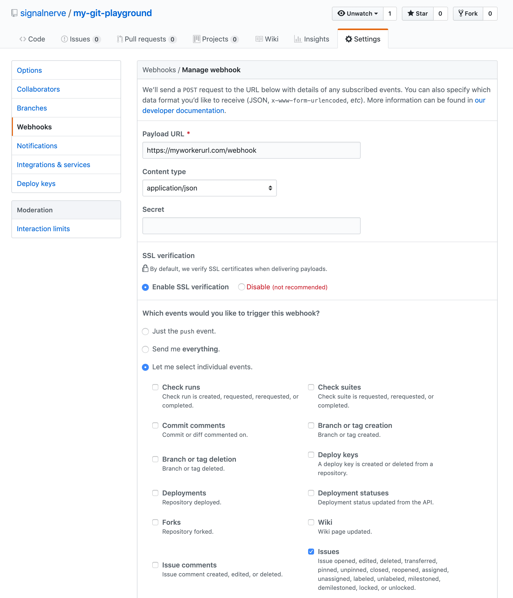
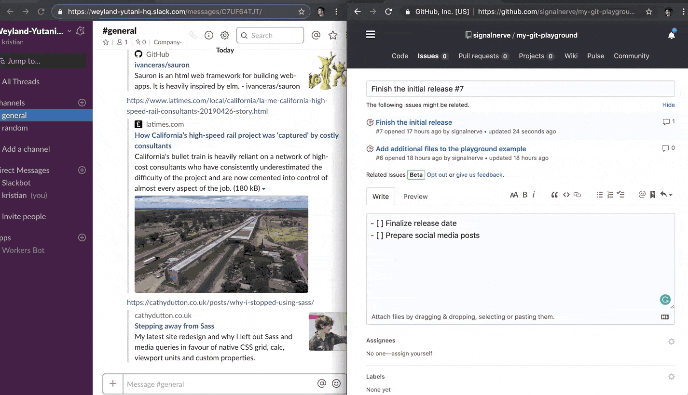

# Build a Slackbot



## Overview

In this tutorial, you will build a [Slack](https://slackhq.com) bot using [Cloudflare Workers](https://workers.cloudflare.com). Your bot will make use of GitHub webhooks to send messages to a Slack channel when issues are updated or created, and allow users to write a command to look up GitHub issues from inside Slack.

This tutorial is recommended for people who are familiar with writing web applications. If you have built an application with tools like [Node](https://nodejs.org) and [Express](https://expressjs.com), this project will feel very familiar to you. If you are new to writing web applications or have wanted to build something like a Slack bot in the past, but were intimidated by deployment or configuration, Workers will be an easy way for you to focus on writing code and shipping projects.

If you would like to see the code or how the bot works in an actual Slack channel before proceeding with this tutorial, you can access the final version of the codebase [on GitHub](https://github.com/signalnerve/workers-slack-bot). From GitHub, you can add your own Slack API keys and deploy it to your own Slack channels for testing.

## Set up Slack

This tutorial assumes that you already have a Slack account, and the ability to create and manage Slack applications.

### Configure a Slack application

To post messages from your Cloudflare Worker into a Slack channel, you will need to create an application in Slack’s UI. To do this, go to Slack’s API section, at [api.slack.com/apps](https://api.slack.com/apps), and select **Create New App**.

Slack applications have many features. You will make use of two of them, Incoming Webhooks and Slash Commands, to build your Worker-powered Slack bot.

#### Incoming Webhook

Incoming Webhooks are URLs that you can use to send messages to your Slack channels. Your incoming webhook will be paired with GitHub’s webhook support to send messages to a Slack channel whenever there are updates to issues in a given repository. You will see the code in more detail as you build your application. First, create a Slack webhook:

1.  On the sidebar of Slack's UI, select **Incoming Webhooks**.
2.  In **Webhook URLs for your Workspace**, select **Add New Webhook to Workspace**.
3.  On the following screen, select the channel that you want your webhook to send messages to (you can select a room, like #general or #code, or be messaged directly by our Slack bot when the webhook is called.)
4.  Authorize the new webhook URL.

After authorizing your webhook URL, you will be returned to the **Incoming Webhooks** page and can view your new webhook URL. You will add this into our Workers code later. Next, you will add the second component to your Slack bot: a Slash Command.

#### Slash Command

A Slash Command in Slack is a custom-configured command that can be attached to a URL request. For example, if you configured `/weather <zip>`, Slack would make an HTTP POST request to a configured URL, passing the text `<zip>` to get the weather for a specified zip code. In your application, you will use the `/issue` command to look up GitHub issues using the [GitHub API](https://developer.github.com). Typing `/issue cloudflare/wrangler#1` will send the text `cloudflare/wrangler#1` in a HTTP POST request to our application, which the application will use to find the [relevant GitHub issue](https://github.com/cloudflare/wrangler/issues/1).

1.  On the Slack sidebar, select **Slash Commands**.
2.  Create your first slash command.

For our example, you will use the command `/issue`. The request URL should be the `/lookup` path on your application URL: for instance, if your application will be hosted at `https://myworkerurl.com`, the Request URL should be `https://myworkerurl.com/lookup`.

### Configure your GitHub Webhooks

Your Cloudflare Workers application will be able to handle incoming requests from Slack. It should also be able to receive events directly from GitHub. If a Github issue is created or updated, you can make use of GitHub webhooks to send that event to your Workers application and post a corresponding message in Slack.

To configure a webhook:

1.  Go to your Github repository's **Settings** > **Webhooks** > **Add webhook**.

If you have a repository like `https://github.com/user/repo`, you can access the **Webhooks** page directly at `https://github.com/user/repo/settings/hooks`.

2.  Set the Payload URL to the `/webhook` path on your Worker URL.

For example, if your Worker will be hosted at `https://myworkerurl.com`, the Payload URL should be `https://myworkerurl.com/webhook`.

3.  In the **Content type** dropdown, select **application/json**.

The **Content type** for your payload can either be a URL-encoded payload (`application/x-www-form-urlencoded`) or JSON (`application/json`). For the purpose of this tutorial and to make parsing the payload sent to our application, select JSON.

4.  In **Which events would you like to trigger this webhook?**, select **Let me select individual events**.

GitHub webhooks allow you to specify which events you would like to have sent to your webhook. By default, the webhook will send `push` events from your repository. For the purpose of this tutorial, you will choose **Let me select individual events**.

5.  Select the **Issues** event type.

There are many different event types that can be enabled for your webhook. Selecting **Issues** will send every issue-related event to your webhook, including when issues are opened, edited, deleted, and more. If you would like to expand your Slack bot application in the future, you can select more of these events after the tutorial.

6.  Select **Add webhook**.

When your webhook is created, it will attempt to send a test payload to your application. Since your application is not actually deployed yet, leave the configuration as it is. You will later return to your repository to create, edit, and close some issues to ensure that the webhook is working once your application is deployed.

## Generate

Cloudflare’s command-line tool for managing Worker projects, [Wrangler](https://github.com/cloudflare/wrangler), supports various templates — pre-built collections of code that make it easy to get started writing Workers. In this tutorial, you will use the [router template](https://github.com/cloudflare/worker-template-router) to generate a Workers project with a built-in router, so you can take incoming requests, and route them to the appropriate JavaScript code.

In the command line, generate your Worker project, passing in a project name (for example, `slack-bot`), and the [template](/workers/examples/) URL to base your project on:
<pre class="CodeBlock CodeBlock-with-rows CodeBlock-scrolls-horizontally CodeBlock-is-light-in-light-theme CodeBlock--language-sh" language="sh">Generate a new project<code>
$ wrangler generate slack-bot https://github.com/cloudflare/worker-template-router

$ cd slack-bot

</code></pre>

Wrangler templates are just Git repositories, so if you want to create your own templates, or use one from the [Template Gallery](/workers/examples/), there is a variety of options to help you get started.

Cloudflare’s `worker-template` includes support for building and deploying JavaScript-based projects. Inside of your new `slack-bot` directory, `index.js` represents the entry point to your Cloudflare Workers application.

All Cloudflare Workers applications start by listening for `fetch` events, which are triggered when a client makes a request to a Workers route. After a request is received by the Worker, the response your application constructs will be returned to the user. This tutorial will guide you through understanding how the request/response pattern works and how you can use it to build fully featured applications.
<pre class="CodeBlock CodeBlock-with-rows CodeBlock-scrolls-horizontally CodeBlock-is-light-in-light-theme CodeBlock--language-js" language="js">index.js<code>
addEventListener('fetch', event =&gt {

  event.respondWith(handleRequest(event.request));

});

/**

 * Handle a request

 * @param {Request} request

 */

async function handleRequest(request) {

  return new Response('Hello worker!', { status: 200 });

}

</code></pre>

In your default `index.js` file, you can see that request/response pattern in action. The `handleRequest` constructs a new `Response` with the body text “Hello worker”, as well as an explicit `200` status code.

When a Worker receives a `fetch` event, the script must use `event.respondWith` to return the newly constructed response to the client. Your Cloudflare Worker script will serve new responses directly from [Cloudflare's edge network](https://www.cloudflare.com/network) instead of continuing to your origin server. A standard server would accept requests and return responses. Cloudflare Workers allows you to respond quickly by constructing responses directly on the Cloudflare edge network.

## Build

To build your Slack bot on Cloudflare Workers, you will build up your application file-by-file, separating different parts of the application and using modern JS tooling like ES modules, NPM packages, and [async/await](https://developer.mozilla.org/en-US/docs/Web/JavaScript/Reference/Statements/async_function) functions to put together your application.

The router template includes a class, `Router`, that is included to help developers with the common task of associating “routes” in your application (for instance, `/users`, or `/about`) with “functions”. In this tutorial, there are two routes/function handlers that you need to define:

1.  The `lookup` function will take requests from Slack (sent when a user uses the `/issue` command), and look up the corresponding issue using the GitHub API. This function will be a `PUT` request to `/lookup`.

2.  The `webhook` function will be called when an issue changes on GitHub, via a configured webhook. This function will be a `POST` request to `/webhook`.

### Handling requests

Inside of `index.js`, import the `Router` class and use it to update the `handleRequest` function:
<pre class="CodeBlock CodeBlock-with-rows CodeBlock-scrolls-horizontally CodeBlock-is-light-in-light-theme CodeBlock--language-js" language="js">index.js<code>
import Router from './router';

addEventListener('fetch', event =&gt {

  event.respondWith(handleRequest(event.request));

});

async function handleRequest(request) {

  const r = new Router();

  r.post('/lookup', lookup);

  r.post('/webhook', webhook);

  let response = await r.route(request);

  if (!response) {

    response = new Response('Not found', { status: 404 });

  }

  return response;

}

</code></pre>

First, import the `Router` class from `router.js`.

In `handleRequest`, instantiate a new instance of `Router`, setting it to the variable `r`. The `Router` class makes use of a few functions to quickly and easily handle requests. The `post` method takes in a path string and a function handler. This indicates “when a client sends an HTTP `POST` to the path `/lookup`, call the `lookup` function”.

There are two `POST` routes to handle: `/lookup` and `/webhook`. These new routes will point to corresponding functions, `lookup` and `webhook` — the two function handlers that you will set up soon.

Once your routes are set up, you need to actually handle the incoming request, which is available under the variable `request`. The `route` function on the router takes in a `request` argument, and returns a `response`.



Note that you are able to use JavaScript features like async/await inside of your Workers application. This is because of Workers’ V8 runtime. Since `r.route` returns a Promise, you can write `await r.route(request)` to set `response` to the result of the resolved Promise.



If there is no matching route (for example, if someone requests the path `/admin`), the function should return a response with a status code of `404`. `handleRequest` checks to see if `response` is `undefined`, and if it is, it sets `response` to a new `Response` with the body text “Not found”, and a status code of `404`.

Finally, the function returns the `response`, whether it is a match from the router, or a `404`, back to the `fetch` event. The result will either be a handled API route, or a plain HTTP response.

This request/response pattern makes it really straightforward to understand how requests are routed in your Workers application. You are almost done with this file. To complete it, you need to define the corresponding function handlers for your routes. In this tutorial, you will define those handlers in `src/handlers`:
<pre class="CodeBlock CodeBlock-with-rows CodeBlock-scrolls-horizontally CodeBlock-is-light-in-light-theme CodeBlock--language-sh" language="sh">Create new folders and files<code>
$ mkdir -p src/handlers

$ touch src/handlers/lookup.js

$ touch src/handlers/webhook.js

</code></pre>

With those files created (you will fill them in soon), import them at the top of `index.js`. The final version of the code looks like this:
<pre class="CodeBlock CodeBlock-with-rows CodeBlock-scrolls-horizontally CodeBlock-is-light-in-light-theme CodeBlock--language-js" language="js">index.js<code>
import lookup from './src/handlers/lookup';

import webhook from './src/handlers/webhook';

import Router from './router';

addEventListener('fetch', event =&gt {

  event.respondWith(handleRequest(event.request));

});

async function handleRequest(request) {

  const r = new Router();

  r.post('/lookup', lookup);

  r.post('/webhook', webhook);

  let response = await r.route(request);

  if (!response) {

    response = new Response('Not found', { status: 404 });

  }

  return response;

}

</code></pre>

### Creating the “lookup” route

In `src/handlers/lookup.js`, define your first route handler. The `lookup` handler is a function with one argument, the `request` being passed from the `fetch` event in `index.js`:
<pre class="CodeBlock CodeBlock-with-rows CodeBlock-scrolls-horizontally CodeBlock-is-light-in-light-theme CodeBlock--language-js" language="js">src/handlers/lookup.js<code>
export default async request =&gt {};

</code></pre>

To understand how you should design this function, you need to understand how Slack slash commands send data to URLs.

According to the [documentation for Slack slash commands](https://api.slack.com/slash-commands), Slack sends an HTTP POST request to your specified URL, with a `application/x-www-form-urlencoded` content type. For example, if someone were to type `/issue cloudflare/wrangler#1`, you could expect a data payload in the format:
<pre class="CodeBlock CodeBlock-with-rows CodeBlock-scrolls-horizontally CodeBlock-is-light-in-light-theme CodeBlock--language-txt" language="txt"><code>
token=gIkuvaNzQIHg97ATvDxqgjtO

&amp;team_id=T0001

&amp;team_domain=example

&amp;enterprise_id=E0001

&amp;enterprise_name=Globular%20Construct%20Inc

&amp;channel_id=C2147483705

&amp;channel_name=test

&amp;user_id=U2147483697

&amp;user_name=Steve

&amp;command=/issue

&amp;text=cloudflare/wrangler#1

&amp;response_url=https://hooks.slack.com/commands/1234/5678

&amp;trigger_id=13345224609.738474920.8088930838d88f008e0
</code></pre>

Given this payload body, you need to parse it, and get the value of the `text` key. With that `text`, for example, `cloudflare/wrangler#1`, you can parse that string into known piece of data (`owner`, `repo`, and `issue_number`), and use it to make a request to GitHub’s API, to retrieve the issue data.

With Slack slash commands, you can respond to a slash command by returning structured data as the response to the incoming slash command. In this case, you should use the response from GitHub’s API to present a formatted version of the GitHub issue, including pieces of data like the title of the issue, who created it, and the date it was created. Slack’s new [Block Kit](https://api.slack.com/block-kit) framework will allow you to return a detailed message response, by constructing text and image blocks with the data from GitHub’s API.

#### Parsing slash commands

To begin, parse the incoming data from a Slack message inside of the `lookup` handler. As previously mentioned, the Slack API sends an HTTP POST in URL Encoded format. To parse this, add the first (and only) NPM package dependency to your project — a popular query string parser package called [`qs`](https://github.com/ljharb/qs):
<pre class="CodeBlock CodeBlock-with-rows CodeBlock-scrolls-horizontally CodeBlock-is-light-in-light-theme CodeBlock--language-sh" language="sh">Install the qs package<code>
$ npm install --save qs

</code></pre>

In `src/handlers/lookup.js`, import `qs`, and use it to parse the `request` body, and get the `text` value from it:
<pre class="CodeBlock CodeBlock-with-rows CodeBlock-scrolls-horizontally CodeBlock-is-light-in-light-theme CodeBlock--language-js" language="js">src/handlers/lookup.js<code>
import qs from 'qs';

export default async request =&gt {

  const body = await request.text();

  const params = qs.parse(body);

  const text = params['text'].trim();

};

</code></pre>

Given a `text` variable, that contains text like `cloudflare/wrangler#1`, you should parse that text, and get the individual parts from it for use with GitHub’s API: `owner`, `repo`, and `issue_number`. To do this, create a new file in your application, at `src/utils/github.js`. This file will contain a number of “utility” functions for working with GitHub’s API. The first of these will be a string parser, called `parseGhIssueString`:
<pre class="CodeBlock CodeBlock-with-rows CodeBlock-scrolls-horizontally CodeBlock-is-light-in-light-theme CodeBlock--language-js" language="js">src/utils/github.js<code>
const ghIssueRegex = /(?&ltowner&gt\w*)\/(?&ltrepo&gt\w*)\#(?&ltissue_number&gt\d*)/;

export const parseGhIssueString = text =&gt {

  const match = text.match(ghIssueRegex);

  return match ? match.groups : null;

};

</code></pre>

`parseGhIssueString` takes in a `text` input, matches it against `ghIssueRegex`, and if a match is found, returns the `groups` object from that match, making use of the `owner`, `repo`, and `issue_number` capture groups defined in the regex. By exporting this function from `src/utils/github.js`, you can make use of it back in `src/handlers/lookup.js`:
<pre class="CodeBlock CodeBlock-with-rows CodeBlock-scrolls-horizontally CodeBlock-is-light-in-light-theme CodeBlock--language-js" language="js">src/handlers/lookup.js<code>
import qs from 'qs';

import { parseGhIssueString } from '../utils/github';

export default async request =&gt {

  const body = await request.text();

  const params = qs.parse(body);

  const text = params['text'].trim();

  const { owner, repo, issue_number } = parseGhIssueString(text);

};

</code></pre>

#### Making requests to GitHub’s API

With this data, you can make your first API lookup to GitHub. Again, make a new function in `src/utils/github.js`, to make a `fetch` request to the GitHub API for the issue data:
<pre class="CodeBlock CodeBlock-with-rows CodeBlock-scrolls-horizontally CodeBlock-is-light-in-light-theme CodeBlock--language-js" language="js">src/utils/github.js<code>
const ghIssueRegex = /(?&ltowner&gt\w*)\/(?&ltrepo&gt\w*)\#(?&ltissue_number&gt\d*)/;

export const parseGhIssueString = text =&gt {

  const match = text.match(ghIssueRegex);

  return match ? match.groups : null;

};

export const fetchGitHubIssue = (owner, repo, issue_number) =&gt {

  const url = `https://api.github.com/repos/${owner}/${repo}/issues/${issue_number}`;

  const headers = { 'User-Agent': 'simple-worker-slack-bot' };

  return fetch(url, { headers });

};

</code></pre>

Back in `src/handlers/lookup.js`, use `fetchGitHubIssue` to make a request to GitHub’s API, and parse the response:
<pre class="CodeBlock CodeBlock-with-rows CodeBlock-scrolls-horizontally CodeBlock-is-light-in-light-theme CodeBlock--language-js" language="js">src/handlers/lookup.js<code>
import qs from 'qs';

import { fetchGitHubIssue, parseGhIssueString } from '../utils/github';

export default async request =&gt {

  const body = await request.text();

  const params = qs.parse(body);

  const text = params['text'].trim();

  const { owner, repo, issue_number } = parseGhIssueString(text);

  const response = await fetchGitHubIssue(owner, repo, issue_number);

  const issue = await response.json();

};

</code></pre>

#### Constructing a Slack message

After you have gotten a response back from GitHub’s API, the final step is to construct a Slack message with the issue data, and return it to the user. The final result will look something like this:

You can see four different pieces in the above screenshot:

1.  The first line (bolded) links to the issue, and shows the issue title
2.  The following lines (including code snippets) are the issue body
3.  The last line of text shows the issue status, the issue creator\_(with a link to the user’s GitHub profile), and the creation date for the issue
4.  The profile picture of the issue creator, on the right-hand side

The previously mentioned [Block Kit](https://api.slack.com/block-kit) framework will help take the issue data (in the structure lined out in [GitHub’s REST API documentation](https://developer.github.com/v3/issues/)) and format it into something like the above screenshot.

Create another file, `src/utils/slack.js`, to contain the function `constructGhIssueSlackMessage`, a function for taking issue data, and turning it into a collection of blocks. Blocks are simple JavaScript objects that Slack will use to format the message:
<pre class="CodeBlock CodeBlock-with-rows CodeBlock-scrolls-horizontally CodeBlock-is-light-in-light-theme CodeBlock--language-js" language="js">src/utils/slack.js<code>
export const constructGhIssueSlackMessage = (issue, issue_string) =&gt {

  const issue_link = `&lt${issue.html_url}|${issue_string}&gt`;

  const user_link = `&lt${issue.user.html_url}|${issue.user.login}&gt`;

  const date = new Date(Date.parse(issue.created_at)).toLocaleDateString();

  const text_lines = [

    `*${issue.title} - ${issue_link}*`,

    issue.body,

    `*${issue.state}* - Created by ${user_link} on ${date}`,

  ];

};

</code></pre>

Slack messages accept a variant of Markdown, which supports bold text via asterisks (`*bolded text*`), and links in the format `<https://yoururl.com|Display Text>`.

Given that format, construct `issue_link`, which takes the `html_url` property from the GitHub API `issue` data (in format `https://github.com/cloudflare/wrangler/issues/1`), and the `issue_string` sent from the Slack slash command, and combines them into a clickable link in the Slack message.

`user_link` is similar, using `issue.user.html_url` (in the format `https://github.com/signalnerve`, a GitHub user) and the user’s GitHub username (`issue.user.login`), to construct a clickable link to the GitHub user.

Finally, parse `issue.created_at`, an ISO 8601 string, convert it into an instance of a JavaScript `Date`, and turn it into a formatted string, in the format `MM/DD/YY`.

With those variables in place, `text_lines` is an array of each line of text for the Slack message. The first line is the **issue title** and the **issue link**, the second is the **issue body**, and the final line is the **issue state** (for example, open or closed), the **user link**, and the **creation date**.

With the text constructed, you can finally construct our Slack message, returning an array of blocks for Slack’s [Block Kit](https://api.slack.com/block-kit). In this case, there is only have one block: a [section](https://api.slack.com/reference/messaging/blocks#section) block with Markdown text, and an accessory image of the user who created the issue. Return that single block inside of an array, to complete the `constructGhIssueSlackMessage` function:
<pre class="CodeBlock CodeBlock-with-rows CodeBlock-scrolls-horizontally CodeBlock-is-light-in-light-theme CodeBlock--language-js" language="js">src/utils/slack.js<code>
export const constructGhIssueSlackMessage = (issue, issue_string) =&gt {

  const issue_link = `&lt${issue.html_url}|${issue_string}&gt`;

  const user_link = `&lt${issue.user.html_url}|${issue.user.login}&gt`;

  const date = new Date(Date.parse(issue.created_at)).toLocaleDateString();

  const text_lines = [

    `*${issue.title} - ${issue_link}*`,

    issue.body,

    `*${issue.state}* - Created by ${user_link} on ${date}`,

  ];

  return [

    {

      type: 'section',

      text: {

        type: 'mrkdwn',

        text: text_lines.join('\n'),

      },

      accessory: {

        type: 'image',

        image_url: issue.user.avatar_url,

        alt_text: issue.user.login,

      },

    },

  ];

};

</code></pre>

#### Finishing the lookup route

In `src/handlers/lookup.js`, use `constructGhIssueSlackMessage` to construct `blocks`, and return them as a new response when the slash command is called:
<pre class="CodeBlock CodeBlock-with-rows CodeBlock-scrolls-horizontally CodeBlock-is-light-in-light-theme CodeBlock--language-js" language="js">src/handlers/lookup.js<code>
import qs from 'qs';

import { fetchGitHubIssue, parseGhIssueString } from '../utils/github';

import { constructGhIssueSlackMessage } from '../utils/slack';

export default async request =&gt {

  const body = await request.text();

  const params = qs.parse(body);

  const text = params['text'].trim();

  const { owner, repo, issue_number } = parseGhIssueString(text);

  const response = await fetchGitHubIssue(owner, repo, issue_number);

  const issue = await response.json();

  const blocks = constructGhIssueSlackMessage(issue, text);

  return new Response(

    JSON.stringify({

      blocks,

      response_type: 'in_channel',

    }),

    { headers: { 'Content-type': 'application/json' } }

  );

};

</code></pre>

One additional parameter passed into the response is `response_type`. By default, responses to slash commands are ephemeral, meaning that they are only seen by the user who writes the slash command. Passing a `response_type` of `in_channel`, as seen above, will cause the response to appear for all users in the channel.

If you would like the messages to remain private, remove the `response_type` line. This will cause `response_type` to default to `ephemeral`.

#### Handling errors

The `lookup` function is almost complete, but there are a number of errors that can occur in the course of this function, such as parsing the body from Slack, getting the issue from GitHub, or constructing the Slack message itself. To address this, wrap the majority of this function in a try/catch block, and return simple error text to the user in Slack if something goes wrong. With that, the final version of `src/handlers/lookup.js` looks like this:
<pre class="CodeBlock CodeBlock-with-rows CodeBlock-scrolls-horizontally CodeBlock-is-light-in-light-theme CodeBlock--language-js" language="js">src/handlers/lookup.js<code>
import qs from 'qs';

import { fetchGitHubIssue, parseGhIssueString } from '../utils/github';

import { constructGhIssueSlackMessage } from '../utils/slack';

export default async request =&gt {

  try {

    const body = await request.text();

    const params = qs.parse(body);

    const text = params['text'].trim();

    const { owner, repo, issue_number } = parseGhIssueString(text);

    const response = await fetchGitHubIssue(owner, repo, issue_number);

    const issue = await response.json();

    const blocks = constructGhIssueSlackMessage(issue, text);

    return new Response(

      JSON.stringify({

        blocks,

        response_type: 'in_channel',

      }),

      { headers: { 'Content-type': 'application/json' } }

    );

  } catch (err) {

    const errorText =

      'Uh-oh! We couldn’t find the issue you provided. We can only find public issues in the following format: `owner/repo#issue_number`.';

    return new Response(errorText);

  }

};

</code></pre>

### Creating the “webhook” route

You are now halfway through implementing the route handlers for your Workers application. In implementing the next handler, `src/handlers/webhook.js`, you will re-use a lot of the code that you have already written for the “lookup” route.

At the beginning of this tutorial, you configured a GitHub webhook to track any events related to issues in your repository. When an issue is opened, for example, the function corresponding to the path `/webhook` on your Workers application should take the data sent to it from GitHub, and post a new message in the configured Slack channel.

In `src/handlers/webhook.js`, define an async function that takes in a `request`, and make it the default export for this file:
<pre class="CodeBlock CodeBlock-with-rows CodeBlock-scrolls-horizontally CodeBlock-is-light-in-light-theme CodeBlock--language-js" language="js">src/handlers/webhook.js<code>
export default async request =&gt {};

</code></pre>

Much like with the `lookup` function handler, you will need to parse the incoming payload inside of `request`, get the relevant issue data from it (see [the GitHub API documentation on `IssueEvent`](https://developer.github.com/v3/activity/events/types/#issuesevent) for the full payload schema), and send a formatted message to Slack to indicate what has changed. The final version will look something like this:

Compare this message format to the format returned when a user uses the `/issue` slash command. You will see that there is only one actual difference between the two: the addition of an “action” text on the first line, in the format `An issue was $action:`. This action, which is sent as part of the `IssueEvent` from GitHub, will be used as you construct a very familiar looking collection of blocks using Slack’s Block Kit.

#### Parsing event data

To start filling out the function, take in the `request` body, parse it into an object, and construct some helper variables:
<pre class="CodeBlock CodeBlock-with-rows CodeBlock-scrolls-horizontally CodeBlock-is-light-in-light-theme CodeBlock--language-js" language="js">src/handlers/webhook.js<code>
import { constructGhIssueSlackMessage } from '../utils/slack';

export default async request =&gt {

  const body = await request.text();

  const { action, issue, repository } = JSON.parse(body);

  const prefix_text = `An issue was ${action}:`;

  const issue_string = `${repository.owner.login}/${repository.name}#${issue.number}`;

};

</code></pre>

An `IssueEvent`, the payload sent from GitHub as part of your webhook configuration, includes an `action` (what happened to the issue: for example, it was opened, closed, locked, etc.), the `issue` itself, and the `repository`, among other things.

Use `JSON.parse` to convert the payload body of the request from JSON into a plain JS object. Use ES6 destructuring to set `action`, `issue` and `repository` as variables you can use in your code. `prefix_text` is a simple string indicating what happened to the issue, and `issue_string` is the familiar string `owner/repo#issue_number` that you have seen before: while the `lookup` handler directly used the text sent from Slack to fill in `issue_string`, you will construct it directly based on the data passed in the JSON payload.

#### Constructing and sending a Slack message

The messages your Slack bot sends back to your Slack channel from the `lookup` and `webhook` function handlers are incredibly similar. Because of this, you can re-use the existing `constructGhIssueSlackMessage` to continue populating `src/handlers/webhook.js`. Import the function from `src/utils/slack.js`, and pass the issue data into it:
<pre class="CodeBlock CodeBlock-with-rows CodeBlock-scrolls-horizontally CodeBlock-is-light-in-light-theme CodeBlock--language-js" language="js">src/handlers/webhook.js<code>
import { constructGhIssueSlackMessage } from '../utils/slack';

export default async request =&gt {

  const body = await request.text();

  const { action, issue, repository } = JSON.parse(body);

  const prefix_text = `An issue was ${action}:`;

  const issue_string = `${repository.owner.login}/${repository.name}#${issue.number}`;

  const blocks = constructGhIssueSlackMessage(issue, issue_string, prefix_text);

};

</code></pre>

Importantly, the usage of `constructGhIssueSlackMessage` in this handler adds one additional argument to the function, `prefix_text`. Update the corresponding function inside of `src/utils/slack.js`, adding `prefix_text` to the collection of `text_lines` in the message block, if it has been passed in to the function.

Add a simple utility function, `compact`, which takes an array, and filters out any `null` or `undefined` values from it. This function will be used to remove `prefix_text` from `text_lines` if it has not actually been passed in to the function, such as when called from `src/handlers/lookup.js`. The full (and final) version of the `src/utils/slack.js` looks like this:
<pre class="CodeBlock CodeBlock-with-rows CodeBlock-scrolls-horizontally CodeBlock-is-light-in-light-theme CodeBlock--language-js" language="js">src/utils/slack.js<code>
const compact = array =&gt array.filter(el =&gt el);

export const constructGhIssueSlackMessage = (issue, issue_string, prefix_text) =&gt {

  const issue_link = `&lt${issue.html_url}|${issue_string}&gt`;

  const user_link = `&lt${issue.user.html_url}|${issue.user.login}&gt`;

  const date = new Date(Date.parse(issue.created_at)).toLocaleDateString();

  const text_lines = [

    prefix_text,

    `*${issue.title} - ${issue_link}*`,

    issue.body,

    `*${issue.state}* - Created by ${user_link} on ${date}`,

  ];

  return [

    {

      type: 'section',

      text: {

        type: 'mrkdwn',

        text: compact(text_lines).join('\n'),

      },

      accessory: {

        type: 'image',

        image_url: issue.user.avatar_url,

        alt_text: issue.user.login,

      },

    },

  ];

};

</code></pre>

Back in `src/handlers/webhook.js`, the `blocks` that are returned from `constructGhIssueSlackMessage` become the body in a new `fetch` request, an HTTP POST request to a Slack webhook URL. Once that request completes, return a response with status code `200`, and the body text `"OK"`:
<pre class="CodeBlock CodeBlock-with-rows CodeBlock-scrolls-horizontally CodeBlock-is-light-in-light-theme CodeBlock--language-js" language="js">src/handlers/webhook.js<code>
import { constructGhIssueSlackMessage } from '../utils/slack';

export default async request =&gt {

  const body = await request.text();

  const { action, issue, repository } = JSON.parse(body);

  const prefix_text = `An issue was ${action}:`;

  const issue_string = `${repository.owner.login}/${repository.name}#${issue.number}`;

  const blocks = constructGhIssueSlackMessage(issue, issue_string, prefix_text);

  const postToSlack = await fetch(SLACK_WEBHOOK_URL, {

    body: JSON.stringify({ blocks }),

    method: 'POST',

    headers: { 'Content-Type': 'application/json' },

  });

  return new Response('OK');

};

</code></pre>

The constant `SLACK_WEBHOOK_URL` represents the Slack Webhook URL that you created all the way back in the [Incoming Webhook](/workers/tutorials/build-a-slackbot/#incoming-webhook) section of this tutorial.



Since this webhook allows developers to post directly to your Slack channel, keep it secret.



To use this constant inside of your codebase, use the [`wrangler secret`](/workers/cli-wrangler/commands/#secret) command:
<pre class="CodeBlock CodeBlock-with-rows CodeBlock-scrolls-horizontally CodeBlock-is-light-in-light-theme CodeBlock--language-sh" language="sh">Set the SLACK_WEBHOOK_URL secret<code>
$ wrangler secret put SLACK_WEBHOOK_URL

Enter the secret text you’d like assigned to the variable name on the script named slack-bot-ENVIRONMENT_NAME: https://hooks.slack.com/services/abc123
</code></pre>

#### Handling errors

Similarly to the `lookup` function handler, the `webhook` function handler should include some basic error handling. Unlike `lookup`, which sends responses directly back into Slack, if something goes wrong with your webhook, it may be useful to actually generate an erroneous response, and return it to GitHub.

To do this, wrap the majority of the `webhook` function handler in a try/catch block, and construct a new response with a status code of `500`, and return it. The final version of `src/handlers/webhook.js` looks like this:
<pre class="CodeBlock CodeBlock-with-rows CodeBlock-scrolls-horizontally CodeBlock-is-light-in-light-theme CodeBlock--language-js" language="js">src/handlers/webhook.js<code>
import { constructGhIssueSlackMessage } from '../utils/slack';

export default async request =&gt {

  try {

    const body = await request.text();

    const { action, issue, repository } = JSON.parse(body);

    const prefix_text = `An issue was ${action}:`;

    const issue_string = `${repository.owner.login}/${repository.name}#${issue.number}`;

    const blocks = constructGhIssueSlackMessage(issue, issue_string, prefix_text);

    const postToSlack = await fetch(SLACK_WEBHOOK_URL, {

      body: JSON.stringify({ blocks }),

      method: 'POST',

      headers: { 'Content-Type': 'application/json' },

    });

    return new Response('OK');

  } catch (err) {

    const errorText = 'Unable to handle webhook';

    return new Response(errorText, { status: 500 });

  }

};

</code></pre>

## Publish

By completing the preceding steps, you have finished writing the code for your Slack bot. You can now publish your application.

Wrangler has built-in support for bundling, uploading, and releasing your Cloudflare Workers application. To do this, run `wrangler publish`, which will build and publish your code:

Publishing your Workers application should now cause issue updates to start appearing in your Slack channel, as the GitHub webhook can now successfully reach your Workers webhook route:

## Related resources

In this tutorial, you built and published a Cloudflare Workers application that can respond to GitHub webhook events, and allow GitHub API lookups within Slack. If you would like to review the full source code for this application, you can find the repository [on GitHub](https://github.com/signalnerve/workers-slack-bot).

If you want to get started building your own projects, review the existing list of [Quickstart templates](/workers/get-started/quickstarts/).
