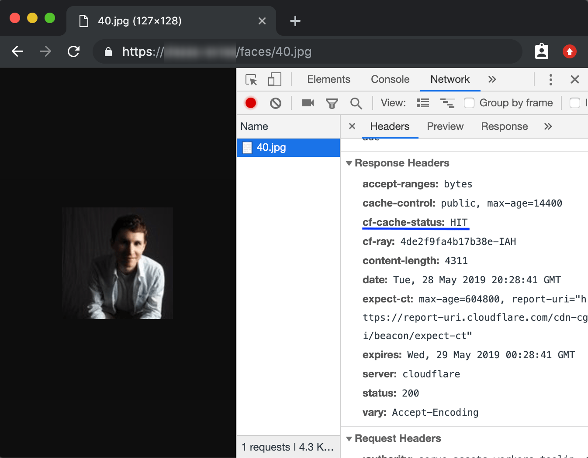

# Configure your CDN



## Overview

In this tutorial, you will build and publish a Cloudflare Workers function that serves assets from a storage platform (in this example, [Google Cloud Storage](https://cloud.google.com/storage/)) to your users. This approach, called white-labelling, often takes the form of complex DNS configuration. With Cloudflare Workers, and Cloudflare’s CDN, you can build a solution to this complexity in a few lines of code.

This tutorial will teach you how to build and publish a Cloudflare Workers function to configure your CDN. No prior experience with serverless functions or Cloudflare Workers is assumed.

If you want to review the code used in this tutorial, the final version of the codebase is [available on GitHub](https://github.com/signalnerve/assets-on-workers). You can take that code, customize it, and deploy it for use in your own projects.

## Prerequisites

This tutorial assumes that you have a public bucket on Google Cloud Storage. You will use it to serve assets through your Cloudflare Workers function. If you do not have a Google Cloud Storage bucket to use with this project, review [Google Cloud’s Cloud Storage Quickstart guide](https://cloud.google.com/storage/docs/quickstart-console).

This tutorial makes use of sample images to illustrate serving data through your Cloudflare Workers function. If you have an existing set of images you would like to use, you can upload those to your Google Cloud Storage bucket and use them — if you do not have an existing set of images, this tutorial provides a sample set of profile pictures via [UIFaces.com](http://uifaces.com/), formatted in numeric order (`1.jpg`, `2.jpg`, … `199.jpg`).

To follow along with this tutorial using the data set provided, download the [sample image collection](https://storage.cloud.google.com/workers-docs-configure-your-cdn-tutorial/faces.zip) and upload the zipped folder `faces` to the root of your bucket. The directory structure should look like this:

```txt
your-bucket
└── faces
    ├── 1.jpg
    ├── 2.jpg
    ├── ...
    └── 99.jpg
```

Finally, to ensure that you can access the objects from your Workers function, your Google Cloud Storage bucket should be publicly accessible. To ensure this, follow the [Making groups of objects publicly readable guide in the Google Cloud Storage documentation](https://cloud.google.com/storage/docs/access-control/making-data-public#buckets).

## Init

Cloudflare’s command-line tool for managing Worker projects, [Wrangler](https://github.com/cloudflare/wrangler), supports various templates — pre-built collections of code that make it easy to get started writing Workers. You will make use of the default JavaScript template to start building your project.

In the command line, create your Worker project, cloning the [worker-template](https://github.com/cloudflare/worker-template) URL and passing in a project name (for example, `serve-cdn-assets`):

```sh
---
header: Create a new project
---
$ git clone https://github.com/cloudflare/worker-template serve-cdn-assets
$ cd serve-cdn-assets
```

By default, Wrangler will use our [`worker-template`](https://github.com/cloudflare/worker-template). Wrangler templates are git repositories, so if you want to create your own templates, or use one from our [Template Gallery](/workers/get-started/quickstarts/#templates), there is a variety of options to help you get started.

Cloudflare’s `worker-template` includes support for building and deploying JavaScript-based projects. Inside of your new `serve-cdn-assets` directory, `index.js` represents the entry point to your Cloudflare Workers application.

All Cloudflare Workers applications start by listening for `fetch` events, which are triggered when a client makes a request to a Workers route. After a request is received by the Worker, the response your application constructs will be returned to the user. This tutorial will guide you through understanding how the request/response pattern works and how you can use it to build fully featured applications.

```js
---
filename: index.js
---
addEventListener('fetch', event => {
  event.respondWith(handleRequest(event));
});

/**
 * Fetch and log a request
 * @param {Request} request
 */
async function handleRequest(event) {
  return new Response('Hello worker!', { status: 200 });
}
```

In your default `index.js` file, you can observe that request/response pattern in action. The `handleRequest` constructs a new `Response` with the body text `"Hello worker!"`, as well as an explicit `200` status code.

When a Worker receives a `fetch` event, the script must use `event.respondWith` to return the newly constructed response to the client. Your Cloudflare Worker script will serve new responses directly from [Cloudflare's edge network](https://www.cloudflare.com/network) instead of continuing to your origin server. A standard server would accept requests and return responses. Cloudflare Workers allows you to respond quickly by constructing responses directly on the Cloudflare edge network.

## Build

Any project you publish to Cloudflare Workers can make use of modern JavaScript tooling like ES modules, NPM packages, and [async/await](https://developer.mozilla.org/en-US/docs/Web/JavaScript/Reference/Statements/async_function) functions to build your application. You can [build full applications](/workers/tutorials/build-a-slackbot/), or [serverless functions](/workers/tutorials/build-a-qr-code-generator/) on Workers using the same tooling and process as what you will be building with this tutorial.

The Cloudflare Workers project built in this tutorial will be a serverless function that runs on a wildcard route and receives requests. When the serverless function receives an incoming request, it should parse the URL, find what asset is being requested and serve it from the configured Cloud Storage bucket.

Because the asset will go through your Workers function, and Cloudflare’s network, you can also make use of both Cloudflare’s default caching behavior, as well as your own custom logic, to ensure that as much data can be cached at Cloudflare’s globally distributed data centers. The result is an easy-to-understand and highly performant CDN configuration, with the ability to customize it to your application’s specific needs.

### Handling requests

Currently, the Workers function receives requests and returns a simple response with the text `"Hello worker!"`. Begin configuring the function by adding an additional check — requests coming in to the function should only be `GET` requests. If it receives other requests, like `POST`s or `DELETE`s, it should return an error response, with a status code of [`405`](https://httpstatuses.com/405). Using `event.request.method`, the resulting code is:

```js
---
filename: index.js
highlight: [2, 3, 4, 5, 6]
---
async function handleRequest(event) {
  if (event.request.method === 'GET') {
    return new Response('Hello worker!', { status: 200 });
  } else {
    return new Response('Method not allowed', { status: 405 });
  }
}
```

Given that the incoming request to the function is a `GET`, the majority of your implementation will happen inside of that conditional, replacing the `"Hello worker!"` response. Create a separate function, `serveAsset`, which will house the majority of the implementation for the remainder of the tutorial:

```js
---
filename: index.js
highlight: [1, 2, 3, 7]
---
async function serveAsset(event) {
  return new Response('Hello worker!', { status: 200 });
}

async function handleRequest(event) {
  if (event.request.method === 'GET') {
    return serveAsset(event);
  } // ...
}
```

### Routing to your assets

Reviewing the original definition of this project, at the beginning of [Build](/workers/tutorials/configure-your-cdn/#build), the `serveAsset` function should parse the URL, find what asset is being requested, and serve it from the configured Cloud Storage bucket. To do this, the `event.request.url` field should be parsed using the `URL` library, and set to `url`.

Given an instance of the `URL` class, `url`, there are a number of useful properties that can be used to query the incoming request. `serveAsset` should check the `pathname`, which contains the part of the URL after the `host`: for example, given the URL `https://assets.mysite.com/faces/1.jpg`, the pathname will be `/faces/1.jpg`:

```js
---
filename: index.js
highlight: [2, 3]
---
function serveAsset(event) {
  const url = new URL(event.request.url);
  console.log(url.pathname); // "/faces/1.jpg"
}
```

With that `path` available, the function can simply request the corresponding path from your Cloud Storage bucket. Given a constant `BUCKET_NAME` (you will set it to `my-bucket` in this tutorial), set a `BUCKET_URL` constant, append `url.pathname` to the end of it, and `fetch` it to get your function’s `response`:

```js
---
filename: index.js
highlight: [1, 2, 6]
---
const BUCKET_NAME = 'my-bucket';
const BUCKET_URL = `http://storage.googleapis.com/${BUCKET_NAME}`;

function serveAsset(event) {
  const url = new URL(event.request.url);
  return fetch(`${BUCKET_URL}${url.pathname}`);
}
```

### Custom caching

At this point in the tutorial, deploying this script would give you a fully-functional project you could use to retrieve assets from your Cloud Storage bucket. You will now continue to explore how to configure your CDN with Workers by making use of the [Cache API](/workers/learning/how-the-cache-works/).

To cache responses in a Workers function, the Cache API provides `cache.match`, to check for the presence of a cached asset, and `cache.put`, to cache a `response` for a given `request`. Given those two functions, the general flow will look like this:

1.  Check for the presence of a cached asset and set it to `response`.
2.  If `response` does not exist, get the asset from cloud storage, set it to `response` and cache it.
3.  Return `response` from the function back to the `fetch` event handler.

The `Cache-Control` header is a common way that HTML responses indicate how they should be cached. The Workers implementation respects the `Cache-Control` header, in indicating how assets should be cached on Cloudflare’s CDN. In building a custom asset serving solution, and enabling caching, you should set a custom `Cache-Control` header (in this example, you will set it to `public`, with a `max-age` value of `14400` seconds, or four hours).

When the asset is retrieved from cloud storage, the `serveAsset` function should construct a new instance of `Response`, copying much of the HTML response data from the cloud storage response, but overwriting the response headers. By doing this, you will define your own custom caching information and pass it to the Workers Cache API.

When you add something to the cache, it is important to note that an HTML response is designed to only be processed once in your code, according to the Service Worker spec that Cloudflare Workers implements. To address this, clone the asset response using `response.clone()`, pass that cloned response to the Cache API, and return the original `response` back from the function. The final code looks like this:

```js
---
filename: index.js
highlight: [ 3, 4, 5, 6, 7, 8, 9, 10, 11, 12]
---
async function serveAsset(event) {
  const url = new URL(event.request.url);
  const cache = caches.default;
  let response = await cache.match(event.request);

  if (!response) {
    response = await fetch(`${BUCKET_URL}${url.pathname}`);
    const headers = { 'cache-control': 'public, max-age=14400' };
    response = new Response(response.body, { ...response, headers });
    event.waitUntil(cache.put(event.request, response.clone()));
  }
  return response;
}
```

If an asset is requested that does not exist, or if your bucket policy does not include public access to an asset, `serveAsset` will pass back the corresponding error page directly to the client. Instead of doing this, the returned response should be checked in `handleRequest`: if the status code is higher than `399` (where `200`-level status codes indicate success, and `399`-level status codes indicate redirection), return a truncated `response` with just the `status` and `statusText` from response:

```js
---
filename: index.js
highlight: [3, 4, 5, 6, 7]
---
async function handleRequest(event) {
  if (event.request.method === 'GET') {
    let response = await serveAsset(event);
    if (response.status > 399) {
      response = new Response(response.statusText, { status: response.status });
    }
    return response;
  } else {
    return new Response('Method not allowed', { status: 405 });
  }
}
```

And with that, you are finished writing the code for this tutorial. The final version of your script should like this:

```js
addEventListener('fetch', event => {
  event.respondWith(handleRequest(event));
});

const BUCKET_NAME = 'hugo-workers';
const BUCKET_URL = `http://storage.googleapis.com/${BUCKET_NAME}`;

async function serveAsset(event) {
  const url = new URL(event.request.url);
  const cache = caches.default;
  let response = await cache.match(event.request);

  if (!response) {
    response = await fetch(`${BUCKET_URL}${url.pathname}`);
    const headers = { 'cache-control': 'public, max-age=14400' };
    response = new Response(response.body, { ...response, headers });
    event.waitUntil(cache.put(event.request, response.clone()));
  }
  return response;
}

async function handleRequest(event) {
  if (event.request.method === 'GET') {
    let response = await serveAsset(event);
    if (response.status > 399) {
      response = new Response(response.statusText, { status: response.status });
    }
    return response;
  } else {
    return new Response('Method not allowed', { status: 405 });
  }
}
```

## Publish

To make this script available for use, you will need to build and publish it to Cloudflare using Wrangler:

```sh
---
header: Build and publish your project
---
$ wrangler build
$ wrangler publish
```

After deploying your project, open your browser to test retrieving your assets. For example, if your Workers project is deployed to the route `myassets.com`, going to the URL `myassets.com/faces/1.jpg` should show an uploaded asset. In addition, you can inspect the request in your browser to confirm that it is being cached. Cloudflare’s CDN will send a `cf-cache-status` header, with `HIT` or `MISS`, to indicate whether the content was cached or not:



## Related resources

In this tutorial, you built and published a serverless function to Cloudflare Workers for serving assets from cloud storage. If you would like to review the full source code for this application, refer to the [repository on GitHub](https://github.com/signalnerve/assets-on-workers).

If you want to get started building your own projects, review the existing list of [Quickstart templates](/workers/get-started/quickstarts/).
